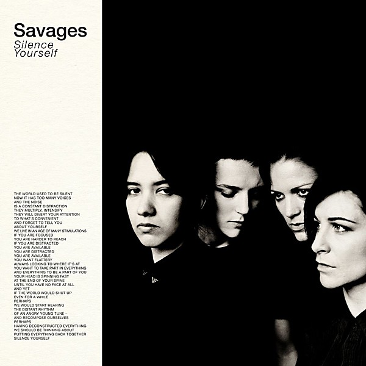

# Silence Yourself

By **Savages**

## Album Data

- **Catalog:** Beets
- **Format:** Digital, Album
- **Album:** Silence Yourself
- **Artist:** Savages
- **Albumartist:** Savages
- **Genre:** Post-Punk
- **MusicBrainz Album Artist ID:** [42d72c29-8a7a-4c88-89ed-a2ca25d40284](https://musicbrainz.org/artist/42d72c29-8a7a-4c88-89ed-a2ca25d40284)
- **MusicBrainz Album ID:** [ad12863f-91bf-4f19-99ba-e792be794d9b](https://musicbrainz.org/release/ad12863f-91bf-4f19-99ba-e792be794d9b)
- **MusicBrainz Release Group ID:** [e00609ef-dc70-4226-a0bb-28b1862c4075](https://musicbrainz.org/release-group/e00609ef-dc70-4226-a0bb-28b1862c4075)
- **Year:** 2013
- **Catalog #:** 
- **Label:** Matador
- **Total Tracks:** 11

## Album Tracks

### Track 01 - Shut Up

- **Artist:** Savages
- **Format:** ALAC
- **Genre:** Indie Rock
- **Length:** 4:48
- **MusicBrainz Track ID:** [655dd3af-f15a-4863-af31-7ed2bd776358](https://musicbrainz.org/recording/655dd3af-f15a-4863-af31-7ed2bd776358)
- **Title:** Shut Up
- **Track:** 01
- **Year:** 2013

### Track 02 - I Am Here

- **Artist:** Savages
- **Format:** ALAC
- **Genre:** Indie Rock
- **Length:** 3:20
- **MusicBrainz Track ID:** [398cfd0b-5892-4f56-88c5-090516587ef8](https://musicbrainz.org/recording/398cfd0b-5892-4f56-88c5-090516587ef8)
- **Title:** I Am Here
- **Track:** 02
- **Year:** 2013

### Track 03 - City’s Full

- **Artist:** Savages
- **Format:** ALAC
- **Genre:** Indie Rock
- **Length:** 3:27
- **MusicBrainz Track ID:** [e694a9a6-7f94-42cf-8c84-c8dd3e4f5cbb](https://musicbrainz.org/recording/e694a9a6-7f94-42cf-8c84-c8dd3e4f5cbb)
- **Title:** City’s Full
- **Track:** 03
- **Year:** 2013

### Track 04 - Strife

- **Artist:** Savages
- **Format:** ALAC
- **Genre:** Indie Rock
- **Length:** 3:57
- **MusicBrainz Track ID:** [75f32581-7691-4474-8d34-8de8bee279a6](https://musicbrainz.org/recording/75f32581-7691-4474-8d34-8de8bee279a6)
- **Title:** Strife
- **Track:** 04
- **Year:** 2013

### Track 05 - Waiting for a Sign

- **Artist:** Savages
- **Format:** ALAC
- **Genre:** Shoegaze
- **Length:** 5:25
- **MusicBrainz Track ID:** [193b5f1f-66f6-4ebb-a9ff-bea35c44041e](https://musicbrainz.org/recording/193b5f1f-66f6-4ebb-a9ff-bea35c44041e)
- **Title:** Waiting for a Sign
- **Track:** 05
- **Year:** 2013

### Track 06 - Dead Nature

- **Artist:** Savages
- **Format:** ALAC
- **Genre:** Indie Rock
- **Length:** 2:06
- **MusicBrainz Track ID:** [3d551839-d4e6-4894-b180-808835fb909f](https://musicbrainz.org/recording/3d551839-d4e6-4894-b180-808835fb909f)
- **Title:** Dead Nature
- **Track:** 06
- **Year:** 2013

### Track 07 - She Will

- **Artist:** Savages
- **Format:** ALAC
- **Genre:** Noise Rock
- **Length:** 3:27
- **MusicBrainz Track ID:** [a012463b-f3e1-4a72-82f6-234e4a44660a](https://musicbrainz.org/recording/a012463b-f3e1-4a72-82f6-234e4a44660a)
- **Title:** She Will
- **Track:** 07
- **Year:** 2013

### Track 08 - No Face

- **Artist:** Savages
- **Format:** ALAC
- **Genre:** Indie Rock
- **Length:** 3:35
- **MusicBrainz Track ID:** [d464f3d2-6cdd-4288-aade-b6d8728159ff](https://musicbrainz.org/recording/d464f3d2-6cdd-4288-aade-b6d8728159ff)
- **Title:** No Face
- **Track:** 08
- **Year:** 2013

### Track 09 - Hit Me

- **Artist:** Savages
- **Format:** ALAC
- **Genre:** Indie Rock
- **Length:** 1:41
- **MusicBrainz Track ID:** [ee45d4d3-d91a-4334-9753-052386dfab9b](https://musicbrainz.org/recording/ee45d4d3-d91a-4334-9753-052386dfab9b)
- **Title:** Hit Me
- **Track:** 09
- **Year:** 2013

### Track 10 - Husbands

- **Artist:** Savages
- **Format:** ALAC
- **Genre:** Riot Grrrl
- **Length:** 2:50
- **MusicBrainz Track ID:** [b2ceee9e-837a-47cd-a2af-831c8798bb6e](https://musicbrainz.org/recording/b2ceee9e-837a-47cd-a2af-831c8798bb6e)
- **Title:** Husbands
- **Track:** 10
- **Year:** 2013

### Track 11 - Marshal Dear

- **Artist:** Savages
- **Format:** ALAC
- **Genre:** Indie Rock
- **Length:** 4:03
- **MusicBrainz Track ID:** [37b7d1dd-c84c-4022-9beb-6893611f7866](https://musicbrainz.org/recording/37b7d1dd-c84c-4022-9beb-6893611f7866)
- **Title:** Marshal Dear
- **Track:** 11
- **Year:** 2013

## See also

- [Roon: Adore Life](../../Roon/Savages/Adore_Life.md)
- [Roon: Silence Yourself](../../Roon/Savages/Silence_Yourself.md)
