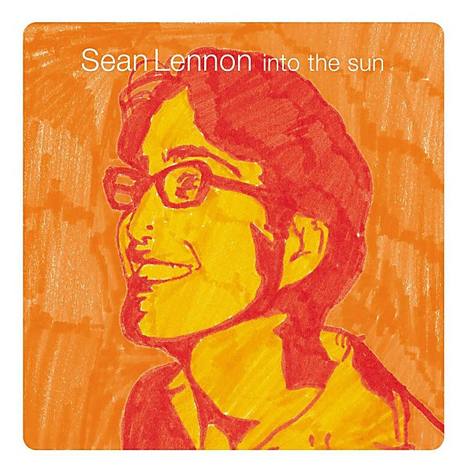

# Into the Sun

By **Sean Lennon**

## Album Data

- **Catalog:** Beets
- **Format:** Digital, Album
- **Album:** Into the Sun
- **Artist:** Sean Lennon
- **Albumartist:** Sean Lennon
- **Genre:** Indie Rock
- **MusicBrainz Album Artist ID:** [722c6718-0c61-4db2-a8bc-993a8c5d2baf](https://musicbrainz.org/artist/722c6718-0c61-4db2-a8bc-993a8c5d2baf)
- **MusicBrainz Album ID:** [a1cf9f15-c48b-41b3-8c85-fcd93aefc291](https://musicbrainz.org/release/a1cf9f15-c48b-41b3-8c85-fcd93aefc291)
- **MusicBrainz Release Group ID:** [bcdce469-00b1-35b8-939a-573e9a9c0719](https://musicbrainz.org/release-group/bcdce469-00b1-35b8-939a-573e9a9c0719)
- **Year:** 1998
- **Catalog #:** CDP 7243 4 94551 2 2
- **Label:** Capitol Records
- **Total Tracks:** 13

## Album Tracks

### Track 01 - Mystery Juice

- **Artist:** Sean Lennon
- **Format:** ALAC
- **Genre:** Sadcore
- **Length:** 5:26
- **MusicBrainz Track ID:** [ad931a8f-1c82-4228-a459-97149526fe37](https://musicbrainz.org/recording/ad931a8f-1c82-4228-a459-97149526fe37)
- **Title:** Mystery Juice
- **Track:** 01
- **Year:** 1998

### Track 03 - Home

- **Artist:** Sean Lennon
- **Format:** ALAC
- **Genre:** Indie Rock
- **Length:** 3:04
- **MusicBrainz Track ID:** [c7c854b2-a49b-4f47-b693-018119b0ebf6](https://musicbrainz.org/recording/c7c854b2-a49b-4f47-b693-018119b0ebf6)
- **Title:** Home
- **Track:** 03
- **Year:** 1998

### Track 04 - Bathtub

- **Artist:** Sean Lennon
- **Format:** ALAC
- **Genre:** Rock
- **Length:** 4:00
- **MusicBrainz Track ID:** [d8c780a2-6ccc-4e7a-8c17-55df5b3afe04](https://musicbrainz.org/recording/d8c780a2-6ccc-4e7a-8c17-55df5b3afe04)
- **Title:** Bathtub
- **Track:** 04
- **Year:** 1998

### Track 05 - One Night

- **Artist:** Sean Lennon
- **Format:** ALAC
- **Genre:** Indie Rock
- **Length:** 2:06
- **MusicBrainz Track ID:** [5648c5e5-b941-4868-b6bb-c4dcc4da8f22](https://musicbrainz.org/recording/5648c5e5-b941-4868-b6bb-c4dcc4da8f22)
- **Title:** One Night
- **Track:** 05
- **Year:** 1998

### Track 06 - Spaceship

- **Artist:** Sean Lennon
- **Format:** ALAC
- **Genre:** Rock
- **Length:** 4:17
- **MusicBrainz Track ID:** [799f0f04-50a5-4cff-bd4d-39fd9e1581ad](https://musicbrainz.org/recording/799f0f04-50a5-4cff-bd4d-39fd9e1581ad)
- **Title:** Spaceship
- **Track:** 06
- **Year:** 1998

### Track 07 - Photosynthesis

- **Artist:** Sean Lennon
- **Format:** ALAC
- **Genre:** Indie Rock
- **Length:** 6:46
- **MusicBrainz Track ID:** [5952b6da-0146-4fa8-b7c0-9edd59be234a](https://musicbrainz.org/recording/5952b6da-0146-4fa8-b7c0-9edd59be234a)
- **Title:** Photosynthesis
- **Track:** 07
- **Year:** 1998

### Track 08 - Queue

- **Artist:** Sean Lennon
- **Format:** ALAC
- **Genre:** Indie Rock
- **Length:** 3:45
- **MusicBrainz Track ID:** [d0a05a01-220a-4894-9305-1a7f084c776f](https://musicbrainz.org/recording/d0a05a01-220a-4894-9305-1a7f084c776f)
- **Title:** Queue
- **Track:** 08
- **Year:** 1998

### Track 09 - Two Fine Lovers

- **Artist:** Sean Lennon
- **Format:** ALAC
- **Genre:** Indie Rock
- **Length:** 3:17
- **MusicBrainz Track ID:** [82b4d6f5-2714-4990-b1d8-037ad621f2ee](https://musicbrainz.org/recording/82b4d6f5-2714-4990-b1d8-037ad621f2ee)
- **Title:** Two Fine Lovers
- **Track:** 09
- **Year:** 1998

### Track 10 - Part One of the Cowboy Trilogy

- **Artist:** Sean Lennon
- **Format:** ALAC
- **Genre:** Indie Rock
- **Length:** 1:48
- **MusicBrainz Track ID:** [a5491442-c077-4861-bf87-50d251a9c7ae](https://musicbrainz.org/recording/a5491442-c077-4861-bf87-50d251a9c7ae)
- **Title:** Part One of the Cowboy Trilogy
- **Track:** 10
- **Year:** 1998

### Track 11 - Wasted

- **Artist:** Sean Lennon
- **Format:** ALAC
- **Genre:** Indie Rock
- **Length:** 1:31
- **MusicBrainz Track ID:** [6e543b81-fb46-4e83-b4c0-d78527ad1c56](https://musicbrainz.org/recording/6e543b81-fb46-4e83-b4c0-d78527ad1c56)
- **Title:** Wasted
- **Track:** 11
- **Year:** 1998

### Track 12 - Breeze

- **Artist:** Sean Lennon
- **Format:** ALAC
- **Genre:** Indie Rock
- **Length:** 3:57
- **MusicBrainz Track ID:** [1ccc1446-6dc4-4a41-b10f-7b55e32274a2](https://musicbrainz.org/recording/1ccc1446-6dc4-4a41-b10f-7b55e32274a2)
- **Title:** Breeze
- **Track:** 12
- **Year:** 1998

### Track 13 - Sean’s Theme

- **Artist:** Sean Lennon
- **Format:** ALAC
- **Genre:** Indie Rock
- **Length:** 5:51
- **MusicBrainz Track ID:** [8dc321ab-a729-494d-ab6a-880626186b96](https://musicbrainz.org/recording/8dc321ab-a729-494d-ab6a-880626186b96)
- **Title:** Sean’s Theme
- **Track:** 13
- **Year:** 1998

### Track 02 - Into the Sun

- **Artist:** Sean Lennon feat. Miho Hatori
- **Format:** ALAC
- **Genre:** Indie Rock
- **Length:** 3:22
- **MusicBrainz Track ID:** [9b2e3e7f-ce7d-4dcb-8092-f79ae9eaa6d9](https://musicbrainz.org/recording/9b2e3e7f-ce7d-4dcb-8092-f79ae9eaa6d9)
- **Title:** Into the Sun
- **Track:** 02
- **Year:** 1998

## See also

- [Friendly Fire](Friendly_Fire.md)
- [CD: Friendly Fire](../../CD/Sean_Lennon/Friendly_Fire.md)
- [CD: Into The Sun](../../CD/Sean_Lennon/Into_The_Sun.md)
- [CD: Rosencrantz And Guildenstern Are Undead](../../CD/Sean_Lennon/Rosencrantz_And_Guildenstern_Are_Undead.md)
- [CD: ](../../CD/Sean_Lennon/Sean_Lennon.md)
- [Roon: Alter Egos (Original Motion Picture Soundtrack)](../../Roon/Sean_Lennon/Alter_Egos_Original_Motion_Picture_Soundtrack.md)
- [Roon: Ava's Possessions](../../Roon/Sean_Lennon/Avas_Possessions.md)
- [Roon: Friendly Fire](../../Roon/Sean_Lennon/Friendly_Fire.md)
- [Roon: Into The Sun](../../Roon/Sean_Lennon/Into_The_Sun.md)
- [Roon: Mystical Weapons](../../Roon/Sean_Lennon/Mystical_Weapons.md)
- [Roon: Rosencrantz & Guildenstern Are Undead](../../Roon/Sean_Lennon/Rosencrantz_and_Guildenstern_Are_Undead.md)
- [Vinyl: Alter Egos](../../Vinyl/Sean_Lennon/Alter_Egos.md)
- [Vinyl: ](../../Vinyl/Sean_Lennon/Sean_Lennon.md)
