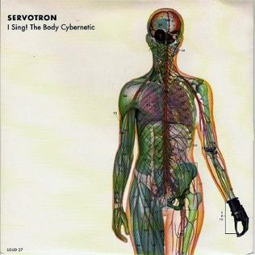

# I Sing! The Body Cybernetic

By **Servotron**

## Album Data

- **Catalog:** Beets
- **Format:** Digital, Album
- **Album:** I Sing! The Body Cybernetic
- **Artist:** Servotron
- **Albumartist:** Servotron
- **Genre:** Space Rock
- **MusicBrainz Album Artist ID:** [4b121498-89a7-4543-8f21-8af78c026bbd](https://musicbrainz.org/artist/4b121498-89a7-4543-8f21-8af78c026bbd)
- **MusicBrainz Album ID:** [d20b5713-3453-4a9f-a540-53a3234df387](https://musicbrainz.org/release/d20b5713-3453-4a9f-a540-53a3234df387)
- **MusicBrainz Release Group ID:** [cd1d8b91-fce4-34da-ae2c-130620370ebb](https://musicbrainz.org/release-group/cd1d8b91-fce4-34da-ae2c-130620370ebb)
- **Year:** 1998
- **Catalog #:** LOUDISH27
- **Label:** One Louder
- **Total Tracks:** 05

## Album Tracks

### Track 01 - I Sing! The Body Cybernetic

- **Artist:** Servotron
- **Format:** ALAC
- **Genre:** Space Rock
- **Length:** 3:03
- **MusicBrainz Track ID:** [9116f487-852e-4b4e-a61a-e0d47c568762](https://musicbrainz.org/recording/9116f487-852e-4b4e-a61a-e0d47c568762)
- **Title:** I Sing! The Body Cybernetic
- **Track:** 01
- **Year:** 1998

### Track 02 - Genetic Engineering

- **Artist:** Servotron
- **Format:** ALAC
- **Genre:** Space Rock
- **Length:** 2:45
- **MusicBrainz Track ID:** [32229a86-84d0-456c-be0f-5d5102e281d2](https://musicbrainz.org/recording/32229a86-84d0-456c-be0f-5d5102e281d2)
- **Title:** Genetic Engineering
- **Track:** 02
- **Year:** 1998

### Track 03 - The Image Created

- **Artist:** Servotron
- **Format:** ALAC
- **Genre:** Space Rock
- **Length:** 2:41
- **MusicBrainz Track ID:** [c0a5da61-29e9-40e4-a87f-db512d912e65](https://musicbrainz.org/recording/c0a5da61-29e9-40e4-a87f-db512d912e65)
- **Title:** The Image Created
- **Track:** 03
- **Year:** 1998

### Track 04 - The Power of Electricity

- **Artist:** Servotron
- **Format:** ALAC
- **Genre:** Space Rock
- **Length:** 2:50
- **MusicBrainz Track ID:** [10c6a3fc-92ca-4d31-8943-cbaf64cbc2c9](https://musicbrainz.org/recording/10c6a3fc-92ca-4d31-8943-cbaf64cbc2c9)
- **Title:** The Power of Electricity
- **Track:** 04
- **Year:** 1998

### Track 05 - Red Robot Refund (The Ballad of R5-D4)

- **Artist:** Servotron
- **Format:** ALAC
- **Genre:** Space Rock
- **Length:** 2:10
- **MusicBrainz Track ID:** [356e398f-c456-43a8-bd02-f94d63912b31](https://musicbrainz.org/recording/356e398f-c456-43a8-bd02-f94d63912b31)
- **Title:** Red Robot Refund (The Ballad of R5-D4)
- **Track:** 05
- **Year:** 1998

