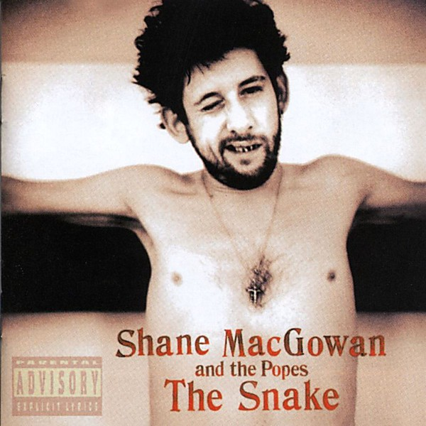

# The Snake

By **Shane MacGowan and the Popes**

## Album Data

- **Catalog:** Beets
- **Format:** Digital, Album
- **Album:** The Snake
- **Artist:** Shane Macgowan And The Popes
- **Albumartist:** Shane MacGowan and the Popes
- **Genre:** Celtic Punk
- **MusicBrainz Album Artist ID:** [9dfb10b9-a66d-4909-b406-c55407744d2b](https://musicbrainz.org/artist/9dfb10b9-a66d-4909-b406-c55407744d2b)
- **MusicBrainz Album ID:** [f413025f-a644-45d9-94c0-c9f92e33816c](https://musicbrainz.org/release/f413025f-a644-45d9-94c0-c9f92e33816c)
- **MusicBrainz Release Group ID:** [9f5e2a2c-c4b7-368b-998a-472993222a0c](https://musicbrainz.org/release-group/9f5e2a2c-c4b7-368b-998a-472993222a0c)
- **Year:** 1995
- **Catalog #:** 9 45821-2
- **Label:** Warner Bros. Records
- **Total Tracks:** 15

## Album Tracks

### Track 01 - The Church of the Holy Spook

- **Artist:** Shane MacGowan and the Popes
- **Format:** MP3
- **Genre:** Rock
- **Length:** 2:59
- **MusicBrainz Track ID:** [d58423d3-cc10-475a-bccf-549bedbba63f](https://musicbrainz.org/recording/d58423d3-cc10-475a-bccf-549bedbba63f)
- **Title:** The Church of the Holy Spook
- **Track:** 01
- **Year:** 1995

### Track 02 - Nancy Whiskey

- **Artist:** Shane MacGowan and the Popes
- **Format:** MP3
- **Genre:** Folk Rock
- **Length:** 2:58
- **MusicBrainz Track ID:** [158cb2c4-b402-499a-89f5-0408a062a304](https://musicbrainz.org/recording/158cb2c4-b402-499a-89f5-0408a062a304)
- **Title:** Nancy Whiskey
- **Track:** 02
- **Year:** 1995

### Track 03 - The Song With No Name

- **Artist:** Shane MacGowan and the Popes
- **Format:** MP3
- **Genre:** Celtic Punk
- **Length:** 4:05
- **MusicBrainz Track ID:** [42ca416d-1813-4e15-a624-fc53e83a3c68](https://musicbrainz.org/recording/42ca416d-1813-4e15-a624-fc53e83a3c68)
- **Title:** The Song With No Name
- **Track:** 03
- **Year:** 1995

### Track 04 - Aisling

- **Artist:** Shane MacGowan and the Popes
- **Format:** MP3
- **Genre:** Celtic Punk
- **Length:** 2:58
- **MusicBrainz Track ID:** [6a8785c5-ecf8-48bd-a6f9-e58812efb36c](https://musicbrainz.org/recording/6a8785c5-ecf8-48bd-a6f9-e58812efb36c)
- **Title:** Aisling
- **Track:** 04
- **Year:** 1995

### Track 05 - Roddy McCorley

- **Artist:** Shane MacGowan and the Popes
- **Format:** MP3
- **Genre:** Folk Rock
- **Length:** 2:20
- **MusicBrainz Track ID:** [c2579c8e-c567-491e-986a-8f04095210c3](https://musicbrainz.org/recording/c2579c8e-c567-491e-986a-8f04095210c3)
- **Title:** Roddy McCorley
- **Track:** 05
- **Year:** 1995

### Track 06 - Victoria

- **Artist:** Shane MacGowan and the Popes
- **Format:** MP3
- **Genre:** Celtic Punk
- **Length:** 4:48
- **MusicBrainz Track ID:** [fc0b3a82-ec95-41a3-a99f-77927abd9232](https://musicbrainz.org/recording/fc0b3a82-ec95-41a3-a99f-77927abd9232)
- **Title:** Victoria
- **Track:** 06
- **Year:** 1995

### Track 07 - That Woman's Got Me Drinking

- **Artist:** Shane MacGowan and the Popes
- **Format:** MP3
- **Genre:** Punk Rock
- **Length:** 3:25
- **MusicBrainz Track ID:** [81f7a83f-1aea-4009-8262-727819954ceb](https://musicbrainz.org/recording/81f7a83f-1aea-4009-8262-727819954ceb)
- **Title:** That Woman's Got Me Drinking
- **Track:** 07
- **Year:** 1995

### Track 08 - A Mexican Funeral in Paris

- **Artist:** Shane MacGowan and the Popes
- **Format:** MP3
- **Genre:** Celtic Punk
- **Length:** 4:48
- **MusicBrainz Track ID:** [017a0aff-04f8-47f0-a591-34d07b782826](https://musicbrainz.org/recording/017a0aff-04f8-47f0-a591-34d07b782826)
- **Title:** A Mexican Funeral in Paris
- **Track:** 08
- **Year:** 1995

### Track 09 - The Rising of the Moon

- **Artist:** Shane MacGowan and the Popes
- **Format:** MP3
- **Genre:** Folk Rock
- **Length:** 2:27
- **MusicBrainz Track ID:** [3afc992d-1ea0-424d-8976-92e7abf33caa](https://musicbrainz.org/recording/3afc992d-1ea0-424d-8976-92e7abf33caa)
- **Title:** The Rising of the Moon
- **Track:** 09
- **Year:** 1995

### Track 10 - The Snake With Eyes of Garnet

- **Artist:** Shane MacGowan and the Popes
- **Format:** MP3
- **Genre:** Folk Rock
- **Length:** 3:43
- **MusicBrainz Track ID:** [b7604d60-fc20-42f4-b513-101977f04fec](https://musicbrainz.org/recording/b7604d60-fc20-42f4-b513-101977f04fec)
- **Title:** The Snake With Eyes of Garnet
- **Track:** 10
- **Year:** 1995

### Track 11 - Haunted

- **Artist:** Shane MacGowan and the Popes
- **Format:** MP3
- **Genre:** Celtic Punk
- **Length:** 4:11
- **MusicBrainz Track ID:** [5dd1662d-6377-42fd-a3ab-12f93c3cf536](https://musicbrainz.org/recording/5dd1662d-6377-42fd-a3ab-12f93c3cf536)
- **Title:** Haunted
- **Track:** 11
- **Year:** 1995

### Track 12 - I'll Be Your Handbag

- **Artist:** Shane MacGowan and the Popes
- **Format:** MP3
- **Genre:** Celtic Punk
- **Length:** 3:02
- **MusicBrainz Track ID:** [57da28c6-aa4f-4122-9545-9049dbb8f48b](https://musicbrainz.org/recording/57da28c6-aa4f-4122-9545-9049dbb8f48b)
- **Title:** I'll Be Your Handbag
- **Track:** 12
- **Year:** 1995

### Track 13 - Her Father Didn't Like Me Anyway

- **Artist:** Shane MacGowan and the Popes
- **Format:** MP3
- **Genre:** Celtic Punk
- **Length:** 4:02
- **MusicBrainz Track ID:** [9c31f989-2cfd-441a-937f-cbb5712d26a8](https://musicbrainz.org/recording/9c31f989-2cfd-441a-937f-cbb5712d26a8)
- **Title:** Her Father Didn't Like Me Anyway
- **Track:** 13
- **Year:** 1995

### Track 14 - Donegal Express

- **Artist:** Shane MacGowan and the Popes
- **Format:** MP3
- **Genre:** Folk Rock
- **Length:** 2:55
- **MusicBrainz Track ID:** [e614d8f1-9e31-4baf-8168-c6870c75daf5](https://musicbrainz.org/recording/e614d8f1-9e31-4baf-8168-c6870c75daf5)
- **Title:** Donegal Express
- **Track:** 14
- **Year:** 1995

### Track 15 - Bring Down the Lamp

- **Artist:** Shane MacGowan and the Popes
- **Format:** MP3
- **Genre:** Celtic Punk
- **Length:** 3:11
- **MusicBrainz Track ID:** [62e11da6-212c-4a87-b790-a1922d8eab20](https://musicbrainz.org/recording/62e11da6-212c-4a87-b790-a1922d8eab20)
- **Title:** Bring Down the Lamp
- **Track:** 15
- **Year:** 1995

