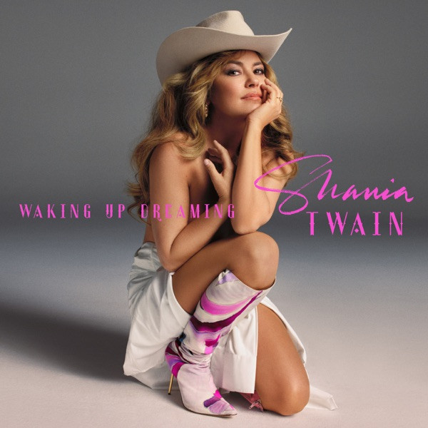

# Up!

By **Shania Twain**

## Album Data

- **Catalog:** Beets
- **Format:** Digital, Album
- **Album:** Up!
- **Artist:** Shania Twain
- **Albumartist:** Shania Twain
- **Genre:** Pop Rock
- **MusicBrainz Album Artist ID:** [faabb55d-3c9e-4c23-8779-732ac2ee2c0d](https://musicbrainz.org/artist/faabb55d-3c9e-4c23-8779-732ac2ee2c0d)
- **MusicBrainz Album ID:** [b832bc45-0f3c-4b45-967f-19d40ed5f627](https://musicbrainz.org/release/b832bc45-0f3c-4b45-967f-19d40ed5f627)
- **MusicBrainz Release Group ID:** [f4b7d3e6-059a-4846-9eab-014e37d47290](https://musicbrainz.org/release-group/f4b7d3e6-059a-4846-9eab-014e37d47290)
- **Year:** 2002
- **Catalog #:** 
- **Label:** 
- **Total Tracks:** 19

## Album Tracks

### Track 01 - Up!

- **Artist:** Shania Twain
- **Format:** ALAC
- **Genre:** Pop
- **Length:** 2:52
- **MusicBrainz Track ID:** [6561928a-01a3-400f-8a1d-ccca46066adc](https://musicbrainz.org/recording/6561928a-01a3-400f-8a1d-ccca46066adc)
- **Title:** Up!
- **Track:** 01
- **Year:** 2002

### Track 02 - I'm Gonna Getcha Good!

- **Artist:** Shania Twain
- **Format:** ALAC
- **Genre:** Country Pop
- **Length:** 4:29
- **MusicBrainz Track ID:** [02767d8f-df5a-4aed-8b81-a07c36bc8dfe](https://musicbrainz.org/recording/02767d8f-df5a-4aed-8b81-a07c36bc8dfe)
- **Title:** I'm Gonna Getcha Good!
- **Track:** 02
- **Year:** 2002

### Track 03 - She's Not Just a Pretty Face

- **Artist:** Shania Twain
- **Format:** ALAC
- **Genre:** Country Pop
- **Length:** 3:49
- **MusicBrainz Track ID:** [108c430d-f990-4696-b25f-6414f3e3ed6e](https://musicbrainz.org/recording/108c430d-f990-4696-b25f-6414f3e3ed6e)
- **Title:** She's Not Just a Pretty Face
- **Track:** 03
- **Year:** 2002

### Track 04 - Juanita

- **Artist:** Shania Twain
- **Format:** ALAC
- **Genre:** Country Pop
- **Length:** 3:50
- **MusicBrainz Track ID:** [e7aa40cd-dd96-487d-adff-13c1c7af755c](https://musicbrainz.org/recording/e7aa40cd-dd96-487d-adff-13c1c7af755c)
- **Title:** Juanita
- **Track:** 04
- **Year:** 2002

### Track 05 - Forever and for Always

- **Artist:** Shania Twain
- **Format:** ALAC
- **Genre:** Country Pop
- **Length:** 4:43
- **MusicBrainz Track ID:** [0c73424b-c673-404b-b984-a832936adf6a](https://musicbrainz.org/recording/0c73424b-c673-404b-b984-a832936adf6a)
- **Title:** Forever and for Always
- **Track:** 05
- **Year:** 2002

### Track 06 - Ain't No Particular Way

- **Artist:** Shania Twain
- **Format:** ALAC
- **Genre:** Country Rock
- **Length:** 4:24
- **MusicBrainz Track ID:** [8309084c-f5a7-4f7d-8d4c-59350b456f26](https://musicbrainz.org/recording/8309084c-f5a7-4f7d-8d4c-59350b456f26)
- **Title:** Ain't No Particular Way
- **Track:** 06
- **Year:** 2002

### Track 07 - It Only Hurts When I'm Breathing

- **Artist:** Shania Twain
- **Format:** ALAC
- **Genre:** Country Pop
- **Length:** 3:19
- **MusicBrainz Track ID:** [fa4a4d82-0c92-4e60-9124-fe28f565efe0](https://musicbrainz.org/recording/fa4a4d82-0c92-4e60-9124-fe28f565efe0)
- **Title:** It Only Hurts When I'm Breathing
- **Track:** 07
- **Year:** 2002

### Track 08 - Nah!

- **Artist:** Shania Twain
- **Format:** ALAC
- **Genre:** Country Pop
- **Length:** 4:08
- **MusicBrainz Track ID:** [4c17b4ad-c6be-468e-b568-1ecd034fb0e3](https://musicbrainz.org/recording/4c17b4ad-c6be-468e-b568-1ecd034fb0e3)
- **Title:** Nah!
- **Track:** 08
- **Year:** 2002

### Track 09 - (Wanna Get to Know You) That Good!

- **Artist:** Shania Twain
- **Format:** ALAC
- **Genre:** Country Pop
- **Length:** 4:33
- **MusicBrainz Track ID:** [f80c8fa3-67e4-4ff4-96b8-b87cb175651b](https://musicbrainz.org/recording/f80c8fa3-67e4-4ff4-96b8-b87cb175651b)
- **Title:** (Wanna Get to Know You) That Good!
- **Track:** 09
- **Year:** 2002

### Track 10 - C'est la vie

- **Artist:** Shania Twain
- **Format:** ALAC
- **Genre:** Country Pop
- **Length:** 3:42
- **MusicBrainz Track ID:** [e3857d09-a244-4c9b-831a-a4b8164242a1](https://musicbrainz.org/recording/e3857d09-a244-4c9b-831a-a4b8164242a1)
- **Title:** C'est la vie
- **Track:** 10
- **Year:** 2002

### Track 11 - I'm Jealous

- **Artist:** Shania Twain
- **Format:** ALAC
- **Genre:** Country Pop
- **Length:** 4:05
- **MusicBrainz Track ID:** [0ad9f4c7-19e9-4751-8f06-9f8be9f94eab](https://musicbrainz.org/recording/0ad9f4c7-19e9-4751-8f06-9f8be9f94eab)
- **Title:** I'm Jealous
- **Track:** 11
- **Year:** 2002

### Track 12 - Ka-Ching!

- **Artist:** Shania Twain
- **Format:** ALAC
- **Genre:** Country Pop
- **Length:** 3:20
- **MusicBrainz Track ID:** [8166b0e9-a1e8-459d-b426-6f4b290bd321](https://musicbrainz.org/recording/8166b0e9-a1e8-459d-b426-6f4b290bd321)
- **Title:** Ka-Ching!
- **Track:** 12
- **Year:** 2002

### Track 13 - Thank You Baby! (for Makin' Someday Come So Soon)

- **Artist:** Shania Twain
- **Format:** ALAC
- **Genre:** Country Pop
- **Length:** 4:00
- **MusicBrainz Track ID:** [23445137-e9b9-46f3-bb3e-28b3eaff835a](https://musicbrainz.org/recording/23445137-e9b9-46f3-bb3e-28b3eaff835a)
- **Title:** Thank You Baby! (for Makin' Someday Come So Soon)
- **Track:** 13
- **Year:** 2002

### Track 14 - Waiter! Bring Me Water!

- **Artist:** Shania Twain
- **Format:** ALAC
- **Genre:** Smooth Jazz
- **Length:** 3:19
- **MusicBrainz Track ID:** [3d2f2bd7-27ce-40fe-b302-58e1930f99cb](https://musicbrainz.org/recording/3d2f2bd7-27ce-40fe-b302-58e1930f99cb)
- **Title:** Waiter! Bring Me Water!
- **Track:** 14
- **Year:** 2002

### Track 15 - What a Way to Wanna Be!

- **Artist:** Shania Twain
- **Format:** ALAC
- **Genre:** Country Pop
- **Length:** 3:36
- **MusicBrainz Track ID:** [5658ceea-7aa5-4b2e-a595-827db7900045](https://musicbrainz.org/recording/5658ceea-7aa5-4b2e-a595-827db7900045)
- **Title:** What a Way to Wanna Be!
- **Track:** 15
- **Year:** 2002

### Track 16 - I Ain't Goin' Down

- **Artist:** Shania Twain
- **Format:** ALAC
- **Genre:** Country Rock
- **Length:** 3:57
- **MusicBrainz Track ID:** [226ee12e-10b2-46b5-9e67-f6b69e7e630c](https://musicbrainz.org/recording/226ee12e-10b2-46b5-9e67-f6b69e7e630c)
- **Title:** I Ain't Goin' Down
- **Track:** 16
- **Year:** 2002

### Track 17 - I'm Not in the Mood (to Say No)!

- **Artist:** Shania Twain
- **Format:** ALAC
- **Genre:** Country Rock
- **Length:** 3:25
- **MusicBrainz Track ID:** [06aa6502-9507-414d-a74f-1a11e346eea8](https://musicbrainz.org/recording/06aa6502-9507-414d-a74f-1a11e346eea8)
- **Title:** I'm Not in the Mood (to Say No)!
- **Track:** 17
- **Year:** 2002

### Track 18 - In My Car (I'll Be the Driver)

- **Artist:** Shania Twain
- **Format:** ALAC
- **Genre:** Country Pop
- **Length:** 3:16
- **MusicBrainz Track ID:** [be4e2c0a-e02c-43b9-8dc6-1040a1158611](https://musicbrainz.org/recording/be4e2c0a-e02c-43b9-8dc6-1040a1158611)
- **Title:** In My Car (I'll Be the Driver)
- **Track:** 18
- **Year:** 2002

### Track 19 - When You Kiss Me

- **Artist:** Shania Twain
- **Format:** ALAC
- **Genre:** Soft Rock
- **Length:** 4:08
- **MusicBrainz Track ID:** [defc3a52-89ab-4b24-b701-8debcd901838](https://musicbrainz.org/recording/defc3a52-89ab-4b24-b701-8debcd901838)
- **Title:** When You Kiss Me
- **Track:** 19
- **Year:** 2002

## See also

- [Greatest Hits](Greatest_Hits.md)
- [CD: Ka-Ching! [cd1]](../../CD/Shania_Twain/Ka-Ching!_[cd1].md)
- [CD: ](../../CD/Shania_Twain/Shania_Twain.md)
- [CD: Up! (Disc 1)](../../CD/Shania_Twain/Up!_Disc_1.md)
- [CD: Up!](../../CD/Shania_Twain/Up!.md)
- [Roon: Greatest Hits](../../Roon/Shania_Twain/Greatest_Hits.md)
- [Roon: Up! (Red And Green Versions)](../../Roon/Shania_Twain/Up!_Red_And_Green_Versions.md)
