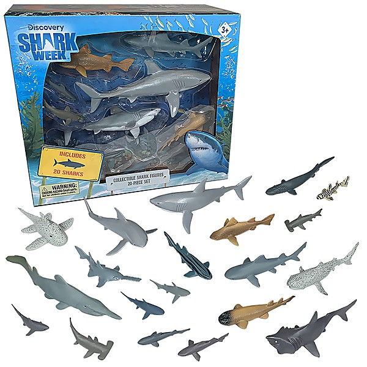

# Ditches

By **SHARKPACT**

## Album Data

- **Catalog:** Beets
- **Format:** Digital, Album
- **Album:** Ditches
- **Artist:** Sharkpact
- **Albumartist:** SHARKPACT
- **Genre:** Punk Rock
- **MusicBrainz Album Artist ID:** 
- **MusicBrainz Album ID:** 
- **MusicBrainz Release Group ID:** 
- **Year:** 2011
- **Catalog #:** 
- **Label:** 
- **Total Tracks:** 00

## Album Tracks

### Track 01 - ocean

- **Artist:** SHARKPACT
- **Format:** MP3
- **Genre:** Punk Rock
- **Length:** 2:03
- **MusicBrainz Track ID:** 
- **Title:** ocean
- **Track:** 01
- **Year:** 2011

### Track 02 - service

- **Artist:** SHARKPACT
- **Format:** MP3
- **Genre:** Punk Rock
- **Length:** 2:40
- **MusicBrainz Track ID:** 
- **Title:** service
- **Track:** 02
- **Year:** 2011

### Track 03 - death

- **Artist:** SHARKPACT
- **Format:** MP3
- **Genre:** Punk Rock
- **Length:** 2:14
- **MusicBrainz Track ID:** 
- **Title:** death
- **Track:** 03
- **Year:** 2011

### Track 04 - water

- **Artist:** SHARKPACT
- **Format:** MP3
- **Genre:** Punk Rock
- **Length:** 3:06
- **MusicBrainz Track ID:** 
- **Title:** water
- **Track:** 04
- **Year:** 2011

### Track 05 - wilderness

- **Artist:** SHARKPACT
- **Format:** MP3
- **Genre:** Punk Rock
- **Length:** 3:16
- **MusicBrainz Track ID:** 
- **Title:** wilderness
- **Track:** 05
- **Year:** 2011

### Track 06 - matter

- **Artist:** SHARKPACT
- **Format:** MP3
- **Genre:** Punk Rock
- **Length:** 2:31
- **MusicBrainz Track ID:** 
- **Title:** matter
- **Track:** 06
- **Year:** 2011

### Track 07 - spring

- **Artist:** SHARKPACT
- **Format:** MP3
- **Genre:** Punk Rock
- **Length:** 1:42
- **MusicBrainz Track ID:** 
- **Title:** spring
- **Track:** 07
- **Year:** 2011

### Track 08 - city

- **Artist:** SHARKPACT
- **Format:** MP3
- **Genre:** Punk Rock
- **Length:** 2:07
- **MusicBrainz Track ID:** 
- **Title:** city
- **Track:** 08
- **Year:** 2011

### Track 09 - cement

- **Artist:** SHARKPACT
- **Format:** MP3
- **Genre:** Punk Rock
- **Length:** 2:14
- **MusicBrainz Track ID:** 
- **Title:** cement
- **Track:** 09
- **Year:** 2011

### Track 10 - flood

- **Artist:** SHARKPACT
- **Format:** MP3
- **Genre:** Punk Rock
- **Length:** 1:54
- **MusicBrainz Track ID:** 
- **Title:** flood
- **Track:** 10
- **Year:** 2011

### Track 11 - ending

- **Artist:** SHARKPACT
- **Format:** MP3
- **Genre:** Punk Rock
- **Length:** 3:03
- **MusicBrainz Track ID:** 
- **Title:** ending
- **Track:** 11
- **Year:** 2011

