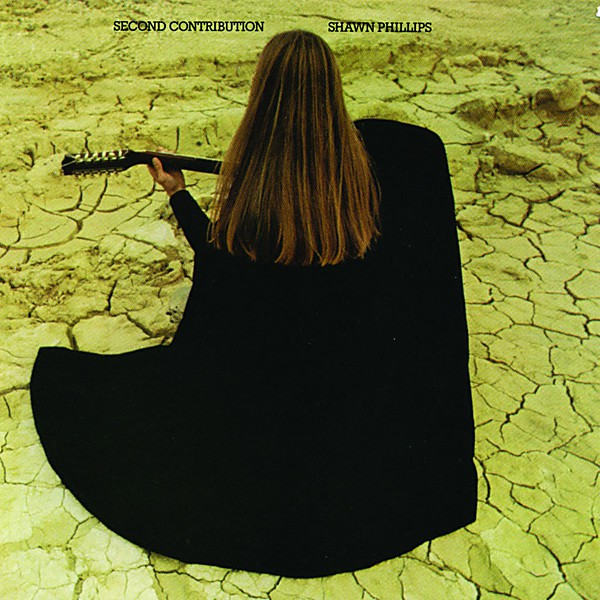

# Second Contribution

By **Shawn Phillips**

## Album Data

- **Catalog:** Beets
- **Format:** Digital, Album
- **Album:** Second Contribution
- **Artist:** Shawn Phillips
- **Albumartist:** Shawn Phillips
- **Genre:** Progressive Rock
- **MusicBrainz Album Artist ID:** [a8e1ce2e-8b10-4bc3-b212-fa3f21a1f053](https://musicbrainz.org/artist/a8e1ce2e-8b10-4bc3-b212-fa3f21a1f053)
- **MusicBrainz Album ID:** [a208daad-b2e3-36df-a152-8c228f27b3ea](https://musicbrainz.org/release/a208daad-b2e3-36df-a152-8c228f27b3ea)
- **MusicBrainz Release Group ID:** [1d87f77b-3ff2-32a0-9759-713f843097ab](https://musicbrainz.org/release-group/1d87f77b-3ff2-32a0-9759-713f843097ab)
- **Year:** 1988
- **Catalog #:** CD 3128
- **Label:** A&M Records
- **Total Tracks:** 12

## Album Tracks

### Track 01 - She Was Waitin' for Her Mother at the Station in Torino and You Know I Love You Baby but It's Getting Too Heavy to Laugh

- **Artist:** Shawn Phillips
- **Format:** ALAC
- **Genre:** Progressive Rock
- **Length:** 4:53
- **MusicBrainz Track ID:** [9881c926-06b6-4beb-aa01-5a0d607a730c](https://musicbrainz.org/recording/9881c926-06b6-4beb-aa01-5a0d607a730c)
- **Title:** She Was Waitin' for Her Mother at the Station in Torino and You Know I Love You Baby but It's Getting Too Heavy to Laugh
- **Track:** 01
- **Year:** 1988

### Track 02 - Keep On

- **Artist:** Shawn Phillips
- **Format:** ALAC
- **Genre:** Progressive Rock
- **Length:** 3:21
- **MusicBrainz Track ID:** [29b60007-ec37-4b20-8fc0-50d59d1f98d6](https://musicbrainz.org/recording/29b60007-ec37-4b20-8fc0-50d59d1f98d6)
- **Title:** Keep On
- **Track:** 02
- **Year:** 1988

### Track 03 - Sleepwalker

- **Artist:** Shawn Phillips
- **Format:** ALAC
- **Genre:** Progressive Rock
- **Length:** 1:32
- **MusicBrainz Track ID:** [6ac95ec6-ea7a-43c8-8466-f12aa8862f77](https://musicbrainz.org/recording/6ac95ec6-ea7a-43c8-8466-f12aa8862f77)
- **Title:** Sleepwalker
- **Track:** 03
- **Year:** 1988

### Track 04 - Song for Mr. C

- **Artist:** Shawn Phillips
- **Format:** ALAC
- **Genre:** Progressive Rock
- **Length:** 3:49
- **MusicBrainz Track ID:** [d237dfeb-2080-43cc-aac0-503e9540b81d](https://musicbrainz.org/recording/d237dfeb-2080-43cc-aac0-503e9540b81d)
- **Title:** Song for Mr. C
- **Track:** 04
- **Year:** 1988

### Track 05 - The Ballad of Casey Deiss

- **Artist:** Shawn Phillips
- **Format:** ALAC
- **Genre:** Progressive Rock
- **Length:** 6:13
- **MusicBrainz Track ID:** [82e7b83f-696c-46e5-9d56-21612181d61b](https://musicbrainz.org/recording/82e7b83f-696c-46e5-9d56-21612181d61b)
- **Title:** The Ballad of Casey Deiss
- **Track:** 05
- **Year:** 1988

### Track 06 - Song For Sagittarians

- **Artist:** Shawn Phillips
- **Format:** ALAC
- **Genre:** Progressive Rock
- **Length:** 3:40
- **MusicBrainz Track ID:** [d5f5deb3-c928-4b7a-8427-5785227ea1b3](https://musicbrainz.org/recording/d5f5deb3-c928-4b7a-8427-5785227ea1b3)
- **Title:** Song For Sagittarians
- **Track:** 06
- **Year:** 1988

### Track 07 - Lookin' Up Lookin' Down

- **Artist:** Shawn Phillips
- **Format:** ALAC
- **Genre:** Progressive Rock
- **Length:** 3:59
- **MusicBrainz Track ID:** [b5e38ec7-26db-4dd6-b5bf-d4e35c07b75e](https://musicbrainz.org/recording/b5e38ec7-26db-4dd6-b5bf-d4e35c07b75e)
- **Title:** Lookin' Up Lookin' Down
- **Track:** 07
- **Year:** 1988

### Track 08 - Remedial Interruption

- **Artist:** Shawn Phillips
- **Format:** ALAC
- **Genre:** Progressive Rock
- **Length:** 1:56
- **MusicBrainz Track ID:** [64eeb7bc-ab11-4d0d-aba8-99d4246f33de](https://musicbrainz.org/recording/64eeb7bc-ab11-4d0d-aba8-99d4246f33de)
- **Title:** Remedial Interruption
- **Track:** 08
- **Year:** 1988

### Track 09 - Whaz' Zat

- **Artist:** Shawn Phillips
- **Format:** ALAC
- **Genre:** Progressive Rock
- **Length:** 1:57
- **MusicBrainz Track ID:** [847d6482-2668-4be5-87cb-3e7805041d7c](https://musicbrainz.org/recording/847d6482-2668-4be5-87cb-3e7805041d7c)
- **Title:** Whaz' Zat
- **Track:** 09
- **Year:** 1988

### Track 10 - Schmaltz Waltz

- **Artist:** Shawn Phillips
- **Format:** ALAC
- **Genre:** Progressive Rock
- **Length:** 1:42
- **MusicBrainz Track ID:** [d7cf8c6c-44e9-457f-89f3-6ac41ec8fd2c](https://musicbrainz.org/recording/d7cf8c6c-44e9-457f-89f3-6ac41ec8fd2c)
- **Title:** Schmaltz Waltz
- **Track:** 10
- **Year:** 1988

### Track 11 - F Sharp Splendor

- **Artist:** Shawn Phillips
- **Format:** ALAC
- **Genre:** Progressive Rock
- **Length:** 0:40
- **MusicBrainz Track ID:** [4a396c6c-bc79-44c8-a046-49c377ba051d](https://musicbrainz.org/recording/4a396c6c-bc79-44c8-a046-49c377ba051d)
- **Title:** F Sharp Splendor
- **Track:** 11
- **Year:** 1988

### Track 12 - Steel Eyes

- **Artist:** Shawn Phillips
- **Format:** ALAC
- **Genre:** Progressive Rock
- **Length:** 4:19
- **MusicBrainz Track ID:** [ff1fb850-c75b-403c-81c1-52757bb8e2da](https://musicbrainz.org/recording/ff1fb850-c75b-403c-81c1-52757bb8e2da)
- **Title:** Steel Eyes
- **Track:** 12
- **Year:** 1988

## See also

- [CD: Second Contribution](../../CD/Shawn_Phillips/Second_Contribution.md)
- [CD: ](../../CD/Shawn_Phillips/Shawn_Phillips.md)
- [Vinyl: Second Contribution](../../Vinyl/Shawn_Phillips/Second_Contribution.md)
- [Vinyl: ](../../Vinyl/Shawn_Phillips/Shawn_Phillips.md)
