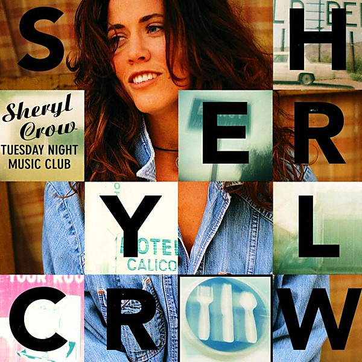

# Tuesday Night Music Club

By **Sheryl Crow**

## Album Data

- **Catalog:** Beets
- **Format:** Digital, Album
- **Album:** Tuesday Night Music Club
- **Artist:** Sheryl Crow
- **Albumartist:** Sheryl Crow
- **Genre:** Pop Rock
- **MusicBrainz Album Artist ID:** [80ccfede-c258-4575-a7ad-c982e9932e0f](https://musicbrainz.org/artist/80ccfede-c258-4575-a7ad-c982e9932e0f)
- **MusicBrainz Album ID:** [f10b4b40-4db1-4b9a-a223-06915fa06b3c](https://musicbrainz.org/release/f10b4b40-4db1-4b9a-a223-06915fa06b3c)
- **MusicBrainz Release Group ID:** [0f0ecd4f-1d20-34b9-9f67-5aaa785c7f11](https://musicbrainz.org/release-group/0f0ecd4f-1d20-34b9-9f67-5aaa785c7f11)
- **Year:** 1993
- **Catalog #:** 
- **Label:** 
- **Total Tracks:** 21

## Album Tracks

### Track 02 - First Cut is the Deepest

- **Artist:** Sheryl Crow
- **Format:** ALAC
- **Genre:** Rock
- **Length:** 3:49
- **MusicBrainz Track ID:** 
- **Title:** First Cut is the Deepest
- **Track:** 02
- **Year:** 0000

## See also

- [Sheryl Crow](Sheryl_Crow.md)
- [CD: ](../../CD/Sheryl_Crow/Sheryl_Crow.md)
- [CD: Tuesday Night Music Club](../../CD/Sheryl_Crow/Tuesday_Night_Music_Club.md)
- [Roon: Live From the Ryman And More](../../Roon/Sheryl_Crow/Live_From_the_Ryman_And_More.md)
- [Roon: Sheryl Crow](../../Roon/Sheryl_Crow/Sheryl_Crow.md)
- [Roon: The Globe Sessions](../../Roon/Sheryl_Crow/The_Globe_Sessions.md)
- [Roon: Threads](../../Roon/Sheryl_Crow/Threads.md)
- [Roon: Tuesday Night Music Club](../../Roon/Sheryl_Crow/Tuesday_Night_Music_Club.md)
