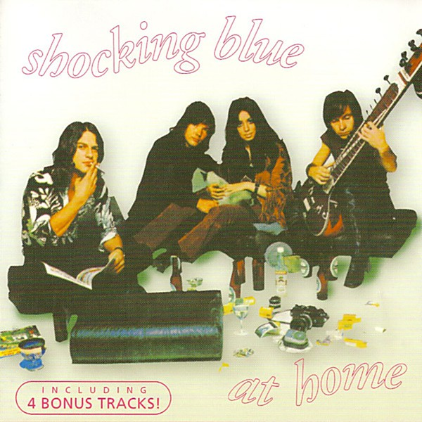

# At Home

By **Shocking Blue**

## Album Data

- **Catalog:** Beets
- **Format:** Digital, Album
- **Album:** At Home
- **Artist:** Shocking Blue
- **Albumartist:** Shocking Blue
- **Genre:** Psychedelic Rock
- **MusicBrainz Album Artist ID:** [8b399704-17f4-4001-943b-1d2b848940aa](https://musicbrainz.org/artist/8b399704-17f4-4001-943b-1d2b848940aa)
- **MusicBrainz Album ID:** [a12897b4-4a29-40e5-8eb7-6a4fed19d8f2](https://musicbrainz.org/release/a12897b4-4a29-40e5-8eb7-6a4fed19d8f2)
- **MusicBrainz Release Group ID:** [f7e9587f-774a-30f9-a749-ccf1a01889e9](https://musicbrainz.org/release-group/f7e9587f-774a-30f9-a749-ccf1a01889e9)
- **Year:** 2000
- **Catalog #:** REP 4041
- **Label:** Repertoire Records
- **Total Tracks:** 15

## Album Tracks

### Track 01 - Boll Weevil

- **Artist:** Shocking Blue
- **Format:** MP3
- **Genre:** Power Pop
- **Length:** 2:37
- **MusicBrainz Track ID:** [032a4776-e4dc-40d4-9773-0635942381d7](https://musicbrainz.org/recording/032a4776-e4dc-40d4-9773-0635942381d7)
- **Title:** Boll Weevil
- **Track:** 01
- **Year:** 2000

### Track 02 - I’ll Write Your Name Through the Fire

- **Artist:** Shocking Blue
- **Format:** MP3
- **Genre:** Psychedelic Rock
- **Length:** 2:55
- **MusicBrainz Track ID:** [589034bf-9f68-4f3b-bf2c-dcc1856e887a](https://musicbrainz.org/recording/589034bf-9f68-4f3b-bf2c-dcc1856e887a)
- **Title:** I’ll Write Your Name Through the Fire
- **Track:** 02
- **Year:** 2000

### Track 03 - Acka Raga

- **Artist:** Shocking Blue
- **Format:** MP3
- **Genre:** Raga Rock
- **Length:** 3:05
- **MusicBrainz Track ID:** [a0b57a7f-a3fd-4c61-879b-d0ef1ce4a4ea](https://musicbrainz.org/recording/a0b57a7f-a3fd-4c61-879b-d0ef1ce4a4ea)
- **Title:** Acka Raga
- **Track:** 03
- **Year:** 2000

### Track 04 - Love Machine

- **Artist:** Shocking Blue
- **Format:** MP3
- **Genre:** Psychedelic Rock
- **Length:** 3:17
- **MusicBrainz Track ID:** [af8d1dba-778c-4191-9006-36d2a9b6511f](https://musicbrainz.org/recording/af8d1dba-778c-4191-9006-36d2a9b6511f)
- **Title:** Love Machine
- **Track:** 04
- **Year:** 2000

### Track 05 - I’m a Woman

- **Artist:** Shocking Blue
- **Format:** MP3
- **Genre:** Psychedelic Rock
- **Length:** 2:59
- **MusicBrainz Track ID:** [1e391ec4-28c0-4c0d-a423-924de87bcba1](https://musicbrainz.org/recording/1e391ec4-28c0-4c0d-a423-924de87bcba1)
- **Title:** I’m a Woman
- **Track:** 05
- **Year:** 2000

### Track 06 - Venus

- **Artist:** Shocking Blue
- **Format:** MP3
- **Genre:** Psychedelic Rock
- **Length:** 3:04
- **MusicBrainz Track ID:** [3923cbe5-f1f6-4496-b602-56ab7570c905](https://musicbrainz.org/recording/3923cbe5-f1f6-4496-b602-56ab7570c905)
- **Title:** Venus
- **Track:** 06
- **Year:** 2000

### Track 07 - California Here I Come

- **Artist:** Shocking Blue
- **Format:** MP3
- **Genre:** Rock
- **Length:** 3:13
- **MusicBrainz Track ID:** [fb49c0eb-c2c1-424a-9c1f-974ec9f1379a](https://musicbrainz.org/recording/fb49c0eb-c2c1-424a-9c1f-974ec9f1379a)
- **Title:** California Here I Come
- **Track:** 07
- **Year:** 2000

### Track 08 - Poor Boy

- **Artist:** Shocking Blue
- **Format:** MP3
- **Genre:** Psychedelic Rock
- **Length:** 2:28
- **MusicBrainz Track ID:** [f6ee348f-c213-4de4-8b05-b3c340b82c3d](https://musicbrainz.org/recording/f6ee348f-c213-4de4-8b05-b3c340b82c3d)
- **Title:** Poor Boy
- **Track:** 08
- **Year:** 2000

### Track 09 - Long and Lonesome Road

- **Artist:** Shocking Blue
- **Format:** MP3
- **Genre:** Psychedelic Rock
- **Length:** 2:47
- **MusicBrainz Track ID:** [fa447c60-e06f-4ed2-a797-9158b0150b3c](https://musicbrainz.org/recording/fa447c60-e06f-4ed2-a797-9158b0150b3c)
- **Title:** Long and Lonesome Road
- **Track:** 09
- **Year:** 2000

### Track 10 - Love Buzz

- **Artist:** Shocking Blue
- **Format:** MP3
- **Genre:** Psychedelic Rock
- **Length:** 3:40
- **MusicBrainz Track ID:** [48e3dde5-8192-4284-a05a-cef3c8584cd2](https://musicbrainz.org/recording/48e3dde5-8192-4284-a05a-cef3c8584cd2)
- **Title:** Love Buzz
- **Track:** 10
- **Year:** 2000

### Track 11 - The Butterfly and I

- **Artist:** Shocking Blue
- **Format:** MP3
- **Genre:** Rock
- **Length:** 4:00
- **MusicBrainz Track ID:** [25bb7fba-a34b-4662-b341-d1a76783c944](https://musicbrainz.org/recording/25bb7fba-a34b-4662-b341-d1a76783c944)
- **Title:** The Butterfly and I
- **Track:** 11
- **Year:** 2000

### Track 12 - Harley Davidson

- **Artist:** Shocking Blue
- **Format:** MP3
- **Genre:** Rock
- **Length:** 2:38
- **MusicBrainz Track ID:** [540dda2f-e2d2-4f49-a99a-f4a5c4ee5f13](https://musicbrainz.org/recording/540dda2f-e2d2-4f49-a99a-f4a5c4ee5f13)
- **Title:** Harley Davidson
- **Track:** 12
- **Year:** 2000

### Track 13 - Fireball of Love

- **Artist:** Shocking Blue
- **Format:** MP3
- **Genre:** Psychedelic Pop
- **Length:** 2:59
- **MusicBrainz Track ID:** [aa6ae110-e769-43f0-9677-e15198a7ef4e](https://musicbrainz.org/recording/aa6ae110-e769-43f0-9677-e15198a7ef4e)
- **Title:** Fireball of Love
- **Track:** 13
- **Year:** 2000

### Track 14 - Hot Sand

- **Artist:** Shocking Blue
- **Format:** MP3
- **Genre:** Psychedelic Rock
- **Length:** 2:34
- **MusicBrainz Track ID:** [2a3e14f4-f8dc-456a-b485-2a04d8efb3aa](https://musicbrainz.org/recording/2a3e14f4-f8dc-456a-b485-2a04d8efb3aa)
- **Title:** Hot Sand
- **Track:** 14
- **Year:** 2000

### Track 15 - Wild Wind

- **Artist:** Shocking Blue
- **Format:** MP3
- **Genre:** Psychedelic Rock
- **Length:** 2:11
- **MusicBrainz Track ID:** [30427803-afc4-4af8-a3a0-c88f8e165ab5](https://musicbrainz.org/recording/30427803-afc4-4af8-a3a0-c88f8e165ab5)
- **Title:** Wild Wind
- **Track:** 15
- **Year:** 2000

## See also

- [Roon: At Home](../../Roon/Shocking_Blue/At_Home.md)
- [Vinyl: At Home](../../Vinyl/Shocking_Blue/At_Home.md)
- [Vinyl: ](../../Vinyl/Shocking_Blue/Shocking_Blue.md)
