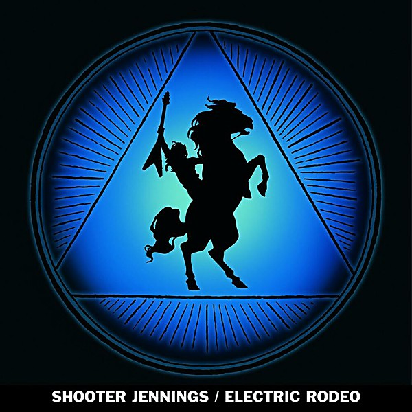

# Electric Rodeo

By **Shooter Jennings**

## Album Data

- **Catalog:** Beets
- **Format:** Digital, Album
- **Album:** Electric Rodeo
- **Artist:** Shooter Jennings
- **Albumartist:** Shooter Jennings
- **Genre:** Southern Rock
- **MusicBrainz Album Artist ID:** 
- **MusicBrainz Album ID:** 
- **MusicBrainz Release Group ID:** 
- **Year:** 0000
- **Catalog #:** 
- **Label:** 
- **Total Tracks:** 00

## Album Tracks

### Track 00 - 01-Electric Rodeo

- **Artist:** Shooter Jennings
- **Format:** ALAC
- **Genre:** Southern Rock
- **Length:** 4:33
- **MusicBrainz Track ID:** 
- **Title:** 01-Electric Rodeo
- **Track:** 00
- **Year:** 0000

### Track 00 - 02-Gone to Carolina

- **Artist:** Shooter Jennings
- **Format:** ALAC
- **Genre:** Southern Rock
- **Length:** 4:06
- **MusicBrainz Track ID:** 
- **Title:** 02-Gone to Carolina
- **Track:** 00
- **Year:** 0000

### Track 00 - 03-Some Rowdy Women

- **Artist:** Shooter Jennings
- **Format:** ALAC
- **Genre:** Southern Rock
- **Length:** 3:13
- **MusicBrainz Track ID:** 
- **Title:** 03-Some Rowdy Women
- **Track:** 00
- **Year:** 0000

### Track 00 - 04-The Song Is Still Slipping Away

- **Artist:** Shooter Jennings
- **Format:** ALAC
- **Genre:** Southern Rock
- **Length:** 3:09
- **MusicBrainz Track ID:** 
- **Title:** 04-The Song Is Still Slipping Away
- **Track:** 00
- **Year:** 0000

### Track 00 - 05-Hair of the Dog

- **Artist:** Shooter Jennings
- **Format:** ALAC
- **Genre:** Southern Rock
- **Length:** 4:01
- **MusicBrainz Track ID:** 
- **Title:** 05-Hair of the Dog
- **Track:** 00
- **Year:** 0000

### Track 00 - 06-Little White Lines

- **Artist:** Shooter Jennings
- **Format:** ALAC
- **Genre:** Southern Rock
- **Length:** 5:29
- **MusicBrainz Track ID:** 
- **Title:** 06-Little White Lines
- **Track:** 00
- **Year:** 0000

### Track 00 - 07-Alligator Chomp (The Ballad of Dr. Martin Luther Frog a s Told To Tony

- **Artist:** Shooter Jennings
- **Format:** ALAC
- **Genre:** Southern Rock
- **Length:** 3:10
- **MusicBrainz Track ID:** 
- **Title:** 07-Alligator Chomp (The Ballad of Dr. Martin Luther Frog a s Told To Tony
- **Track:** 00
- **Year:** 0000

### Track 00 - 08-Manifesto No. 2

- **Artist:** Shooter Jennings
- **Format:** ALAC
- **Genre:** Southern Rock
- **Length:** 2:09
- **MusicBrainz Track ID:** 
- **Title:** 08-Manifesto No. 2
- **Track:** 00
- **Year:** 0000

### Track 00 - 09-Aviators

- **Artist:** Shooter Jennings
- **Format:** ALAC
- **Genre:** Southern Rock
- **Length:** 3:23
- **MusicBrainz Track ID:** 
- **Title:** 09-Aviators
- **Track:** 00
- **Year:** 0000

### Track 00 - 10-Bad Magick

- **Artist:** Shooter Jennings
- **Format:** ALAC
- **Genre:** Southern Rock
- **Length:** 5:12
- **MusicBrainz Track ID:** 
- **Title:** 10-Bad Magick
- **Track:** 00
- **Year:** 0000

### Track 00 - 11-It Ain't Easy

- **Artist:** Shooter Jennings
- **Format:** ALAC
- **Genre:** Southern Rock
- **Length:** 3:05
- **MusicBrainz Track ID:** 
- **Title:** 11-It Ain't Easy
- **Track:** 00
- **Year:** 0000

### Track 01 - Electric Rodeo

- **Artist:** Shooter Jennings
- **Format:** ALAC
- **Genre:** Southern Rock
- **Length:** 4:33
- **MusicBrainz Track ID:** 
- **Title:** Electric Rodeo
- **Track:** 01
- **Year:** 2006

### Track 02 - Gone To Carolina

- **Artist:** Shooter Jennings
- **Format:** ALAC
- **Genre:** Southern Rock
- **Length:** 4:06
- **MusicBrainz Track ID:** 
- **Title:** Gone To Carolina
- **Track:** 02
- **Year:** 2006

### Track 03 - Some Rowdy Women

- **Artist:** Shooter Jennings
- **Format:** ALAC
- **Genre:** Southern Rock
- **Length:** 3:13
- **MusicBrainz Track ID:** 
- **Title:** Some Rowdy Women
- **Track:** 03
- **Year:** 2006

### Track 04 - The Song Is Still Slipping Away

- **Artist:** Shooter Jennings
- **Format:** ALAC
- **Genre:** Alternative Country
- **Length:** 3:09
- **MusicBrainz Track ID:** 
- **Title:** The Song Is Still Slipping Away
- **Track:** 04
- **Year:** 2006

### Track 05 - Hair Of The Dog

- **Artist:** Shooter Jennings
- **Format:** ALAC
- **Genre:** Outlaw Country
- **Length:** 4:01
- **MusicBrainz Track ID:** 
- **Title:** Hair Of The Dog
- **Track:** 05
- **Year:** 2006

### Track 06 - Little White Lines

- **Artist:** Shooter Jennings
- **Format:** ALAC
- **Genre:** Southern Rock
- **Length:** 5:29
- **MusicBrainz Track ID:** 
- **Title:** Little White Lines
- **Track:** 06
- **Year:** 2006

### Track 07 - Alligator Chomp (The Ballad Of Dr. Martin Luther Frog Jr.)

- **Artist:** Shooter Jennings
- **Format:** ALAC
- **Genre:** Southern Rock
- **Length:** 3:10
- **MusicBrainz Track ID:** 
- **Title:** Alligator Chomp (The Ballad Of Dr. Martin Luther Frog Jr.)
- **Track:** 07
- **Year:** 2006

### Track 08 - Manifesto No. 2

- **Artist:** Shooter Jennings
- **Format:** ALAC
- **Genre:** Southern Rock
- **Length:** 2:09
- **MusicBrainz Track ID:** 
- **Title:** Manifesto No. 2
- **Track:** 08
- **Year:** 2006

### Track 09 - Aviators

- **Artist:** Shooter Jennings
- **Format:** ALAC
- **Genre:** Southern Rock
- **Length:** 3:23
- **MusicBrainz Track ID:** 
- **Title:** Aviators
- **Track:** 09
- **Year:** 2006

### Track 10 - Bad Magick

- **Artist:** Shooter Jennings
- **Format:** ALAC
- **Genre:** Southern Rock
- **Length:** 5:12
- **MusicBrainz Track ID:** 
- **Title:** Bad Magick
- **Track:** 10
- **Year:** 2006

### Track 11 - It Ain't Easy

- **Artist:** Shooter Jennings
- **Format:** ALAC
- **Genre:** Outlaw Country
- **Length:** 3:05
- **MusicBrainz Track ID:** 
- **Title:** It Ain't Easy
- **Track:** 11
- **Year:** 2006

## See also

- [Put the O Back in Country](Put_the_O_Back_in_Country.md)
