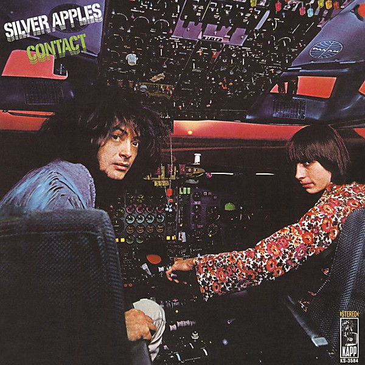

# Contact

By **Silver Apples**

## Album Data

- **Catalog:** Beets
- **Format:** Digital, Album
- **Album:** Contact
- **Artist:** Silver Apples
- **Albumartist:** Silver Apples
- **Genre:** No Wave
- **MusicBrainz Album Artist ID:** [802d971d-5fb1-4ca1-8e56-69c64122d957](https://musicbrainz.org/artist/802d971d-5fb1-4ca1-8e56-69c64122d957)
- **MusicBrainz Album ID:** [de964d10-4b90-4f71-9983-1109e5b15d11](https://musicbrainz.org/release/de964d10-4b90-4f71-9983-1109e5b15d11)
- **MusicBrainz Release Group ID:** [10c10d05-2cae-36ca-be85-4b607b84269f](https://musicbrainz.org/release-group/10c10d05-2cae-36ca-be85-4b607b84269f)
- **Year:** 2007
- **Catalog #:** ASHCD3303
- **Label:** Phoenix Records
- **Total Tracks:** 09

## Album Tracks

### Track 01 - Oscillations

- **Artist:** Silver Apples
- **Format:** ALAC
- **Genre:** Krautrock
- **Length:** 2:49
- **MusicBrainz Track ID:** [01e96a24-e109-4baf-98f5-afc7dd3eafc3](https://musicbrainz.org/recording/01e96a24-e109-4baf-98f5-afc7dd3eafc3)
- **Title:** Oscillations
- **Track:** 01
- **Year:** 2007

### Track 02 - Seagreen Serenades

- **Artist:** Silver Apples
- **Format:** ALAC
- **Genre:** Psychedelic Rock
- **Length:** 2:55
- **MusicBrainz Track ID:** [78a047d1-1823-4ba3-882f-44c031451051](https://musicbrainz.org/recording/78a047d1-1823-4ba3-882f-44c031451051)
- **Title:** Seagreen Serenades
- **Track:** 02
- **Year:** 2007

### Track 03 - Lovefingers

- **Artist:** Silver Apples
- **Format:** ALAC
- **Genre:** Psychedelic Rock
- **Length:** 4:11
- **MusicBrainz Track ID:** [3c7be70c-0c93-4ec1-a1cc-a55c70d0b175](https://musicbrainz.org/recording/3c7be70c-0c93-4ec1-a1cc-a55c70d0b175)
- **Title:** Lovefingers
- **Track:** 03
- **Year:** 2007

### Track 04 - Program

- **Artist:** Silver Apples
- **Format:** ALAC
- **Genre:** Space Rock
- **Length:** 4:07
- **MusicBrainz Track ID:** [6d66f31c-0d5f-4542-8e0c-fc28365ab7b1](https://musicbrainz.org/recording/6d66f31c-0d5f-4542-8e0c-fc28365ab7b1)
- **Title:** Program
- **Track:** 04
- **Year:** 2007

### Track 05 - Velvet Cave

- **Artist:** Silver Apples
- **Format:** ALAC
- **Genre:** Krautrock
- **Length:** 3:30
- **MusicBrainz Track ID:** [aca2bcc3-63a5-4de8-ae7f-0c5b1d71ace1](https://musicbrainz.org/recording/aca2bcc3-63a5-4de8-ae7f-0c5b1d71ace1)
- **Title:** Velvet Cave
- **Track:** 05
- **Year:** 2007

### Track 06 - Whirly-Bird

- **Artist:** Silver Apples
- **Format:** ALAC
- **Genre:** Krautrock
- **Length:** 2:41
- **MusicBrainz Track ID:** [f6341ee5-8929-42c1-a048-8bf4d83c5ae4](https://musicbrainz.org/recording/f6341ee5-8929-42c1-a048-8bf4d83c5ae4)
- **Title:** Whirly-Bird
- **Track:** 06
- **Year:** 2007

### Track 07 - Dust

- **Artist:** Silver Apples
- **Format:** ALAC
- **Genre:** Krautrock
- **Length:** 3:40
- **MusicBrainz Track ID:** [056d8f52-b82f-41ba-bcf3-168c4cfa6059](https://musicbrainz.org/recording/056d8f52-b82f-41ba-bcf3-168c4cfa6059)
- **Title:** Dust
- **Track:** 07
- **Year:** 2007

### Track 08 - Dancing Gods

- **Artist:** Silver Apples
- **Format:** ALAC
- **Genre:** Punk Rock
- **Length:** 5:57
- **MusicBrainz Track ID:** [51aa535c-7cbc-48df-99d3-06188fcf8ae0](https://musicbrainz.org/recording/51aa535c-7cbc-48df-99d3-06188fcf8ae0)
- **Title:** Dancing Gods
- **Track:** 08
- **Year:** 2007

### Track 09 - Misty Mountain

- **Artist:** Silver Apples
- **Format:** ALAC
- **Genre:** Krautrock
- **Length:** 2:46
- **MusicBrainz Track ID:** [6ba1d3a4-fd2a-42aa-9eae-4f62ae0d80b9](https://musicbrainz.org/recording/6ba1d3a4-fd2a-42aa-9eae-4f62ae0d80b9)
- **Title:** Misty Mountain
- **Track:** 09
- **Year:** 2007

## See also

- [Silver Apples](Silver_Apples.md)
- [CD: ](../../CD/Silver_Apples/Silver_Apples_index.md)
- [CD: Silver Apples](../../CD/Silver_Apples/Silver_Apples.md)
- [Roon: Contact](../../Roon/Silver_Apples/Contact.md)
- [Roon: Silver Apples](../../Roon/Silver_Apples/Silver_Apples.md)
- [Vinyl: ](../../Vinyl/Silver_Apples/Silver_Apples_index.md)
- [Vinyl: Silver Apples](../../Vinyl/Silver_Apples/Silver_Apples.md)
