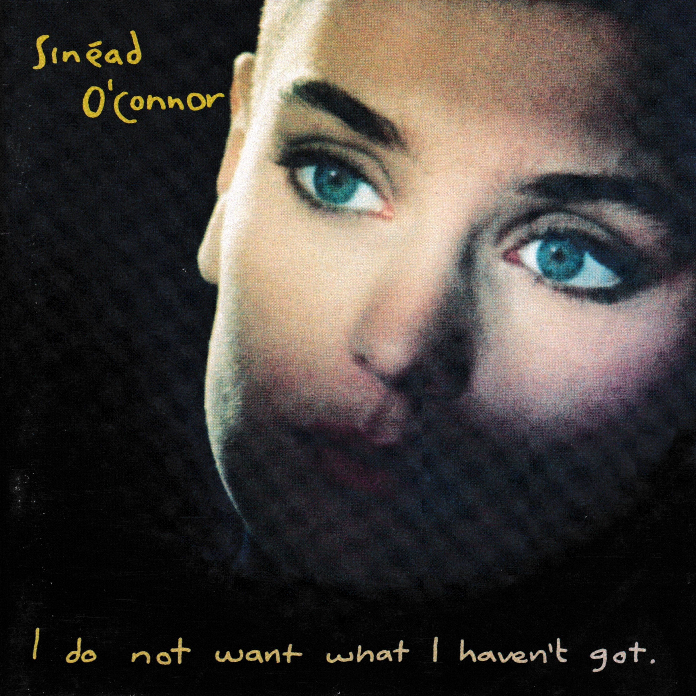

# I Do Not Want What I Haven’t Got

By **Sinéad O’Connor**

## Album Data

- **Catalog:** Beets
- **Format:** Digital, Album
- **Album:** I Do Not Want What I Haven’t Got
- **Artist:** Sinéad O’connor
- **Albumartist:** Sinéad O’Connor
- **Genre:** Rock
- **MusicBrainz Album Artist ID:** [c78a77fa-507c-4c07-947a-0355029453bd](https://musicbrainz.org/artist/c78a77fa-507c-4c07-947a-0355029453bd)
- **MusicBrainz Album ID:** [92f17814-57bb-4c9b-8948-fee1f0677472](https://musicbrainz.org/release/92f17814-57bb-4c9b-8948-fee1f0677472)
- **MusicBrainz Release Group ID:** [9747bcfe-7c42-35ac-8c3e-7ecac9f1227b](https://musicbrainz.org/release-group/9747bcfe-7c42-35ac-8c3e-7ecac9f1227b)
- **Year:** 1990
- **Catalog #:** F2 21759
- **Label:** Ensign
- **Total Tracks:** 10

## Album Tracks

### Track 01 - Feel So Different

- **Artist:** Sinéad O’Connor
- **Format:** MP3
- **Genre:** Alternative Rock
- **Length:** 6:46
- **MusicBrainz Track ID:** [dc5531eb-d59f-48ce-8346-e99cc664c0fb](https://musicbrainz.org/recording/dc5531eb-d59f-48ce-8346-e99cc664c0fb)
- **Title:** Feel So Different
- **Track:** 01
- **Year:** 1990

### Track 02 - I Am Stretched on Your Grave

- **Artist:** Sinéad O’Connor
- **Format:** MP3
- **Genre:** Alternative Rock
- **Length:** 5:33
- **MusicBrainz Track ID:** [cb21fcfc-e981-46eb-88e9-d0264c467cf7](https://musicbrainz.org/recording/cb21fcfc-e981-46eb-88e9-d0264c467cf7)
- **Title:** I Am Stretched on Your Grave
- **Track:** 02
- **Year:** 1990

### Track 03 - Three Babies

- **Artist:** Sinéad O’Connor
- **Format:** MP3
- **Genre:** Rock
- **Length:** 4:46
- **MusicBrainz Track ID:** [554fe8dc-f2e0-4aaf-8f32-a63cab47d797](https://musicbrainz.org/recording/554fe8dc-f2e0-4aaf-8f32-a63cab47d797)
- **Title:** Three Babies
- **Track:** 03
- **Year:** 1990

### Track 04 - The Emperor’s New Clothes

- **Artist:** Sinéad O’Connor
- **Format:** MP3
- **Genre:** Rock
- **Length:** 5:15
- **MusicBrainz Track ID:** [2c5d41b5-3852-4d5e-a6b3-1438c5538d1a](https://musicbrainz.org/recording/2c5d41b5-3852-4d5e-a6b3-1438c5538d1a)
- **Title:** The Emperor’s New Clothes
- **Track:** 04
- **Year:** 1990

### Track 05 - Black Boys on Mopeds

- **Artist:** Sinéad O’Connor
- **Format:** MP3
- **Genre:** Rock
- **Length:** 3:52
- **MusicBrainz Track ID:** [39b23454-0f37-4039-a2c9-64a99c41771a](https://musicbrainz.org/recording/39b23454-0f37-4039-a2c9-64a99c41771a)
- **Title:** Black Boys on Mopeds
- **Track:** 05
- **Year:** 1990

### Track 06 - Nothing Compares 2 U

- **Artist:** Sinéad O’Connor
- **Format:** MP3
- **Genre:** Rock
- **Length:** 5:10
- **MusicBrainz Track ID:** [14c099d1-a8a4-4625-ac5c-7d245af4059f](https://musicbrainz.org/recording/14c099d1-a8a4-4625-ac5c-7d245af4059f)
- **Title:** Nothing Compares 2 U
- **Track:** 06
- **Year:** 1990

### Track 07 - Jump in the River

- **Artist:** Sinéad O’Connor
- **Format:** MP3
- **Genre:** Alternative Rock
- **Length:** 4:12
- **MusicBrainz Track ID:** [4fec419c-1980-4a3e-8b15-6c9b957e1051](https://musicbrainz.org/recording/4fec419c-1980-4a3e-8b15-6c9b957e1051)
- **Title:** Jump in the River
- **Track:** 07
- **Year:** 1990

### Track 08 - You Cause as Much Sorrow

- **Artist:** Sinéad O’Connor
- **Format:** MP3
- **Genre:** Alternative Rock
- **Length:** 5:04
- **MusicBrainz Track ID:** [b4c5ff89-8c86-473d-8587-fd2af4389f58](https://musicbrainz.org/recording/b4c5ff89-8c86-473d-8587-fd2af4389f58)
- **Title:** You Cause as Much Sorrow
- **Track:** 08
- **Year:** 1990

### Track 09 - The Last Day of Our Acquaintance

- **Artist:** Sinéad O’Connor
- **Format:** MP3
- **Genre:** Alternative Rock
- **Length:** 4:40
- **MusicBrainz Track ID:** [664bba54-4f22-412f-8514-e56039fd3d0a](https://musicbrainz.org/recording/664bba54-4f22-412f-8514-e56039fd3d0a)
- **Title:** The Last Day of Our Acquaintance
- **Track:** 09
- **Year:** 1990

### Track 10 - I Do Not Want What I Haven’t Got

- **Artist:** Sinéad O’Connor
- **Format:** MP3
- **Genre:** Rock
- **Length:** 5:44
- **MusicBrainz Track ID:** [d0ea351d-5ec7-4489-81a8-1b61d02df380](https://musicbrainz.org/recording/d0ea351d-5ec7-4489-81a8-1b61d02df380)
- **Title:** I Do Not Want What I Haven’t Got
- **Track:** 10
- **Year:** 1990

