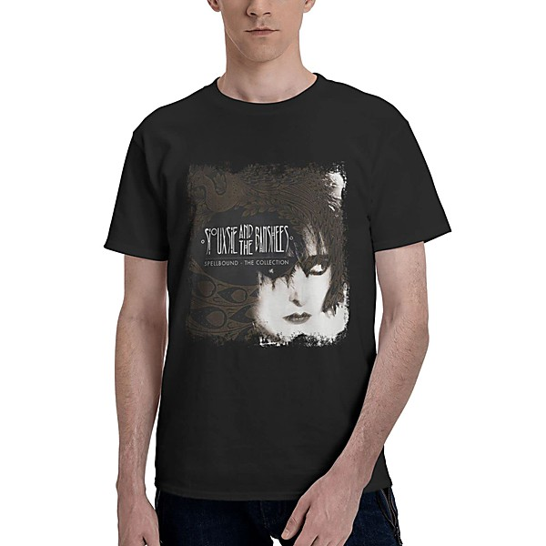

# Spellbound

By **Siouxsie and the Banshees**

## Album Data

- **Catalog:** Beets
- **Format:** Digital, Album
- **Album:** Spellbound
- **Artist:** Siouxsie And The Banshees
- **Albumartist:** Siouxsie and the Banshees
- **Genre:** Gothic Rock
- **MusicBrainz Album Artist ID:** [78ea5ea1-3c4d-4b7e-ac5d-68900319ebe2](https://musicbrainz.org/artist/78ea5ea1-3c4d-4b7e-ac5d-68900319ebe2)
- **MusicBrainz Album ID:** [f65eb635-bbe3-40b5-9d34-1af7af1b1cd2](https://musicbrainz.org/release/f65eb635-bbe3-40b5-9d34-1af7af1b1cd2)
- **MusicBrainz Release Group ID:** [db4e5934-6f77-4000-b133-e77c3431bcb6](https://musicbrainz.org/release-group/db4e5934-6f77-4000-b133-e77c3431bcb6)
- **Year:** 2015
- **Catalog #:** SPEC2199
- **Label:** Spectrum Music
- **Total Tracks:** 18

## Album Tracks

### Track 01 - Hong Kong Garden

- **Artist:** Siouxsie and the Banshees
- **Format:** ALAC
- **Genre:** Gothic Rock
- **Length:** 3:13
- **MusicBrainz Track ID:** [58f7dd0a-bacd-4c9f-b4ab-00671ea73214](https://musicbrainz.org/recording/58f7dd0a-bacd-4c9f-b4ab-00671ea73214)
- **Title:** Hong Kong Garden
- **Track:** 01
- **Year:** 2015

### Track 02 - Mirage

- **Artist:** Siouxsie and the Banshees
- **Format:** ALAC
- **Genre:** Gothic Rock
- **Length:** 2:49
- **MusicBrainz Track ID:** [21ed615e-7cf7-41d2-9b13-e16fd370c41b](https://musicbrainz.org/recording/21ed615e-7cf7-41d2-9b13-e16fd370c41b)
- **Title:** Mirage
- **Track:** 02
- **Year:** 2015

### Track 03 - Placebo Effect

- **Artist:** Siouxsie and the Banshees
- **Format:** ALAC
- **Genre:** Gothic Rock
- **Length:** 4:37
- **MusicBrainz Track ID:** [756656cd-7e10-45e6-ad42-70ff6c664f6a](https://musicbrainz.org/recording/756656cd-7e10-45e6-ad42-70ff6c664f6a)
- **Title:** Placebo Effect
- **Track:** 03
- **Year:** 2015

### Track 04 - Happy House

- **Artist:** Siouxsie and the Banshees
- **Format:** ALAC
- **Genre:** Gothic Rock
- **Length:** 3:52
- **MusicBrainz Track ID:** [4c60831c-398c-4640-b4d2-55227a8468f8](https://musicbrainz.org/recording/4c60831c-398c-4640-b4d2-55227a8468f8)
- **Title:** Happy House
- **Track:** 04
- **Year:** 2015

### Track 05 - Desert Kisses

- **Artist:** Siouxsie and the Banshees
- **Format:** ALAC
- **Genre:** Gothic Rock
- **Length:** 4:16
- **MusicBrainz Track ID:** [8a896fb8-dd39-49bd-849f-e4b453c235cf](https://musicbrainz.org/recording/8a896fb8-dd39-49bd-849f-e4b453c235cf)
- **Title:** Desert Kisses
- **Track:** 05
- **Year:** 2015

### Track 06 - Spellbound

- **Artist:** Siouxsie and the Banshees
- **Format:** ALAC
- **Genre:** Gothic Rock
- **Length:** 3:17
- **MusicBrainz Track ID:** [a435aa59-93ca-4e4d-9604-b4132f50d4b2](https://musicbrainz.org/recording/a435aa59-93ca-4e4d-9604-b4132f50d4b2)
- **Title:** Spellbound
- **Track:** 06
- **Year:** 2015

### Track 07 - Into the Light

- **Artist:** Siouxsie and the Banshees
- **Format:** ALAC
- **Genre:** Gothic Rock
- **Length:** 4:15
- **MusicBrainz Track ID:** [b6bd2827-0c45-428f-9622-87695a0af021](https://musicbrainz.org/recording/b6bd2827-0c45-428f-9622-87695a0af021)
- **Title:** Into the Light
- **Track:** 07
- **Year:** 2015

### Track 08 - Cascade

- **Artist:** Siouxsie and the Banshees
- **Format:** ALAC
- **Genre:** Gothic Rock
- **Length:** 4:25
- **MusicBrainz Track ID:** [60040cd2-b1c6-4614-97cf-2825db01c2ba](https://musicbrainz.org/recording/60040cd2-b1c6-4614-97cf-2825db01c2ba)
- **Title:** Cascade
- **Track:** 08
- **Year:** 2015

### Track 09 - Tattoo

- **Artist:** Siouxsie and the Banshees
- **Format:** ALAC
- **Genre:** Post-Punk
- **Length:** 3:29
- **MusicBrainz Track ID:** [23d83e37-cc09-4a1c-9fc3-e56f2f92b0f1](https://musicbrainz.org/recording/23d83e37-cc09-4a1c-9fc3-e56f2f92b0f1)
- **Title:** Tattoo
- **Track:** 09
- **Year:** 2015

### Track 10 - We Hunger

- **Artist:** Siouxsie and the Banshees
- **Format:** ALAC
- **Genre:** Gothic Rock
- **Length:** 3:31
- **MusicBrainz Track ID:** [7afb3d86-bef0-44f4-a83c-fba260d515c8](https://musicbrainz.org/recording/7afb3d86-bef0-44f4-a83c-fba260d515c8)
- **Title:** We Hunger
- **Track:** 10
- **Year:** 2015

### Track 11 - Cities in Dust

- **Artist:** Siouxsie and the Banshees
- **Format:** ALAC
- **Genre:** Gothic Rock
- **Length:** 4:08
- **MusicBrainz Track ID:** [27c5dfec-8063-4d38-99ac-292431272324](https://musicbrainz.org/recording/27c5dfec-8063-4d38-99ac-292431272324)
- **Title:** Cities in Dust
- **Track:** 11
- **Year:** 2015

### Track 12 - Lands End

- **Artist:** Siouxsie and the Banshees
- **Format:** ALAC
- **Genre:** Neo-Psychedelia
- **Length:** 6:13
- **MusicBrainz Track ID:** [91232fe7-c2d7-4fd2-b778-a212cfbb26c9](https://musicbrainz.org/recording/91232fe7-c2d7-4fd2-b778-a212cfbb26c9)
- **Title:** Lands End
- **Track:** 12
- **Year:** 2015

### Track 13 - Shooting Sun

- **Artist:** Siouxsie and the Banshees
- **Format:** ALAC
- **Genre:** Gothic Rock
- **Length:** 4:44
- **MusicBrainz Track ID:** [553eb930-88c0-4315-8bfb-a79c0e5b4b2e](https://musicbrainz.org/recording/553eb930-88c0-4315-8bfb-a79c0e5b4b2e)
- **Title:** Shooting Sun
- **Track:** 13
- **Year:** 2015

### Track 14 - Peek‐a‐Boo

- **Artist:** Siouxsie and the Banshees
- **Format:** ALAC
- **Genre:** Gothic Rock
- **Length:** 3:12
- **MusicBrainz Track ID:** [bf388b5f-e7e2-45bb-9eb3-37bcbc1be9bf](https://musicbrainz.org/recording/bf388b5f-e7e2-45bb-9eb3-37bcbc1be9bf)
- **Title:** Peek‐a‐Boo
- **Track:** 14
- **Year:** 2015

### Track 15 - Turn to Stone

- **Artist:** Siouxsie and the Banshees
- **Format:** ALAC
- **Genre:** Gothic Rock
- **Length:** 4:07
- **MusicBrainz Track ID:** [31a26394-604e-4bcf-b8aa-a53b2b093c3d](https://musicbrainz.org/recording/31a26394-604e-4bcf-b8aa-a53b2b093c3d)
- **Title:** Turn to Stone
- **Track:** 15
- **Year:** 2015

### Track 16 - Kiss Them for Me

- **Artist:** Siouxsie and the Banshees
- **Format:** ALAC
- **Genre:** Gothic Rock
- **Length:** 4:37
- **MusicBrainz Track ID:** [7bf391e3-1ba4-41f1-a7e7-03f08a8a89d0](https://musicbrainz.org/recording/7bf391e3-1ba4-41f1-a7e7-03f08a8a89d0)
- **Title:** Kiss Them for Me
- **Track:** 16
- **Year:** 2015

### Track 17 - Drifter

- **Artist:** Siouxsie and the Banshees
- **Format:** ALAC
- **Genre:** Gothic Rock
- **Length:** 4:45
- **MusicBrainz Track ID:** [2addba8a-4910-4312-a38c-22abf7c9432f](https://musicbrainz.org/recording/2addba8a-4910-4312-a38c-22abf7c9432f)
- **Title:** Drifter
- **Track:** 17
- **Year:** 2015

### Track 18 - Not Forgotten

- **Artist:** Siouxsie and the Banshees
- **Format:** ALAC
- **Genre:** Gothic Rock
- **Length:** 4:43
- **MusicBrainz Track ID:** [c9bbb3da-e90b-4e8a-a87e-2ca6cf78adbf](https://musicbrainz.org/recording/c9bbb3da-e90b-4e8a-a87e-2ca6cf78adbf)
- **Title:** Not Forgotten
- **Track:** 18
- **Year:** 2015

