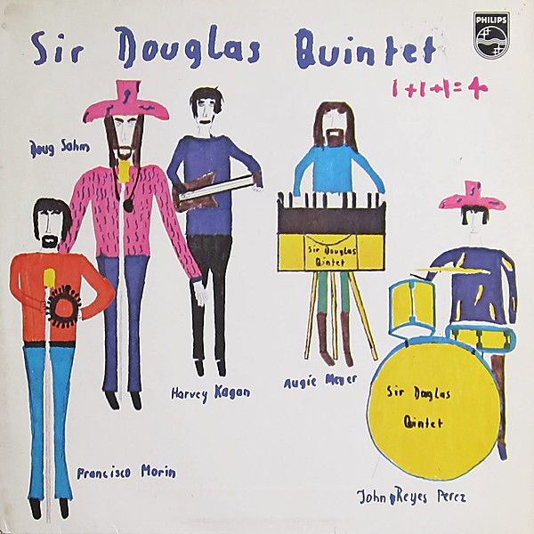

# 1+1+1=4

By Sir Douglas Quintet

## Album Data

- Catalog: Beets
- Format: Digital, Album
- Album: 1+1+1=4
- Artist: Sir Douglas Quintet
- Albumartist: Sir Douglas Quintet
- Genre: Tejano
- MusicBrainz Album Artist ID: b2b3eed6-d9b2-4d1a-bf9b-0160e401720e
- MusicBrainz Album ID: ceaf79e4-d302-4c02-ac79-e6cc75ca3d48
- MusicBrainz Release Group ID: 6b9261bb-5c7b-48c5-a4a4-270d65d66139
- Year: 1970

