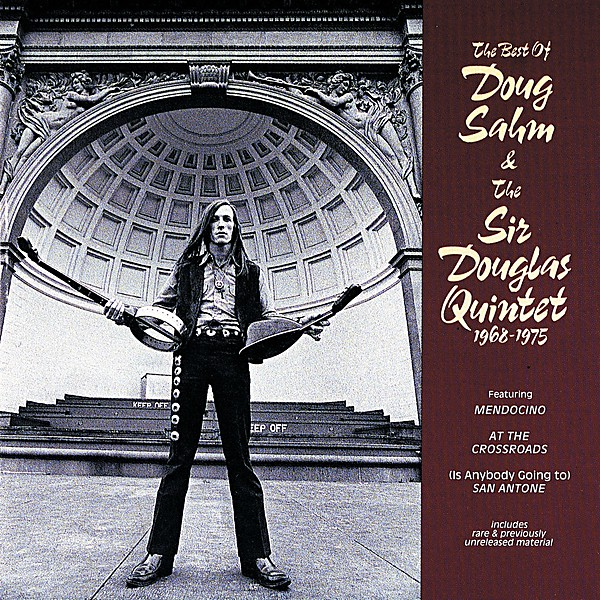

# The Best of Doug Sahm & the Sir Douglas Quintet 1968-1975

By **Sir Douglas Quintet**

## Album Data

- **Catalog:** Beets
- **Format:** Digital, Album
- **Album:** The Best of Doug Sahm & the Sir Douglas Quintet 1968-1975
- **Artist:** Sir Douglas Quintet
- **Albumartist:** Sir Douglas Quintet
- **Genre:** Tejano
- **MusicBrainz Album Artist ID:** [b2b3eed6-d9b2-4d1a-bf9b-0160e401720e](https://musicbrainz.org/artist/b2b3eed6-d9b2-4d1a-bf9b-0160e401720e)
- **MusicBrainz Album ID:** [1fa917dc-b0d4-424e-ac5c-0f3a5422bc52](https://musicbrainz.org/release/1fa917dc-b0d4-424e-ac5c-0f3a5422bc52)
- **MusicBrainz Release Group ID:** [fbeee947-be8a-3017-b7cd-f79e8265345c](https://musicbrainz.org/release-group/fbeee947-be8a-3017-b7cd-f79e8265345c)
- **Year:** 1990
- **Catalog #:** 846 586-2
- **Label:** Mercury Records
- **Total Tracks:** 22

## Album Tracks

### Track 01 - Mendocino

- **Artist:** Sir Douglas Quintet
- **Format:** MP3
- **Genre:** Country Rock
- **Length:** 2:38
- **MusicBrainz Track ID:** [645e673e-2431-436f-bebc-ac32ce32e2a3](https://musicbrainz.org/recording/645e673e-2431-436f-bebc-ac32ce32e2a3)
- **Title:** Mendocino
- **Track:** 01
- **Year:** 1990

### Track 02 - Sunday Sunny Mill Valley Groove Day

- **Artist:** Sir Douglas Quintet
- **Format:** MP3
- **Genre:** Tejano
- **Length:** 3:26
- **MusicBrainz Track ID:** [8232c961-dd9f-472d-bd82-f0327e69cb61](https://musicbrainz.org/recording/8232c961-dd9f-472d-bd82-f0327e69cb61)
- **Title:** Sunday Sunny Mill Valley Groove Day
- **Track:** 02
- **Year:** 1990

### Track 03 - I'm Glad for Your Sake (But I'm Sorry for Mine)

- **Artist:** Sir Douglas Quintet
- **Format:** MP3
- **Genre:** Rock
- **Length:** 3:39
- **MusicBrainz Track ID:** [d28c4d62-5ee4-4bd6-85ab-91f0a7d1bc9a](https://musicbrainz.org/recording/d28c4d62-5ee4-4bd6-85ab-91f0a7d1bc9a)
- **Title:** I'm Glad for Your Sake (But I'm Sorry for Mine)
- **Track:** 03
- **Year:** 1990

### Track 04 - Texas Me

- **Artist:** Sir Douglas Quintet
- **Format:** MP3
- **Genre:** Country
- **Length:** 2:36
- **MusicBrainz Track ID:** [29756c42-7db2-4ed1-9334-1c01ffb9f057](https://musicbrainz.org/recording/29756c42-7db2-4ed1-9334-1c01ffb9f057)
- **Title:** Texas Me
- **Track:** 04
- **Year:** 1990

### Track 05 - You Never Get Too Big and You Sure Don't Get Too Heavy That You Don't Have to Stop and Pay Dues...

- **Artist:** Sir Douglas Quintet
- **Format:** MP3
- **Genre:** Tejano
- **Length:** 3:17
- **MusicBrainz Track ID:** [2f81f11b-5ff9-4aab-91b7-78f1fb254d4a](https://musicbrainz.org/recording/2f81f11b-5ff9-4aab-91b7-78f1fb254d4a)
- **Title:** You Never Get Too Big and You Sure Don't Get Too Heavy That You Don't Have to Stop and Pay Dues...
- **Track:** 05
- **Year:** 1990

### Track 06 - Song of Everything

- **Artist:** Sir Douglas Quintet
- **Format:** MP3
- **Genre:** Tejano
- **Length:** 4:05
- **MusicBrainz Track ID:** [07a11a6b-85b2-418b-ac99-5ca531cb90c9](https://musicbrainz.org/recording/07a11a6b-85b2-418b-ac99-5ca531cb90c9)
- **Title:** Song of Everything
- **Track:** 06
- **Year:** 1990

### Track 07 - Catch the Man on the Rise

- **Artist:** Sir Douglas Quintet
- **Format:** MP3
- **Genre:** Tejano
- **Length:** 2:20
- **MusicBrainz Track ID:** [115d9a4d-fd7e-4d79-b680-5ef27235c752](https://musicbrainz.org/recording/115d9a4d-fd7e-4d79-b680-5ef27235c752)
- **Title:** Catch the Man on the Rise
- **Track:** 07
- **Year:** 1990

### Track 08 - At the Crossroads

- **Artist:** Sir Douglas Quintet
- **Format:** MP3
- **Genre:** Soul
- **Length:** 4:37
- **MusicBrainz Track ID:** [0525048a-89bc-4ecc-8a5f-654ffe3b2fe7](https://musicbrainz.org/recording/0525048a-89bc-4ecc-8a5f-654ffe3b2fe7)
- **Title:** At the Crossroads
- **Track:** 08
- **Year:** 1990

### Track 09 - In the Dark

- **Artist:** Sir Douglas Quintet
- **Format:** MP3
- **Genre:** Tejano
- **Length:** 3:00
- **MusicBrainz Track ID:** [0dd66330-bc19-4e64-a497-1c2321165f87](https://musicbrainz.org/recording/0dd66330-bc19-4e64-a497-1c2321165f87)
- **Title:** In the Dark
- **Track:** 09
- **Year:** 1990

### Track 10 - Nuevo Laredo

- **Artist:** Sir Douglas Quintet
- **Format:** MP3
- **Genre:** Pop
- **Length:** 2:42
- **MusicBrainz Track ID:** [5ae0cf91-bdb9-49bd-b1f6-0bdab49dea86](https://musicbrainz.org/recording/5ae0cf91-bdb9-49bd-b1f6-0bdab49dea86)
- **Title:** Nuevo Laredo
- **Track:** 10
- **Year:** 1990

### Track 11 - I Wanna Be Your Mama Again

- **Artist:** Sir Douglas Quintet
- **Format:** MP3
- **Genre:** Blue-Eyed Soul
- **Length:** 2:20
- **MusicBrainz Track ID:** [7eb34cdc-8fab-4f03-b4c3-e7c2490a3477](https://musicbrainz.org/recording/7eb34cdc-8fab-4f03-b4c3-e7c2490a3477)
- **Title:** I Wanna Be Your Mama Again
- **Track:** 11
- **Year:** 1990

### Track 12 - I Don't Want to Go Home

- **Artist:** Sir Douglas Quintet
- **Format:** MP3
- **Genre:** Tejano
- **Length:** 2:44
- **MusicBrainz Track ID:** [df8a2d4c-f28d-4b58-874d-1eebee0e3455](https://musicbrainz.org/recording/df8a2d4c-f28d-4b58-874d-1eebee0e3455)
- **Title:** I Don't Want to Go Home
- **Track:** 12
- **Year:** 1990

### Track 13 - Be Real

- **Artist:** Sir Douglas Quintet
- **Format:** MP3
- **Genre:** Tejano
- **Length:** 2:34
- **MusicBrainz Track ID:** [053ef7d8-56df-44ce-a9ea-d185d83e772c](https://musicbrainz.org/recording/053ef7d8-56df-44ce-a9ea-d185d83e772c)
- **Title:** Be Real
- **Track:** 13
- **Year:** 1990

### Track 14 - Papa Ain't Salty

- **Artist:** Sir Douglas Quintet
- **Format:** MP3
- **Genre:** Tejano
- **Length:** 3:50
- **MusicBrainz Track ID:** [e998b930-5780-4256-834d-77383b57ca01](https://musicbrainz.org/recording/e998b930-5780-4256-834d-77383b57ca01)
- **Title:** Papa Ain't Salty
- **Track:** 14
- **Year:** 1990

### Track 15 - The Gypsy

- **Artist:** Sir Douglas Quintet
- **Format:** MP3
- **Genre:** Tejano
- **Length:** 3:32
- **MusicBrainz Track ID:** [1a69e641-3bfa-4307-9e44-558288fa64b9](https://musicbrainz.org/recording/1a69e641-3bfa-4307-9e44-558288fa64b9)
- **Title:** The Gypsy
- **Track:** 15
- **Year:** 1990

### Track 16 - Wasted Days and Wasted Nights

- **Artist:** Sir Douglas Quintet
- **Format:** MP3
- **Genre:** Tejano
- **Length:** 3:37
- **MusicBrainz Track ID:** [f9890c61-d5db-45bf-900d-007c7531a5f6](https://musicbrainz.org/recording/f9890c61-d5db-45bf-900d-007c7531a5f6)
- **Title:** Wasted Days and Wasted Nights
- **Track:** 16
- **Year:** 1990

### Track 17 - Michoacan

- **Artist:** Sir Douglas Quintet
- **Format:** MP3
- **Genre:** Tejano
- **Length:** 3:21
- **MusicBrainz Track ID:** [aa3e13e3-00a7-43d8-ae7f-45b78b269284](https://musicbrainz.org/recording/aa3e13e3-00a7-43d8-ae7f-45b78b269284)
- **Title:** Michoacan
- **Track:** 17
- **Year:** 1990

### Track 18 - Westside Blues Again

- **Artist:** Sir Douglas Quintet
- **Format:** MP3
- **Genre:** Tejano
- **Length:** 6:19
- **MusicBrainz Track ID:** [7651b172-f18a-480e-ae5b-e0a861a56db4](https://musicbrainz.org/recording/7651b172-f18a-480e-ae5b-e0a861a56db4)
- **Title:** Westside Blues Again
- **Track:** 18
- **Year:** 1990

### Track 19 - (Is Anybody Going To) San Antone

- **Artist:** Sir Douglas Quintet
- **Format:** MP3
- **Genre:** Tejano
- **Length:** 3:03
- **MusicBrainz Track ID:** [4acfa105-8890-4bff-9978-2bfda1ffcb90](https://musicbrainz.org/recording/4acfa105-8890-4bff-9978-2bfda1ffcb90)
- **Title:** (Is Anybody Going To) San Antone
- **Track:** 19
- **Year:** 1990

### Track 20 - Texas Tornado

- **Artist:** Sir Douglas Quintet
- **Format:** MP3
- **Genre:** Country
- **Length:** 2:52
- **MusicBrainz Track ID:** [0cc11fa9-0aad-415a-837a-75cb40539774](https://musicbrainz.org/recording/0cc11fa9-0aad-415a-837a-75cb40539774)
- **Title:** Texas Tornado
- **Track:** 20
- **Year:** 1990

### Track 21 - Baby, Let's Go to Mexico

- **Artist:** Sir Douglas Quintet
- **Format:** MP3
- **Genre:** Tejano
- **Length:** 2:43
- **MusicBrainz Track ID:** [c0a6451f-095a-42de-b842-eaa5e96113f9](https://musicbrainz.org/recording/c0a6451f-095a-42de-b842-eaa5e96113f9)
- **Title:** Baby, Let's Go to Mexico
- **Track:** 21
- **Year:** 1990

### Track 22 - I'm Not That Kat Anymore

- **Artist:** Sir Douglas Quintet
- **Format:** MP3
- **Genre:** Tejano
- **Length:** 3:14
- **MusicBrainz Track ID:** [60f0664c-1556-438d-a896-799732b5328a](https://musicbrainz.org/recording/60f0664c-1556-438d-a896-799732b5328a)
- **Title:** I'm Not That Kat Anymore
- **Track:** 22
- **Year:** 1990

## See also

- [1+1+1=4](1+1+1=4.md)
