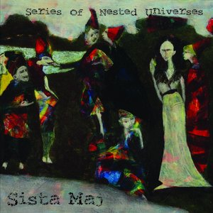

# Series of Nested Universes

By **Sista Maj**

## Album Data

- **Catalog:** Beets
- **Format:** Digital, Album
- **Album:** Series of Nested Universes
- **Artist:** Sista Maj
- **Albumartist:** Sista Maj
- **Genre:** Unknown
- **MusicBrainz Album Artist ID:** [cfefbd57-0df9-4475-a30e-5d8f42043f79](https://musicbrainz.org/artist/cfefbd57-0df9-4475-a30e-5d8f42043f79)
- **MusicBrainz Album ID:** [5ad471e6-2f96-4a6d-9df1-3dbfb6a3a60c](https://musicbrainz.org/release/5ad471e6-2f96-4a6d-9df1-3dbfb6a3a60c)
- **MusicBrainz Release Group ID:** [197c43de-b8e4-4c04-8b54-a9088b0d0451](https://musicbrainz.org/release-group/197c43de-b8e4-4c04-8b54-a9088b0d0451)
- **Year:** 2016
- **Catalog #:** SRP037
- **Label:** Space Rock Productions
- **Total Tracks:** 08

## Album Tracks

### Track 01 - Peony Spies

- **Artist:** Sista Maj
- **Format:** ALAC
- **Genre:** Unknown
- **Length:** 6:38
- **MusicBrainz Track ID:** [64463330-7472-456f-a48c-136d7bd4dcf2](https://musicbrainz.org/recording/64463330-7472-456f-a48c-136d7bd4dcf2)
- **Title:** Peony Spies
- **Track:** 01
- **Year:** 2016

### Track 02 - Secret Cave, Secret Rat

- **Artist:** Sista Maj
- **Format:** ALAC
- **Genre:** Unknown
- **Length:** 10:29
- **MusicBrainz Track ID:** [6789c8f0-1262-41c0-8fe6-d55ec990aa4d](https://musicbrainz.org/recording/6789c8f0-1262-41c0-8fe6-d55ec990aa4d)
- **Title:** Secret Cave, Secret Rat
- **Track:** 02
- **Year:** 2016

### Track 03 - Which, in Turn, Falls

- **Artist:** Sista Maj
- **Format:** ALAC
- **Genre:** Unknown
- **Length:** 13:59
- **MusicBrainz Track ID:** [577f68a4-aae2-4fd2-99ed-354562067640](https://musicbrainz.org/recording/577f68a4-aae2-4fd2-99ed-354562067640)
- **Title:** Which, in Turn, Falls
- **Track:** 03
- **Year:** 2016

### Track 04 - A Very Heavy Feather

- **Artist:** Sista Maj
- **Format:** ALAC
- **Genre:** Unknown
- **Length:** 25:40
- **MusicBrainz Track ID:** [60c84a06-4ee5-4ff7-aef4-e74ed8d57847](https://musicbrainz.org/recording/60c84a06-4ee5-4ff7-aef4-e74ed8d57847)
- **Title:** A Very Heavy Feather
- **Track:** 04
- **Year:** 2016

### Track 05 - Series of Nested Universes

- **Artist:** Sista Maj
- **Format:** ALAC
- **Genre:** Unknown
- **Length:** 10:52
- **MusicBrainz Track ID:** [1c85bbe4-c380-4533-a7cf-0847f99d15e4](https://musicbrainz.org/recording/1c85bbe4-c380-4533-a7cf-0847f99d15e4)
- **Title:** Series of Nested Universes
- **Track:** 05
- **Year:** 2016

### Track 06 - Like a Diamond in This Guy

- **Artist:** Sista Maj
- **Format:** ALAC
- **Genre:** Unknown
- **Length:** 11:36
- **MusicBrainz Track ID:** [b4bd854d-fff0-42e1-abc6-516814198fb5](https://musicbrainz.org/recording/b4bd854d-fff0-42e1-abc6-516814198fb5)
- **Title:** Like a Diamond in This Guy
- **Track:** 06
- **Year:** 2016

### Track 07 - It Never Ends

- **Artist:** Sista Maj
- **Format:** ALAC
- **Genre:** Unknown
- **Length:** 17:18
- **MusicBrainz Track ID:** [8815cd85-bc2c-4f43-b9d0-f5e2c06d87af](https://musicbrainz.org/recording/8815cd85-bc2c-4f43-b9d0-f5e2c06d87af)
- **Title:** It Never Ends
- **Track:** 07
- **Year:** 2016

### Track 08 - Bones of Steel

- **Artist:** Sista Maj
- **Format:** ALAC
- **Genre:** Unknown
- **Length:** 16:13
- **MusicBrainz Track ID:** [a632a98b-50d2-46d9-9b7a-d43a31cef3d6](https://musicbrainz.org/recording/a632a98b-50d2-46d9-9b7a-d43a31cef3d6)
- **Title:** Bones of Steel
- **Track:** 08
- **Year:** 2016

