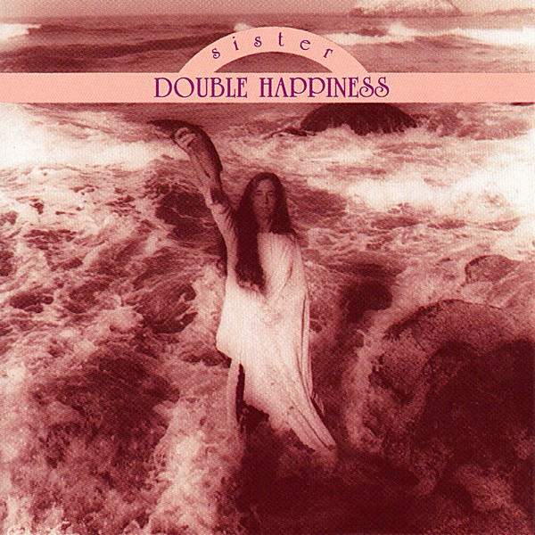

# Sister Double Happiness

By **Sister Double Happiness**

## Album Data

- **Catalog:** Beets
- **Format:** Digital, Album
- **Album:** Sister Double Happiness
- **Artist:** Sister Double Happiness
- **Albumartist:** Sister Double Happiness
- **Genre:** Emo
- **MusicBrainz Album Artist ID:** [4971ca31-f23d-4fc8-957a-656342a5c207](https://musicbrainz.org/artist/4971ca31-f23d-4fc8-957a-656342a5c207)
- **MusicBrainz Album ID:** [af0ee9ef-8dd4-4e84-86cd-ac838716b939](https://musicbrainz.org/release/af0ee9ef-8dd4-4e84-86cd-ac838716b939)
- **MusicBrainz Release Group ID:** [8b145b41-ab88-33cd-87ff-ac8060a0e5c1](https://musicbrainz.org/release-group/8b145b41-ab88-33cd-87ff-ac8060a0e5c1)
- **Year:** 1988
- **Catalog #:** SST CD 162
- **Label:** SST Records
- **Total Tracks:** 11

## Album Tracks

### Track 01 - Sister Double Happiness

- **Artist:** Sister Double Happiness
- **Format:** MP3
- **Genre:** Emo
- **Length:** 5:53
- **MusicBrainz Track ID:** [2f90f9c9-013b-447e-ae4d-dc920251e731](https://musicbrainz.org/recording/2f90f9c9-013b-447e-ae4d-dc920251e731)
- **Title:** Sister Double Happiness
- **Track:** 01
- **Year:** 1988

### Track 02 - Freight Train

- **Artist:** Sister Double Happiness
- **Format:** MP3
- **Genre:** Emo
- **Length:** 2:27
- **MusicBrainz Track ID:** [fe44d4ca-3768-4f7f-9f61-b926fedfc96a](https://musicbrainz.org/recording/fe44d4ca-3768-4f7f-9f61-b926fedfc96a)
- **Title:** Freight Train
- **Track:** 02
- **Year:** 1988

### Track 03 - Let Me In

- **Artist:** Sister Double Happiness
- **Format:** MP3
- **Genre:** Emo
- **Length:** 3:26
- **MusicBrainz Track ID:** [12e44eb9-c56b-41c3-9533-9b49722c3fb9](https://musicbrainz.org/recording/12e44eb9-c56b-41c3-9533-9b49722c3fb9)
- **Title:** Let Me In
- **Track:** 03
- **Year:** 1988

### Track 04 - Cry Like a Baby

- **Artist:** Sister Double Happiness
- **Format:** MP3
- **Genre:** Emo
- **Length:** 4:30
- **MusicBrainz Track ID:** [cca176cd-c68c-4fa1-b2c1-23444e5faf4e](https://musicbrainz.org/recording/cca176cd-c68c-4fa1-b2c1-23444e5faf4e)
- **Title:** Cry Like a Baby
- **Track:** 04
- **Year:** 1988

### Track 05 - On the Beach

- **Artist:** Sister Double Happiness
- **Format:** MP3
- **Genre:** Emo
- **Length:** 4:32
- **MusicBrainz Track ID:** [909dcb19-a115-4e62-b0d8-ca35d370d605](https://musicbrainz.org/recording/909dcb19-a115-4e62-b0d8-ca35d370d605)
- **Title:** On the Beach
- **Track:** 05
- **Year:** 1988

### Track 06 - Poodle Dog

- **Artist:** Sister Double Happiness
- **Format:** MP3
- **Genre:** Emo
- **Length:** 2:49
- **MusicBrainz Track ID:** [96f67827-4d9a-41e2-a71f-29c657ab8fff](https://musicbrainz.org/recording/96f67827-4d9a-41e2-a71f-29c657ab8fff)
- **Title:** Poodle Dog
- **Track:** 06
- **Year:** 1988

### Track 07 - It's Our Life

- **Artist:** Sister Double Happiness
- **Format:** MP3
- **Genre:** Emo
- **Length:** 2:52
- **MusicBrainz Track ID:** [94e5de3a-19ea-4461-84f4-1ff48da1e727](https://musicbrainz.org/recording/94e5de3a-19ea-4461-84f4-1ff48da1e727)
- **Title:** It's Our Life
- **Track:** 07
- **Year:** 1988

### Track 08 - I Tried

- **Artist:** Sister Double Happiness
- **Format:** MP3
- **Genre:** Emo
- **Length:** 3:41
- **MusicBrainz Track ID:** [c829ad90-3a72-43c4-a1bf-b21e376a41cc](https://musicbrainz.org/recording/c829ad90-3a72-43c4-a1bf-b21e376a41cc)
- **Title:** I Tried
- **Track:** 08
- **Year:** 1988

### Track 09 - Sweet Talker

- **Artist:** Sister Double Happiness
- **Format:** MP3
- **Genre:** Emo
- **Length:** 2:59
- **MusicBrainz Track ID:** [27a61c87-73b3-4bac-a3cf-09ceabb6188a](https://musicbrainz.org/recording/27a61c87-73b3-4bac-a3cf-09ceabb6188a)
- **Title:** Sweet Talker
- **Track:** 09
- **Year:** 1988

### Track 10 - Get Drunk and Die

- **Artist:** Sister Double Happiness
- **Format:** MP3
- **Genre:** Emo
- **Length:** 2:10
- **MusicBrainz Track ID:** [c0b1cf0d-9442-4985-bd64-38556788cd32](https://musicbrainz.org/recording/c0b1cf0d-9442-4985-bd64-38556788cd32)
- **Title:** Get Drunk and Die
- **Track:** 10
- **Year:** 1988

### Track 11 - You Don't Know Me

- **Artist:** Sister Double Happiness
- **Format:** MP3
- **Genre:** Emo
- **Length:** 4:39
- **MusicBrainz Track ID:** [c36a7164-a45f-4f22-8e89-bd0c79595132](https://musicbrainz.org/recording/c36a7164-a45f-4f22-8e89-bd0c79595132)
- **Title:** You Don't Know Me
- **Track:** 11
- **Year:** 1988

## See also

- [Roon: Heart And Mind](../../Roon/Sister_Double_Happiness/Heart_And_Mind.md)
