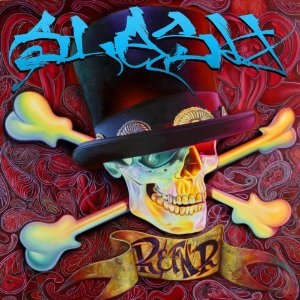

# Slash

By **Slash**

## Album Data

- **Catalog:** Beets
- **Format:** Digital, Album
- **Album:** Slash
- **Artist:** Slash
- **Albumartist:** Slash
- **Genre:** Rock And Roll
- **MusicBrainz Album Artist ID:** [5e7a7026-dfc5-4aba-8496-95140716f3db](https://musicbrainz.org/artist/5e7a7026-dfc5-4aba-8496-95140716f3db)
- **MusicBrainz Album ID:** [678f6bbd-90eb-3c85-83d7-cc7b12ffe6a1](https://musicbrainz.org/release/678f6bbd-90eb-3c85-83d7-cc7b12ffe6a1)
- **MusicBrainz Release Group ID:** [b41ac508-2d26-4323-9bb5-be7ec9bf3318](https://musicbrainz.org/release-group/b41ac508-2d26-4323-9bb5-be7ec9bf3318)
- **Year:** 2010
- **Catalog #:** 
- **Label:** 
- **Total Tracks:** 14

## Album Tracks

### Track 01 - Ghost

- **Artist:** Slash feat. Ian Astbury
- **Format:** ALAC
- **Genre:** Rock And Roll
- **Length:** 3:35
- **MusicBrainz Track ID:** [086bc5fc-81c9-4fd6-b4da-dd6bbde0475c](https://musicbrainz.org/recording/086bc5fc-81c9-4fd6-b4da-dd6bbde0475c)
- **Title:** Ghost
- **Track:** 01
- **Year:** 2010

### Track 05 - Promise

- **Artist:** Slash feat. Chris Cornell
- **Format:** ALAC
- **Genre:** Heavy Metal
- **Length:** 4:40
- **MusicBrainz Track ID:** [4b295961-553d-48ee-8d80-4f65828d89d1](https://musicbrainz.org/recording/4b295961-553d-48ee-8d80-4f65828d89d1)
- **Title:** Promise
- **Track:** 05
- **Year:** 2010

### Track 13 - Saint Is a Sinner Too

- **Artist:** Slash feat. Rocco DeLuca
- **Format:** ALAC
- **Genre:** Hard Rock
- **Length:** 3:27
- **MusicBrainz Track ID:** [5b09ad94-0400-4088-8714-e4550b0000e6](https://musicbrainz.org/recording/5b09ad94-0400-4088-8714-e4550b0000e6)
- **Title:** Saint Is a Sinner Too
- **Track:** 13
- **Year:** 2010

### Track 03 - Beautiful Dangerous

- **Artist:** Slash feat. Fergie
- **Format:** ALAC
- **Genre:** Heavy Metal
- **Length:** 4:38
- **MusicBrainz Track ID:** [3bb2939f-44df-4476-9b47-c63da8a87a72](https://musicbrainz.org/recording/3bb2939f-44df-4476-9b47-c63da8a87a72)
- **Title:** Beautiful Dangerous
- **Track:** 03
- **Year:** 2010

### Track 09 - Watch This

- **Artist:** Slash feat. Dave Grohl & Duff McKagan
- **Format:** ALAC
- **Genre:** Rock And Roll
- **Length:** 3:47
- **MusicBrainz Track ID:** [47c36235-0261-45fe-963c-14e13c75540b](https://musicbrainz.org/recording/47c36235-0261-45fe-963c-14e13c75540b)
- **Title:** Watch This
- **Track:** 09
- **Year:** 2010

### Track 04 - Back From Cali

- **Artist:** Slash feat. Myles Kennedy
- **Format:** ALAC
- **Genre:** Rock And Roll
- **Length:** 3:36
- **MusicBrainz Track ID:** [5083b7ed-a0a2-4cd0-9124-4485e0ef657a](https://musicbrainz.org/recording/5083b7ed-a0a2-4cd0-9124-4485e0ef657a)
- **Title:** Back From Cali
- **Track:** 04
- **Year:** 2010

### Track 12 - Starlight

- **Artist:** Slash feat. Myles Kennedy
- **Format:** ALAC
- **Genre:** Rock And Roll
- **Length:** 5:26
- **MusicBrainz Track ID:** [78bf0a49-91d4-4f55-a093-d26f86df1439](https://musicbrainz.org/recording/78bf0a49-91d4-4f55-a093-d26f86df1439)
- **Title:** Starlight
- **Track:** 12
- **Year:** 2010

### Track 10 - I Hold On

- **Artist:** Slash feat. Kid Rock
- **Format:** ALAC
- **Genre:** Rock And Roll
- **Length:** 4:16
- **MusicBrainz Track ID:** [1d714332-e964-4cc7-979b-35c40d8075df](https://musicbrainz.org/recording/1d714332-e964-4cc7-979b-35c40d8075df)
- **Title:** I Hold On
- **Track:** 10
- **Year:** 2010

### Track 08 - Doctor Alibi

- **Artist:** Slash feat. Lemmy Kilmister
- **Format:** ALAC
- **Genre:** Rock And Roll
- **Length:** 3:09
- **MusicBrainz Track ID:** [5e7a3747-2011-4907-91cb-ac102b21bf2d](https://musicbrainz.org/recording/5e7a3747-2011-4907-91cb-ac102b21bf2d)
- **Title:** Doctor Alibi
- **Track:** 08
- **Year:** 2010

### Track 07 - Gotten

- **Artist:** Slash feat. Adam Levine
- **Format:** ALAC
- **Genre:** Heavy Metal
- **Length:** 5:02
- **MusicBrainz Track ID:** [65348e77-4018-4d53-a7aa-9b044a531948](https://musicbrainz.org/recording/65348e77-4018-4d53-a7aa-9b044a531948)
- **Title:** Gotten
- **Track:** 07
- **Year:** 2010

### Track 02 - Crucify the Dead

- **Artist:** Slash feat. Ozzy Osbourne
- **Format:** ALAC
- **Genre:** Heavy Metal
- **Length:** 4:04
- **MusicBrainz Track ID:** [545fcdcf-2f2c-4868-911b-1ce0f6ae033c](https://musicbrainz.org/recording/545fcdcf-2f2c-4868-911b-1ce0f6ae033c)
- **Title:** Crucify the Dead
- **Track:** 02
- **Year:** 2010

### Track 14 - We’re All Gonna Die

- **Artist:** Slash feat. Iggy Pop
- **Format:** ALAC
- **Genre:** Rock And Roll
- **Length:** 4:32
- **MusicBrainz Track ID:** [51ef64f6-98a4-41b2-8262-cb3cf1180c3c](https://musicbrainz.org/recording/51ef64f6-98a4-41b2-8262-cb3cf1180c3c)
- **Title:** We’re All Gonna Die
- **Track:** 14
- **Year:** 2010

### Track 11 - Nothing to Say

- **Artist:** Slash feat. M. Shadows
- **Format:** ALAC
- **Genre:** Rock And Roll
- **Length:** 5:26
- **MusicBrainz Track ID:** [9ae63517-013e-454d-9219-6f20362a0c6d](https://musicbrainz.org/recording/9ae63517-013e-454d-9219-6f20362a0c6d)
- **Title:** Nothing to Say
- **Track:** 11
- **Year:** 2010

### Track 06 - By the Sword

- **Artist:** Slash feat. Andrew Stockdale
- **Format:** ALAC
- **Genre:** Rock
- **Length:** 4:51
- **MusicBrainz Track ID:** [1d5d24e4-9a4a-429f-91c3-27c88ffe681b](https://musicbrainz.org/recording/1d5d24e4-9a4a-429f-91c3-27c88ffe681b)
- **Title:** By the Sword
- **Track:** 06
- **Year:** 2010

## See also

- [Roon: 4 (feat. Myles Kennedy and The Conspirators)](../../Roon/Slash/4_feat_Myles_Kennedy_and_The_Conspirators.md)
- [Roon: Slash](../../Roon/Slash/Slash.md)
- [Vinyl: ](../../Vinyl/Slash/Slash_index.md)
- [Vinyl: Slash](../../Vinyl/Slash/Slash.md)
