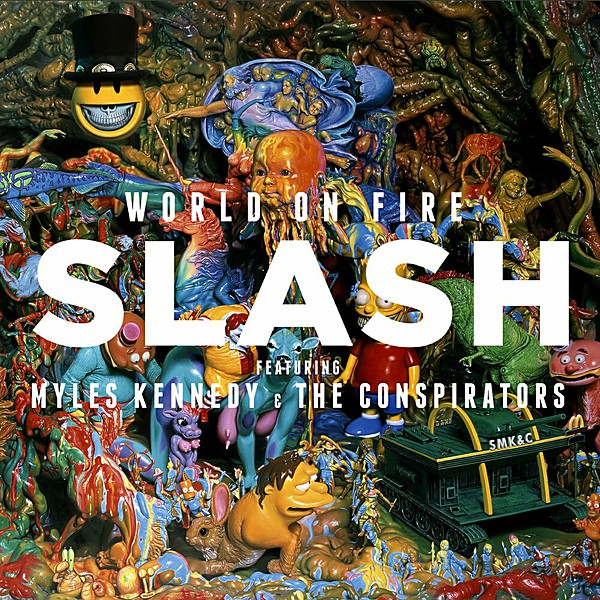

# World on Fire

By **Slash featuring Myles Kennedy and the Conspirators**

## Album Data

- **Catalog:** Beets
- **Format:** Digital, Album
- **Album:** World on Fire
- **Artist:** Slash Featuring Myles Kennedy And The Conspirators
- **Albumartist:** Slash featuring Myles Kennedy and the Conspirators
- **Genre:** Hard Rock
- **MusicBrainz Album Artist ID:** [7ce51ba7-91f4-46aa-a030-1e22aaa7510d](https://musicbrainz.org/artist/7ce51ba7-91f4-46aa-a030-1e22aaa7510d)
- **MusicBrainz Album ID:** [83743d51-2aaa-413b-bf31-ef8b76b76bc2](https://musicbrainz.org/release/83743d51-2aaa-413b-bf31-ef8b76b76bc2)
- **MusicBrainz Release Group ID:** [ceb61f9f-b157-4da0-8ef4-8e1f7c4f39ae](https://musicbrainz.org/release-group/ceb61f9f-b157-4da0-8ef4-8e1f7c4f39ae)
- **Year:** 2014
- **Catalog #:** 
- **Label:** 
- **Total Tracks:** 17

## Album Tracks

### Track 01 - World on Fire

- **Artist:** Slash featuring Myles Kennedy and the Conspirators
- **Format:** ALAC
- **Genre:** Hard Rock
- **Length:** 4:31
- **MusicBrainz Track ID:** [c8fd027f-7e7a-40a7-854e-43980750de13](https://musicbrainz.org/recording/c8fd027f-7e7a-40a7-854e-43980750de13)
- **Title:** World on Fire
- **Track:** 01
- **Year:** 2014

### Track 02 - Shadow Life

- **Artist:** Slash featuring Myles Kennedy and the Conspirators
- **Format:** ALAC
- **Genre:** Hard Rock
- **Length:** 4:00
- **MusicBrainz Track ID:** [dfc419bc-8fd7-43b1-b7f7-54844fb08489](https://musicbrainz.org/recording/dfc419bc-8fd7-43b1-b7f7-54844fb08489)
- **Title:** Shadow Life
- **Track:** 02
- **Year:** 2014

### Track 03 - Automatic Overdrive

- **Artist:** Slash featuring Myles Kennedy and the Conspirators
- **Format:** ALAC
- **Genre:** Hard Rock
- **Length:** 3:35
- **MusicBrainz Track ID:** [728d62e5-ecfe-4314-84ce-96ea22215fe0](https://musicbrainz.org/recording/728d62e5-ecfe-4314-84ce-96ea22215fe0)
- **Title:** Automatic Overdrive
- **Track:** 03
- **Year:** 2014

### Track 04 - Wicked Stone

- **Artist:** Slash featuring Myles Kennedy and the Conspirators
- **Format:** ALAC
- **Genre:** Hard Rock
- **Length:** 5:27
- **MusicBrainz Track ID:** [fa637f65-1e2c-495b-9c44-a89bcef932d7](https://musicbrainz.org/recording/fa637f65-1e2c-495b-9c44-a89bcef932d7)
- **Title:** Wicked Stone
- **Track:** 04
- **Year:** 2014

### Track 05 - 30 Years to Life

- **Artist:** Slash featuring Myles Kennedy and the Conspirators
- **Format:** ALAC
- **Genre:** Hard Rock
- **Length:** 5:08
- **MusicBrainz Track ID:** [d662e5c3-e4a8-4636-b705-daac0f05981a](https://musicbrainz.org/recording/d662e5c3-e4a8-4636-b705-daac0f05981a)
- **Title:** 30 Years to Life
- **Track:** 05
- **Year:** 2014

### Track 06 - Bent to Fly

- **Artist:** Slash featuring Myles Kennedy and the Conspirators
- **Format:** ALAC
- **Genre:** Hard Rock
- **Length:** 4:56
- **MusicBrainz Track ID:** [f9140cff-c854-48c6-85a6-dba0cbbb6c58](https://musicbrainz.org/recording/f9140cff-c854-48c6-85a6-dba0cbbb6c58)
- **Title:** Bent to Fly
- **Track:** 06
- **Year:** 2014

### Track 07 - Stone Blind

- **Artist:** Slash featuring Myles Kennedy and the Conspirators
- **Format:** ALAC
- **Genre:** Hard Rock
- **Length:** 3:49
- **MusicBrainz Track ID:** [3d2f1827-e2b4-4895-8f7c-e6ba5f742ca8](https://musicbrainz.org/recording/3d2f1827-e2b4-4895-8f7c-e6ba5f742ca8)
- **Title:** Stone Blind
- **Track:** 07
- **Year:** 2014

### Track 08 - Too Far Gone

- **Artist:** Slash featuring Myles Kennedy and the Conspirators
- **Format:** ALAC
- **Genre:** Hard Rock
- **Length:** 4:07
- **MusicBrainz Track ID:** [88639c89-7f2f-4d34-aab7-a5b6e981e516](https://musicbrainz.org/recording/88639c89-7f2f-4d34-aab7-a5b6e981e516)
- **Title:** Too Far Gone
- **Track:** 08
- **Year:** 2014

### Track 09 - Beneath the Savage Sun

- **Artist:** Slash featuring Myles Kennedy and the Conspirators
- **Format:** ALAC
- **Genre:** Hard Rock
- **Length:** 5:48
- **MusicBrainz Track ID:** [be484fca-7663-4784-bb9e-380e033d1950](https://musicbrainz.org/recording/be484fca-7663-4784-bb9e-380e033d1950)
- **Title:** Beneath the Savage Sun
- **Track:** 09
- **Year:** 2014

### Track 10 - Withered Delilah

- **Artist:** Slash featuring Myles Kennedy and the Conspirators
- **Format:** ALAC
- **Genre:** Hard Rock
- **Length:** 3:10
- **MusicBrainz Track ID:** [f58bd455-5601-4e81-ae58-423f56f2444e](https://musicbrainz.org/recording/f58bd455-5601-4e81-ae58-423f56f2444e)
- **Title:** Withered Delilah
- **Track:** 10
- **Year:** 2014

### Track 11 - Battleground

- **Artist:** Slash featuring Myles Kennedy and the Conspirators
- **Format:** ALAC
- **Genre:** Hard Rock
- **Length:** 6:59
- **MusicBrainz Track ID:** [3fbab4d0-c7ba-4608-8b66-76456172365f](https://musicbrainz.org/recording/3fbab4d0-c7ba-4608-8b66-76456172365f)
- **Title:** Battleground
- **Track:** 11
- **Year:** 2014

### Track 12 - Dirty Girl

- **Artist:** Slash featuring Myles Kennedy and the Conspirators
- **Format:** ALAC
- **Genre:** Hard Rock
- **Length:** 4:14
- **MusicBrainz Track ID:** [52cad654-74c0-4dfe-8b4f-efa11b9d3c8c](https://musicbrainz.org/recording/52cad654-74c0-4dfe-8b4f-efa11b9d3c8c)
- **Title:** Dirty Girl
- **Track:** 12
- **Year:** 2014

### Track 13 - Iris of the Storm

- **Artist:** Slash featuring Myles Kennedy and the Conspirators
- **Format:** ALAC
- **Genre:** Hard Rock
- **Length:** 4:00
- **MusicBrainz Track ID:** [7649b3c1-38c5-4ebe-a82f-09c202d5cb21](https://musicbrainz.org/recording/7649b3c1-38c5-4ebe-a82f-09c202d5cb21)
- **Title:** Iris of the Storm
- **Track:** 13
- **Year:** 2014

### Track 14 - Avalon

- **Artist:** Slash featuring Myles Kennedy and the Conspirators
- **Format:** ALAC
- **Genre:** Hard Rock
- **Length:** 3:00
- **MusicBrainz Track ID:** [3b30e0ed-ba95-4f4e-b345-f7fe335375b2](https://musicbrainz.org/recording/3b30e0ed-ba95-4f4e-b345-f7fe335375b2)
- **Title:** Avalon
- **Track:** 14
- **Year:** 2014

### Track 15 - The Dissident

- **Artist:** Slash featuring Myles Kennedy and the Conspirators
- **Format:** ALAC
- **Genre:** Hard Rock
- **Length:** 4:26
- **MusicBrainz Track ID:** [d5ddbe0e-e81b-496e-afca-b68256a1c5c7](https://musicbrainz.org/recording/d5ddbe0e-e81b-496e-afca-b68256a1c5c7)
- **Title:** The Dissident
- **Track:** 15
- **Year:** 2014

### Track 16 - Safari Inn

- **Artist:** Slash featuring Myles Kennedy and the Conspirators
- **Format:** ALAC
- **Genre:** Hard Rock
- **Length:** 3:26
- **MusicBrainz Track ID:** [614bfeac-3c33-4768-a61e-e63699828078](https://musicbrainz.org/recording/614bfeac-3c33-4768-a61e-e63699828078)
- **Title:** Safari Inn
- **Track:** 16
- **Year:** 2014

### Track 17 - The Unholy

- **Artist:** Slash featuring Myles Kennedy and the Conspirators
- **Format:** ALAC
- **Genre:** Hard Rock
- **Length:** 6:48
- **MusicBrainz Track ID:** [f1d98129-6ab4-49ce-9bd5-ca11669c1527](https://musicbrainz.org/recording/f1d98129-6ab4-49ce-9bd5-ca11669c1527)
- **Title:** The Unholy
- **Track:** 17
- **Year:** 2014

