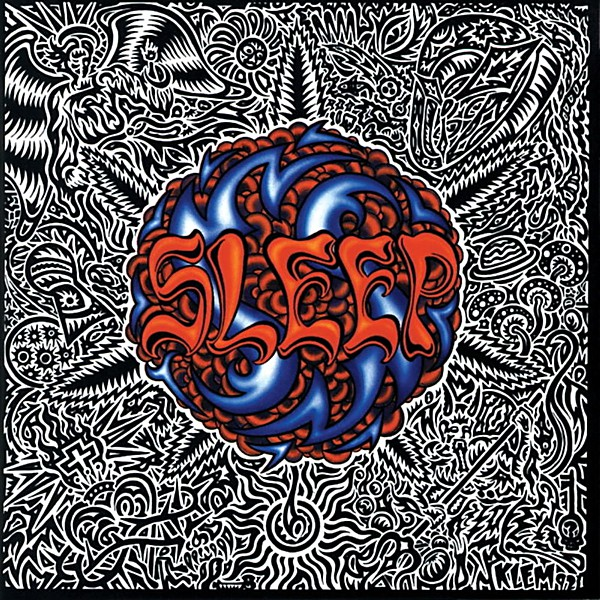

# Sleep’s Holy Mountain

By **Sleep**

## Album Data

- **Catalog:** Beets
- **Format:** Digital, Album
- **Album:** Sleep’s Holy Mountain
- **Artist:** Sleep
- **Albumartist:** Sleep
- **Genre:** Stoner Metal
- **MusicBrainz Album Artist ID:** [6fc69ec6-3e59-4ff7-849d-b5da932abe4d](https://musicbrainz.org/artist/6fc69ec6-3e59-4ff7-849d-b5da932abe4d)
- **MusicBrainz Album ID:** [a480fda9-2f0e-4eb7-a17f-deb3ec596a36](https://musicbrainz.org/release/a480fda9-2f0e-4eb7-a17f-deb3ec596a36)
- **MusicBrainz Release Group ID:** [8fef03e2-e48d-3d09-a324-e39056eb2575](https://musicbrainz.org/release-group/8fef03e2-e48d-3d09-a324-e39056eb2575)
- **Year:** 1993
- **Catalog #:** MOSH 79CD
- **Label:** Earache Records
- **Total Tracks:** 09

## Album Tracks

### Track 01 - Dragonaut

- **Artist:** Sleep
- **Format:** MP3
- **Genre:** Stoner Metal
- **Length:** 5:46
- **MusicBrainz Track ID:** [4b124c85-7d6d-4053-9b96-294dafe953e9](https://musicbrainz.org/recording/4b124c85-7d6d-4053-9b96-294dafe953e9)
- **Title:** Dragonaut
- **Track:** 01
- **Year:** 1993

### Track 02 - The Druid

- **Artist:** Sleep
- **Format:** MP3
- **Genre:** Stoner Metal
- **Length:** 2:19
- **MusicBrainz Track ID:** [22003b45-75cf-4cdd-9f50-f8f23599cb1b](https://musicbrainz.org/recording/22003b45-75cf-4cdd-9f50-f8f23599cb1b)
- **Title:** The Druid
- **Track:** 02
- **Year:** 1993

### Track 03 - Evil Gypsy / Solomon’s Theme

- **Artist:** Sleep
- **Format:** MP3
- **Genre:** Stoner Metal
- **Length:** 9:41
- **MusicBrainz Track ID:** [21f1d187-9833-4558-96d5-b44dc44e9949](https://musicbrainz.org/recording/21f1d187-9833-4558-96d5-b44dc44e9949)
- **Title:** Evil Gypsy / Solomon’s Theme
- **Track:** 03
- **Year:** 1993

### Track 04 - Some Grass

- **Artist:** Sleep
- **Format:** MP3
- **Genre:** Stoner Metal
- **Length:** 0:43
- **MusicBrainz Track ID:** [42766710-a514-46fe-928f-58dce4e6d361](https://musicbrainz.org/recording/42766710-a514-46fe-928f-58dce4e6d361)
- **Title:** Some Grass
- **Track:** 04
- **Year:** 1993

### Track 05 - Aquarian

- **Artist:** Sleep
- **Format:** MP3
- **Genre:** Stoner Metal
- **Length:** 5:05
- **MusicBrainz Track ID:** [7c0f2640-4a8e-4f86-8c17-9bb69c48274e](https://musicbrainz.org/recording/7c0f2640-4a8e-4f86-8c17-9bb69c48274e)
- **Title:** Aquarian
- **Track:** 05
- **Year:** 1993

### Track 06 - Holy Mountain

- **Artist:** Sleep
- **Format:** MP3
- **Genre:** Stoner Metal
- **Length:** 8:46
- **MusicBrainz Track ID:** [8de89817-d98c-4822-8d4c-f97cc74ef5df](https://musicbrainz.org/recording/8de89817-d98c-4822-8d4c-f97cc74ef5df)
- **Title:** Holy Mountain
- **Track:** 06
- **Year:** 1993

### Track 07 - Inside the Sun

- **Artist:** Sleep
- **Format:** MP3
- **Genre:** Stoner Metal
- **Length:** 5:44
- **MusicBrainz Track ID:** [e778d83a-ab80-4957-a75c-0d1407346b58](https://musicbrainz.org/recording/e778d83a-ab80-4957-a75c-0d1407346b58)
- **Title:** Inside the Sun
- **Track:** 07
- **Year:** 1993

### Track 08 - From Beyond

- **Artist:** Sleep
- **Format:** MP3
- **Genre:** Stoner Metal
- **Length:** 10:37
- **MusicBrainz Track ID:** [162187c3-d7e2-4f9e-b271-21bd0df1d8e2](https://musicbrainz.org/recording/162187c3-d7e2-4f9e-b271-21bd0df1d8e2)
- **Title:** From Beyond
- **Track:** 08
- **Year:** 1993

### Track 09 - Nain’s Baptism

- **Artist:** Sleep
- **Format:** MP3
- **Genre:** Stoner Metal
- **Length:** 3:05
- **MusicBrainz Track ID:** [8698be25-f5f9-413f-9370-61857ec4c7ea](https://musicbrainz.org/recording/8698be25-f5f9-413f-9370-61857ec4c7ea)
- **Title:** Nain’s Baptism
- **Track:** 09
- **Year:** 1993

## See also

- [Vinyl: ](../../Vinyl/Sleep/Sleep.md)
- [Vinyl: Sleep's Holy Mountain](../../Vinyl/Sleep/Sleeps_Holy_Mountain.md)
