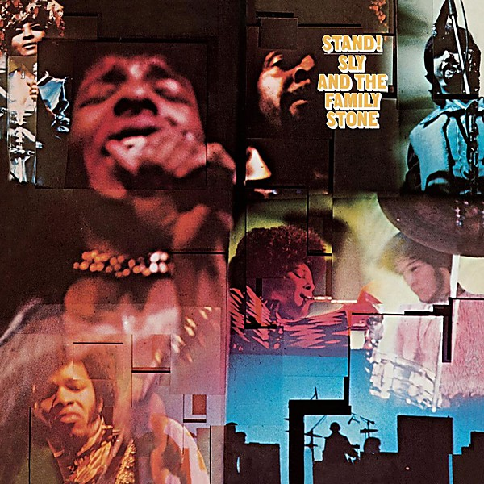

# Stand!

By **Sly & The Family Stone**

## Album Data

- **Catalog:** Beets
- **Format:** Digital, Album
- **Album:** Stand!
- **Artist:** Sly & The Family Stone
- **Albumartist:** Sly & The Family Stone
- **Genre:** Soul
- **MusicBrainz Album Artist ID:** 
- **MusicBrainz Album ID:** 
- **MusicBrainz Release Group ID:** 
- **Year:** 1969
- **Catalog #:** 
- **Label:** 
- **Total Tracks:** 08

## Album Tracks

### Track 01 - Stand!

- **Artist:** Sly & The Family Stone
- **Format:** ALAC
- **Genre:** Soul
- **Length:** 3:08
- **MusicBrainz Track ID:** 
- **Title:** Stand!
- **Track:** 01
- **Year:** 1969

### Track 02 - Don't Call Me Nigger, Whitey

- **Artist:** Sly & The Family Stone
- **Format:** ALAC
- **Genre:** Uk Garage
- **Length:** 5:58
- **MusicBrainz Track ID:** 
- **Title:** Don't Call Me Nigger, Whitey
- **Track:** 02
- **Year:** 1969

### Track 03 - I Want To Take You Higher

- **Artist:** Sly & The Family Stone
- **Format:** ALAC
- **Genre:** Soul
- **Length:** 5:22
- **MusicBrainz Track ID:** 
- **Title:** I Want To Take You Higher
- **Track:** 03
- **Year:** 1969

### Track 04 - Somebody's Watching You

- **Artist:** Sly & The Family Stone
- **Format:** ALAC
- **Genre:** Soul
- **Length:** 3:20
- **MusicBrainz Track ID:** 
- **Title:** Somebody's Watching You
- **Track:** 04
- **Year:** 1969

### Track 05 - Sing A Simple Song

- **Artist:** Sly & The Family Stone
- **Format:** ALAC
- **Genre:** Uk Garage
- **Length:** 3:56
- **MusicBrainz Track ID:** 
- **Title:** Sing A Simple Song
- **Track:** 05
- **Year:** 1969

### Track 06 - Everyday People

- **Artist:** Sly & The Family Stone
- **Format:** ALAC
- **Genre:** Soul
- **Length:** 2:20
- **MusicBrainz Track ID:** 
- **Title:** Everyday People
- **Track:** 06
- **Year:** 1969

### Track 07 - Sex Machine

- **Artist:** Sly & The Family Stone
- **Format:** ALAC
- **Genre:** Uk Garage
- **Length:** 13:45
- **MusicBrainz Track ID:** 
- **Title:** Sex Machine
- **Track:** 07
- **Year:** 1969

### Track 08 - You Can Make It If You Try

- **Artist:** Sly & The Family Stone
- **Format:** ALAC
- **Genre:** Uk Garage
- **Length:** 3:37
- **MusicBrainz Track ID:** 
- **Title:** You Can Make It If You Try
- **Track:** 08
- **Year:** 1969

## See also

- [1969](1969.md)
- [1971](1971.md)
- [Greatest Hits](Greatest_Hits.md)
- [Vinyl: ](../../Vinyl/Sly_and_The_Family_Stone/Sly_and_The_Family_Stone.md)
- [Vinyl: Thank You (Falettinme Be Mice Elf Agin) / Everybody Is A Star](../../Vinyl/Sly_and_The_Family_Stone/Thank_You_Falettinme_Be_Mice_Elf_Agin_-_Everybody_Is_A_Star.md)
