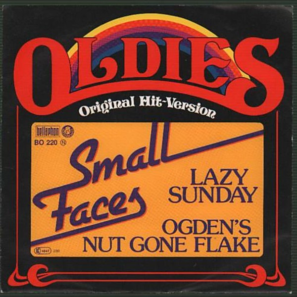

# Odgens' Nut Gone Flake

By **Small Faces**

## Album Data

- **Catalog:** Beets
- **Format:** Digital, Album
- **Album:** Odgens' Nut Gone Flake
- **Artist:** Small Faces
- **Albumartist:** Small Faces
- **Genre:** Psychedelic Rock
- **MusicBrainz Album Artist ID:** [7771a68c-ef6a-400f-978d-64050d45a54c](https://musicbrainz.org/artist/7771a68c-ef6a-400f-978d-64050d45a54c)
- **MusicBrainz Album ID:** [429570e3-9f90-4db5-a1ac-48c64e04bfc2](https://musicbrainz.org/release/429570e3-9f90-4db5-a1ac-48c64e04bfc2)
- **MusicBrainz Release Group ID:** [1c8d49cc-bcb0-3539-af12-26de5c4573fa](https://musicbrainz.org/release-group/1c8d49cc-bcb0-3539-af12-26de5c4573fa)
- **Year:** 2007
- **Catalog #:** 278 134-5
- **Label:** Immediate
- **Total Tracks:** 45

## Album Tracks

### Track 01 - (Tell Me) Have You Ever Seen Me

- **Artist:** Small Faces
- **Format:** MP3
- **Genre:** Close Harmony
- **Length:** 2:15
- **MusicBrainz Track ID:** [dd0a7547-5241-4666-9ae9-dca1227a1cb5](https://musicbrainz.org/recording/dd0a7547-5241-4666-9ae9-dca1227a1cb5)
- **Title:** (Tell Me) Have You Ever Seen Me
- **Track:** 01
- **Year:** 2012

### Track 02 - Something I Want to Tell You

- **Artist:** Small Faces
- **Format:** MP3
- **Genre:** Close Harmony
- **Length:** 2:07
- **MusicBrainz Track ID:** [d3be25c8-2b6e-4497-8954-9962e7047f57](https://musicbrainz.org/recording/d3be25c8-2b6e-4497-8954-9962e7047f57)
- **Title:** Something I Want to Tell You
- **Track:** 02
- **Year:** 2012

### Track 03 - Feeling Lonely

- **Artist:** Small Faces
- **Format:** MP3
- **Genre:** Close Harmony
- **Length:** 1:32
- **MusicBrainz Track ID:** [6c441d41-d59e-4413-88b2-ec1e298a42b2](https://musicbrainz.org/recording/6c441d41-d59e-4413-88b2-ec1e298a42b2)
- **Title:** Feeling Lonely
- **Track:** 03
- **Year:** 2012

### Track 04 - Happy Boys Happy

- **Artist:** Small Faces
- **Format:** MP3
- **Genre:** Close Harmony
- **Length:** 1:35
- **MusicBrainz Track ID:** [d9a43b12-b56e-49e1-823d-4649ba639299](https://musicbrainz.org/recording/d9a43b12-b56e-49e1-823d-4649ba639299)
- **Title:** Happy Boys Happy
- **Track:** 04
- **Year:** 2012

### Track 05 - Things Are Going to Get Better

- **Artist:** Small Faces
- **Format:** MP3
- **Genre:** Rock
- **Length:** 2:36
- **MusicBrainz Track ID:** [af45a4e2-9703-42ae-b5ef-11992bd4addb](https://musicbrainz.org/recording/af45a4e2-9703-42ae-b5ef-11992bd4addb)
- **Title:** Things Are Going to Get Better
- **Track:** 05
- **Year:** 2012

### Track 06 - My Way of Giving

- **Artist:** Small Faces
- **Format:** MP3
- **Genre:** Psychedelic Rock
- **Length:** 1:55
- **MusicBrainz Track ID:** [ec9bca43-35aa-4359-8d58-cf130ed432b0](https://musicbrainz.org/recording/ec9bca43-35aa-4359-8d58-cf130ed432b0)
- **Title:** My Way of Giving
- **Track:** 06
- **Year:** 2012

### Track 07 - Green Circles

- **Artist:** Small Faces
- **Format:** MP3
- **Genre:** Psychedelic Rock
- **Length:** 2:31
- **MusicBrainz Track ID:** [42927db8-a6fc-4ddb-b1ae-0f00fae73db4](https://musicbrainz.org/recording/42927db8-a6fc-4ddb-b1ae-0f00fae73db4)
- **Title:** Green Circles
- **Track:** 07
- **Year:** 2012

### Track 08 - Become Like You

- **Artist:** Small Faces
- **Format:** MP3
- **Genre:** Close Harmony
- **Length:** 1:57
- **MusicBrainz Track ID:** [3c6f9420-b00e-4cf3-aa87-370e0dff4e9f](https://musicbrainz.org/recording/3c6f9420-b00e-4cf3-aa87-370e0dff4e9f)
- **Title:** Become Like You
- **Track:** 08
- **Year:** 2012

### Track 09 - Get Yourself Together

- **Artist:** Small Faces
- **Format:** MP3
- **Genre:** Freakbeat
- **Length:** 1:48
- **MusicBrainz Track ID:** [5ecae61f-dff6-47e3-be5c-626978eaa4c4](https://musicbrainz.org/recording/5ecae61f-dff6-47e3-be5c-626978eaa4c4)
- **Title:** Get Yourself Together
- **Track:** 09
- **Year:** 2012

### Track 10 - All Our Yesterdays

- **Artist:** Small Faces
- **Format:** MP3
- **Genre:** Close Harmony
- **Length:** 2:05
- **MusicBrainz Track ID:** [ea6f08c6-093c-4c31-a8e9-26da2fb4b25e](https://musicbrainz.org/recording/ea6f08c6-093c-4c31-a8e9-26da2fb4b25e)
- **Title:** All Our Yesterdays
- **Track:** 10
- **Year:** 2012

### Track 11 - Talk to You

- **Artist:** Small Faces
- **Format:** MP3
- **Genre:** Psychedelic Rock
- **Length:** 2:04
- **MusicBrainz Track ID:** [86d59c51-062f-43ce-b6fb-b5104b444950](https://musicbrainz.org/recording/86d59c51-062f-43ce-b6fb-b5104b444950)
- **Title:** Talk to You
- **Track:** 11
- **Year:** 2012

### Track 12 - Show Me the Way

- **Artist:** Small Faces
- **Format:** MP3
- **Genre:** Psychedelic Rock
- **Length:** 2:18
- **MusicBrainz Track ID:** [4f986219-7acc-4fa1-a413-f8924a28170a](https://musicbrainz.org/recording/4f986219-7acc-4fa1-a413-f8924a28170a)
- **Title:** Show Me the Way
- **Track:** 12
- **Year:** 2012

### Track 13 - Up the Wooden Hills to Bedfordshire

- **Artist:** Small Faces
- **Format:** MP3
- **Genre:** Psychedelic Rock
- **Length:** 2:02
- **MusicBrainz Track ID:** [ed54564d-9a98-4c96-8fd8-2e7d2ee6d9f3](https://musicbrainz.org/recording/ed54564d-9a98-4c96-8fd8-2e7d2ee6d9f3)
- **Title:** Up the Wooden Hills to Bedfordshire
- **Track:** 13
- **Year:** 2012

### Track 14 - Eddie’s Dreaming

- **Artist:** Small Faces
- **Format:** MP3
- **Genre:** Close Harmony
- **Length:** 2:52
- **MusicBrainz Track ID:** [5349317c-96f5-4ad2-a5c4-69eadb6f9743](https://musicbrainz.org/recording/5349317c-96f5-4ad2-a5c4-69eadb6f9743)
- **Title:** Eddie’s Dreaming
- **Track:** 14
- **Year:** 2012

### Track 15 - Here Come the Nice

- **Artist:** Small Faces
- **Format:** MP3
- **Genre:** Psychedelic Pop
- **Length:** 2:56
- **MusicBrainz Track ID:** [5c1eb154-2aec-498b-b4fe-382c58a90ecf](https://musicbrainz.org/recording/5c1eb154-2aec-498b-b4fe-382c58a90ecf)
- **Title:** Here Come the Nice
- **Track:** 15
- **Year:** 2012

### Track 16 - Itchycoo Park

- **Artist:** Small Faces
- **Format:** MP3
- **Genre:** Psychedelic Rock
- **Length:** 2:45
- **MusicBrainz Track ID:** [aecf5361-51bf-4325-aa78-a1ad271445cc](https://musicbrainz.org/recording/aecf5361-51bf-4325-aa78-a1ad271445cc)
- **Title:** Itchycoo Park
- **Track:** 16
- **Year:** 2012

### Track 17 - I’m Only Dreaming

- **Artist:** Small Faces
- **Format:** MP3
- **Genre:** Close Harmony
- **Length:** 2:23
- **MusicBrainz Track ID:** [da5152a0-5493-42c7-b507-4076581d82fc](https://musicbrainz.org/recording/da5152a0-5493-42c7-b507-4076581d82fc)
- **Title:** I’m Only Dreaming
- **Track:** 17
- **Year:** 2012

### Track 18 - Tin Soldier

- **Artist:** Small Faces
- **Format:** MP3
- **Genre:** Psychedelic Rock
- **Length:** 3:20
- **MusicBrainz Track ID:** [4ab78d42-1664-4ebe-99f6-bfc4a3e2230a](https://musicbrainz.org/recording/4ab78d42-1664-4ebe-99f6-bfc4a3e2230a)
- **Title:** Tin Soldier
- **Track:** 18
- **Year:** 2012

### Track 19 - I Feel Much Better

- **Artist:** Small Faces
- **Format:** MP3
- **Genre:** Psychedelic Rock
- **Length:** 3:56
- **MusicBrainz Track ID:** [36234a72-b36d-4903-9d53-723a3bebb4d6](https://musicbrainz.org/recording/36234a72-b36d-4903-9d53-723a3bebb4d6)
- **Title:** I Feel Much Better
- **Track:** 19
- **Year:** 2012

### Track 20 - (Tell Me) Have You Ever Seen Me (alternate mix)

- **Artist:** Small Faces
- **Format:** MP3
- **Genre:** Close Harmony
- **Length:** 2:05
- **MusicBrainz Track ID:** [d17f4cf0-95c4-45bd-9baf-6f21ca8602ca](https://musicbrainz.org/recording/d17f4cf0-95c4-45bd-9baf-6f21ca8602ca)
- **Title:** (Tell Me) Have You Ever Seen Me (alternate mix)
- **Track:** 20
- **Year:** 2012

### Track 21 - Eddie’s Dreaming (alternate mix)

- **Artist:** Small Faces
- **Format:** MP3
- **Genre:** Close Harmony
- **Length:** 2:40
- **MusicBrainz Track ID:** [4d436b0e-a835-43c0-bd9d-c271f5a3d205](https://musicbrainz.org/recording/4d436b0e-a835-43c0-bd9d-c271f5a3d205)
- **Title:** Eddie’s Dreaming (alternate mix)
- **Track:** 21
- **Year:** 2012

### Track 22 - Green Circles (take 1 alternate mix 3)

- **Artist:** Small Faces
- **Format:** MP3
- **Genre:** Close Harmony
- **Length:** 2:34
- **MusicBrainz Track ID:** [ce411d51-4998-4edb-9cdc-a1f1001ab317](https://musicbrainz.org/recording/ce411d51-4998-4edb-9cdc-a1f1001ab317)
- **Title:** Green Circles (take 1 alternate mix 3)
- **Track:** 22
- **Year:** 2012

### Track 23 - (Tell Me) Have You Ever Seen Me

- **Artist:** Small Faces
- **Format:** MP3
- **Genre:** Close Harmony
- **Length:** 2:14
- **MusicBrainz Track ID:** [508212d2-824e-4eca-87e5-5519546d083b](https://musicbrainz.org/recording/508212d2-824e-4eca-87e5-5519546d083b)
- **Title:** (Tell Me) Have You Ever Seen Me
- **Track:** 23
- **Year:** 2012

### Track 24 - Something I Want to Tell You

- **Artist:** Small Faces
- **Format:** MP3
- **Genre:** Close Harmony
- **Length:** 2:09
- **MusicBrainz Track ID:** [64d10ab8-5e6a-4ec4-872a-f5072d68d08b](https://musicbrainz.org/recording/64d10ab8-5e6a-4ec4-872a-f5072d68d08b)
- **Title:** Something I Want to Tell You
- **Track:** 24
- **Year:** 2012

### Track 25 - Feeling Lonely

- **Artist:** Small Faces
- **Format:** MP3
- **Genre:** Close Harmony
- **Length:** 1:32
- **MusicBrainz Track ID:** [9e3e6e39-8fdf-492f-bf28-e9bbcee62b74](https://musicbrainz.org/recording/9e3e6e39-8fdf-492f-bf28-e9bbcee62b74)
- **Title:** Feeling Lonely
- **Track:** 25
- **Year:** 2012

### Track 26 - Happy Boys Happy

- **Artist:** Small Faces
- **Format:** MP3
- **Genre:** Close Harmony
- **Length:** 1:35
- **MusicBrainz Track ID:** [762e3d67-e466-4f2e-a4f3-6a53a4687c16](https://musicbrainz.org/recording/762e3d67-e466-4f2e-a4f3-6a53a4687c16)
- **Title:** Happy Boys Happy
- **Track:** 26
- **Year:** 2012

### Track 27 - Things Are Going to Get Better

- **Artist:** Small Faces
- **Format:** MP3
- **Genre:** Rock
- **Length:** 2:37
- **MusicBrainz Track ID:** [03468e4a-45d7-41dd-8d97-2b857c3b9a4f](https://musicbrainz.org/recording/03468e4a-45d7-41dd-8d97-2b857c3b9a4f)
- **Title:** Things Are Going to Get Better
- **Track:** 27
- **Year:** 2012

### Track 28 - My Way of Giving

- **Artist:** Small Faces
- **Format:** MP3
- **Genre:** Psychedelic Rock
- **Length:** 1:57
- **MusicBrainz Track ID:** [814273a6-1c09-4988-9436-447e293aa305](https://musicbrainz.org/recording/814273a6-1c09-4988-9436-447e293aa305)
- **Title:** My Way of Giving
- **Track:** 28
- **Year:** 2012

### Track 29 - Green Circles

- **Artist:** Small Faces
- **Format:** MP3
- **Genre:** Psychedelic Rock
- **Length:** 2:43
- **MusicBrainz Track ID:** [45648142-b4d2-457c-bed6-6936cc7d84db](https://musicbrainz.org/recording/45648142-b4d2-457c-bed6-6936cc7d84db)
- **Title:** Green Circles
- **Track:** 29
- **Year:** 2012

### Track 30 - Become Like You

- **Artist:** Small Faces
- **Format:** MP3
- **Genre:** Close Harmony
- **Length:** 1:59
- **MusicBrainz Track ID:** [46c35f40-fcc1-4f70-99ac-886245252ba5](https://musicbrainz.org/recording/46c35f40-fcc1-4f70-99ac-886245252ba5)
- **Title:** Become Like You
- **Track:** 30
- **Year:** 2012

### Track 31 - Get Yourself Together

- **Artist:** Small Faces
- **Format:** MP3
- **Genre:** Freakbeat
- **Length:** 2:15
- **MusicBrainz Track ID:** [ece0c64e-f2ad-4e2b-9dde-2d3ee4781925](https://musicbrainz.org/recording/ece0c64e-f2ad-4e2b-9dde-2d3ee4781925)
- **Title:** Get Yourself Together
- **Track:** 31
- **Year:** 2012

### Track 32 - All Our Yesterdays

- **Artist:** Small Faces
- **Format:** MP3
- **Genre:** Close Harmony
- **Length:** 1:51
- **MusicBrainz Track ID:** [a9f320f1-a209-4bde-9bc6-0d716e0469b6](https://musicbrainz.org/recording/a9f320f1-a209-4bde-9bc6-0d716e0469b6)
- **Title:** All Our Yesterdays
- **Track:** 32
- **Year:** 2012

### Track 33 - Talk to You

- **Artist:** Small Faces
- **Format:** MP3
- **Genre:** Psychedelic Rock
- **Length:** 2:06
- **MusicBrainz Track ID:** [ba4b70eb-65ae-4431-846c-8596d2261c43](https://musicbrainz.org/recording/ba4b70eb-65ae-4431-846c-8596d2261c43)
- **Title:** Talk to You
- **Track:** 33
- **Year:** 2012

### Track 34 - Show Me the Way

- **Artist:** Small Faces
- **Format:** MP3
- **Genre:** Psychedelic Rock
- **Length:** 2:08
- **MusicBrainz Track ID:** [43d18a32-27c4-4cb6-a74a-405fea13cf23](https://musicbrainz.org/recording/43d18a32-27c4-4cb6-a74a-405fea13cf23)
- **Title:** Show Me the Way
- **Track:** 34
- **Year:** 2012

### Track 35 - Up the Wooden Hills to Bedfordshire

- **Artist:** Small Faces
- **Format:** MP3
- **Genre:** Psychedelic Rock
- **Length:** 2:04
- **MusicBrainz Track ID:** [c62610e5-00ad-4c43-8552-3ea4c72e1a22](https://musicbrainz.org/recording/c62610e5-00ad-4c43-8552-3ea4c72e1a22)
- **Title:** Up the Wooden Hills to Bedfordshire
- **Track:** 35
- **Year:** 2012

### Track 36 - Eddie’s Dreaming

- **Artist:** Small Faces
- **Format:** MP3
- **Genre:** Close Harmony
- **Length:** 2:55
- **MusicBrainz Track ID:** [b4d5ed51-99f4-401f-a084-21866251d221](https://musicbrainz.org/recording/b4d5ed51-99f4-401f-a084-21866251d221)
- **Title:** Eddie’s Dreaming
- **Track:** 36
- **Year:** 2012

### Track 37 - Just Passing

- **Artist:** Small Faces
- **Format:** MP3
- **Genre:** Rock
- **Length:** 1:15
- **MusicBrainz Track ID:** [ab5bf7c1-f579-4660-b304-7ef8a35aed55](https://musicbrainz.org/recording/ab5bf7c1-f579-4660-b304-7ef8a35aed55)
- **Title:** Just Passing
- **Track:** 37
- **Year:** 2012

### Track 38 - Itchycoo Park

- **Artist:** Small Faces
- **Format:** MP3
- **Genre:** Psychedelic Rock
- **Length:** 2:48
- **MusicBrainz Track ID:** [0a96ec30-d124-41f0-9ad7-ee39d8116c3e](https://musicbrainz.org/recording/0a96ec30-d124-41f0-9ad7-ee39d8116c3e)
- **Title:** Itchycoo Park
- **Track:** 38
- **Year:** 2012

### Track 39 - Here Come the Nice

- **Artist:** Small Faces
- **Format:** MP3
- **Genre:** Psychedelic Pop
- **Length:** 3:03
- **MusicBrainz Track ID:** [ccba7a8e-9c89-4cb2-aa13-51ecfdeb0b3a](https://musicbrainz.org/recording/ccba7a8e-9c89-4cb2-aa13-51ecfdeb0b3a)
- **Title:** Here Come the Nice
- **Track:** 39
- **Year:** 2012

### Track 40 - Don’t Burst My Bubble

- **Artist:** Small Faces
- **Format:** MP3
- **Genre:** Close Harmony
- **Length:** 2:23
- **MusicBrainz Track ID:** [4edf1048-9ad5-433d-9e3f-c6dbefb7a8ef](https://musicbrainz.org/recording/4edf1048-9ad5-433d-9e3f-c6dbefb7a8ef)
- **Title:** Don’t Burst My Bubble
- **Track:** 40
- **Year:** 2012

### Track 41 - Things Are Going to Get Better (alternate version)

- **Artist:** Small Faces
- **Format:** MP3
- **Genre:** Close Harmony
- **Length:** 2:33
- **MusicBrainz Track ID:** [6bbba240-d6a3-4bdb-b24c-b7d867fb52b7](https://musicbrainz.org/recording/6bbba240-d6a3-4bdb-b24c-b7d867fb52b7)
- **Title:** Things Are Going to Get Better (alternate version)
- **Track:** 41
- **Year:** 2012

### Track 42 - I Can’t Make It (session version)

- **Artist:** Small Faces
- **Format:** MP3
- **Genre:** Close Harmony
- **Length:** 2:09
- **MusicBrainz Track ID:** [50276547-6268-4676-bf2d-0ed8f827f516](https://musicbrainz.org/recording/50276547-6268-4676-bf2d-0ed8f827f516)
- **Title:** I Can’t Make It (session version)
- **Track:** 42
- **Year:** 2012

### Track 43 - Green Circles (alternate take 2) (mono)

- **Artist:** Small Faces
- **Format:** MP3
- **Genre:** Close Harmony
- **Length:** 2:41
- **MusicBrainz Track ID:** [53c6e3f4-bb6e-4b7f-8e37-fbaaba870738](https://musicbrainz.org/recording/53c6e3f4-bb6e-4b7f-8e37-fbaaba870738)
- **Title:** Green Circles (alternate take 2) (mono)
- **Track:** 43
- **Year:** 2012

### Track 44 - Tin Soldier

- **Artist:** Small Faces
- **Format:** MP3
- **Genre:** Psychedelic Rock
- **Length:** 3:22
- **MusicBrainz Track ID:** [d864f715-54b1-49ff-a6d8-2d6722b74333](https://musicbrainz.org/recording/d864f715-54b1-49ff-a6d8-2d6722b74333)
- **Title:** Tin Soldier
- **Track:** 44
- **Year:** 2012

### Track 45 - (If You Think You're) Groovy (backing track) (mono)

- **Artist:** Small Faces
- **Format:** MP3
- **Genre:** Close Harmony
- **Length:** 3:10
- **MusicBrainz Track ID:** [e7a141c5-5180-47ab-9886-9c59e8c3851c](https://musicbrainz.org/recording/e7a141c5-5180-47ab-9886-9c59e8c3851c)
- **Title:** (If You Think You're) Groovy (backing track) (mono)
- **Track:** 45
- **Year:** 2012

## See also

- [Small Faces](Small_Faces.md)
- [The Immediate Years (CD 2)](The_Immediate_Years_CD_2.md)
