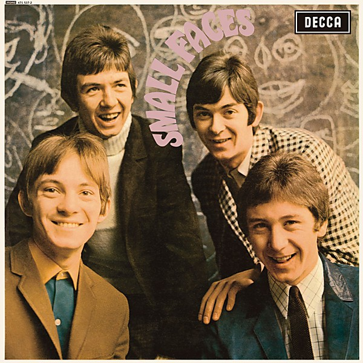

# Small Faces

By **Small Faces**

## Album Data

- **Catalog:** Beets
- **Format:** Digital, Album
- **Album:** Small Faces
- **Artist:** Small Faces
- **Albumartist:** Small Faces
- **Genre:** Close Harmony
- **MusicBrainz Album Artist ID:** [7771a68c-ef6a-400f-978d-64050d45a54c](https://musicbrainz.org/artist/7771a68c-ef6a-400f-978d-64050d45a54c)
- **MusicBrainz Album ID:** [cfd74473-a181-49fb-9177-fc9ae9220dd2](https://musicbrainz.org/release/cfd74473-a181-49fb-9177-fc9ae9220dd2)
- **MusicBrainz Release Group ID:** [8f9eb990-56df-347d-bd09-e7e4cdf31cfe](https://musicbrainz.org/release-group/8f9eb990-56df-347d-bd09-e7e4cdf31cfe)
- **Year:** 2012
- **Catalog #:** 
- **Label:** 
- **Total Tracks:** 00

## Album Tracks

### Track 01 - I Can't Make It

- **Artist:** Small Faces
- **Format:** MP3
- **Genre:** Rock
- **Length:** 2:09
- **MusicBrainz Track ID:** 
- **Title:** I Can't Make It
- **Track:** 01
- **Year:** 1969

### Track 02 - Just Passing

- **Artist:** Small Faces
- **Format:** MP3
- **Genre:** Rock
- **Length:** 1:14
- **MusicBrainz Track ID:** 
- **Title:** Just Passing
- **Track:** 02
- **Year:** 1969

### Track 03 - Here Comes The Nice

- **Artist:** Small Faces
- **Format:** MP3
- **Genre:** Psychedelic Rock
- **Length:** 2:55
- **MusicBrainz Track ID:** 
- **Title:** Here Comes The Nice
- **Track:** 03
- **Year:** 1969

### Track 04 - Itchycoo Park

- **Artist:** Small Faces
- **Format:** MP3
- **Genre:** Psychedelic Rock
- **Length:** 2:46
- **MusicBrainz Track ID:** 
- **Title:** Itchycoo Park
- **Track:** 04
- **Year:** 1969

### Track 05 - I'm Only Dreaming

- **Artist:** Small Faces
- **Format:** MP3
- **Genre:** Freakbeat
- **Length:** 2:24
- **MusicBrainz Track ID:** 
- **Title:** I'm Only Dreaming
- **Track:** 05
- **Year:** 1969

### Track 06 - Tin Soldier

- **Artist:** Small Faces
- **Format:** MP3
- **Genre:** Psychedelic Rock
- **Length:** 3:23
- **MusicBrainz Track ID:** 
- **Title:** Tin Soldier
- **Track:** 06
- **Year:** 1969

### Track 07 - I Feel Much Better

- **Artist:** Small Faces
- **Format:** MP3
- **Genre:** Psychedelic Rock
- **Length:** 3:57
- **MusicBrainz Track ID:** 
- **Title:** I Feel Much Better
- **Track:** 07
- **Year:** 1969

### Track 08 - The Universal

- **Artist:** Small Faces
- **Format:** MP3
- **Genre:** Folk Rock
- **Length:** 2:40
- **MusicBrainz Track ID:** 
- **Title:** The Universal
- **Track:** 08
- **Year:** 1969

### Track 09 - Donkey Rides, A Penny A Glass

- **Artist:** Small Faces
- **Format:** MP3
- **Genre:** Psychedelic Rock
- **Length:** 2:49
- **MusicBrainz Track ID:** 
- **Title:** Donkey Rides, A Penny A Glass
- **Track:** 09
- **Year:** 1969

### Track 10 - Wham Bam, Thank You Mam

- **Artist:** Small Faces
- **Format:** MP3
- **Genre:** Psychedelic Rock
- **Length:** 3:19
- **MusicBrainz Track ID:** 
- **Title:** Wham Bam, Thank You Mam
- **Track:** 10
- **Year:** 1969

### Track 11 - (Tell Me) Have You Ever Seen Me

- **Artist:** Small Faces
- **Format:** MP3
- **Genre:** Psychedelic Rock
- **Length:** 2:12
- **MusicBrainz Track ID:** 
- **Title:** (Tell Me) Have You Ever Seen Me
- **Track:** 11
- **Year:** 1969

### Track 12 - Something I Want To Tell You

- **Artist:** Small Faces
- **Format:** MP3
- **Genre:** Psychedelic Rock
- **Length:** 2:07
- **MusicBrainz Track ID:** 
- **Title:** Something I Want To Tell You
- **Track:** 12
- **Year:** 1969

### Track 13 - Feeling Lonely

- **Artist:** Small Faces
- **Format:** MP3
- **Genre:** Psychedelic Rock
- **Length:** 1:32
- **MusicBrainz Track ID:** 
- **Title:** Feeling Lonely
- **Track:** 13
- **Year:** 1969

### Track 14 - Happy, Boys, Happy

- **Artist:** Small Faces
- **Format:** MP3
- **Genre:** Psychedelic Rock
- **Length:** 1:33
- **MusicBrainz Track ID:** 
- **Title:** Happy, Boys, Happy
- **Track:** 14
- **Year:** 1969

### Track 15 - Things Are Going To Get Better

- **Artist:** Small Faces
- **Format:** MP3
- **Genre:** Rock
- **Length:** 2:37
- **MusicBrainz Track ID:** 
- **Title:** Things Are Going To Get Better
- **Track:** 15
- **Year:** 1969

### Track 16 - My Way Of Giving

- **Artist:** Small Faces
- **Format:** MP3
- **Genre:** Psychedelic Rock
- **Length:** 1:57
- **MusicBrainz Track ID:** 
- **Title:** My Way Of Giving
- **Track:** 16
- **Year:** 1969

### Track 17 - Green Circles

- **Artist:** Small Faces
- **Format:** MP3
- **Genre:** Psychedelic Rock
- **Length:** 2:40
- **MusicBrainz Track ID:** 
- **Title:** Green Circles
- **Track:** 17
- **Year:** 1969

### Track 18 - Become Like You

- **Artist:** Small Faces
- **Format:** MP3
- **Genre:** Psychedelic Rock
- **Length:** 1:57
- **MusicBrainz Track ID:** 
- **Title:** Become Like You
- **Track:** 18
- **Year:** 1969

### Track 19 - Get Yourself Together

- **Artist:** Small Faces
- **Format:** MP3
- **Genre:** Freakbeat
- **Length:** 2:12
- **MusicBrainz Track ID:** 
- **Title:** Get Yourself Together
- **Track:** 19
- **Year:** 1969

### Track 20 - All Our Yesterdays

- **Artist:** Small Faces
- **Format:** MP3
- **Genre:** Psychedelic Rock
- **Length:** 1:51
- **MusicBrainz Track ID:** 
- **Title:** All Our Yesterdays
- **Track:** 20
- **Year:** 1969

### Track 21 - Talk To You

- **Artist:** Small Faces
- **Format:** MP3
- **Genre:** Psychedelic Rock
- **Length:** 2:06
- **MusicBrainz Track ID:** 
- **Title:** Talk To You
- **Track:** 21
- **Year:** 1969

### Track 22 - Show Me The Way

- **Artist:** Small Faces
- **Format:** MP3
- **Genre:** Psychedelic Rock
- **Length:** 2:06
- **MusicBrainz Track ID:** 
- **Title:** Show Me The Way
- **Track:** 22
- **Year:** 1969

### Track 23 - Up The Wooden Hills To Bedfordshire

- **Artist:** Small Faces
- **Format:** MP3
- **Genre:** Psychedelic Rock
- **Length:** 2:01
- **MusicBrainz Track ID:** 
- **Title:** Up The Wooden Hills To Bedfordshire
- **Track:** 23
- **Year:** 1969

### Track 24 - Eddie's Dreaming

- **Artist:** Small Faces
- **Format:** MP3
- **Genre:** Psychedelic Rock
- **Length:** 2:54
- **MusicBrainz Track ID:** 
- **Title:** Eddie's Dreaming
- **Track:** 24
- **Year:** 1969

## See also

- [Odgens' Nut Gone Flake](Odgens_Nut_Gone_Flake.md)
- [The Immediate Years (CD 2)](The_Immediate_Years_CD_2.md)
