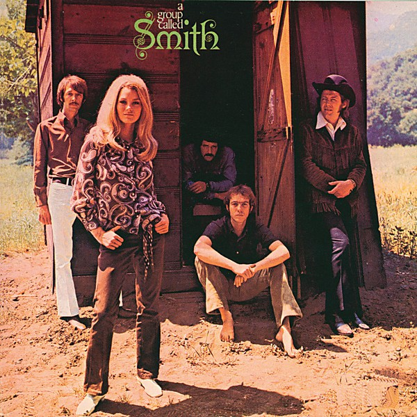

# A Group Called Smith

By **Smith**

## Album Data

- **Catalog:** Beets
- **Format:** Digital, Album
- **Album:** A Group Called Smith
- **Artist:** Smith
- **Albumartist:** Smith
- **Genre:** Rock
- **MusicBrainz Album Artist ID:** [e09266a4-3df7-4c7f-b913-10b79a724284](https://musicbrainz.org/artist/e09266a4-3df7-4c7f-b913-10b79a724284)
- **MusicBrainz Album ID:** [5dc344f3-4d7d-40e0-b4db-7072fed3edf2](https://musicbrainz.org/release/5dc344f3-4d7d-40e0-b4db-7072fed3edf2)
- **MusicBrainz Release Group ID:** [2a377374-3045-3844-8749-90f9a3cfcbcc](https://musicbrainz.org/release-group/2a377374-3045-3844-8749-90f9a3cfcbcc)
- **Year:** 1969
- **Catalog #:** DS-50056
- **Label:** Dunhill ABC
- **Total Tracks:** 10

## Album Tracks

### Track 01 - Let's Get Together

- **Artist:** Smith
- **Format:** MP3
- **Genre:** Rock
- **Length:** 3:27
- **MusicBrainz Track ID:** [417d5010-aa40-4a03-bb5f-c6aa3817848a](https://musicbrainz.org/recording/417d5010-aa40-4a03-bb5f-c6aa3817848a)
- **Title:** Let's Get Together
- **Track:** 01
- **Year:** 1969

### Track 02 - I Don't Believe

- **Artist:** Smith
- **Format:** MP3
- **Genre:** Rock
- **Length:** 3:45
- **MusicBrainz Track ID:** [6d0ac645-3ea9-407d-b29e-122425ff27cc](https://musicbrainz.org/recording/6d0ac645-3ea9-407d-b29e-122425ff27cc)
- **Title:** I Don't Believe
- **Track:** 02
- **Year:** 1969

### Track 03 - Tell Him No

- **Artist:** Smith
- **Format:** MP3
- **Genre:** Rock
- **Length:** 3:29
- **MusicBrainz Track ID:** [43886486-92d1-432c-8d62-01234667fafa](https://musicbrainz.org/recording/43886486-92d1-432c-8d62-01234667fafa)
- **Title:** Tell Him No
- **Track:** 03
- **Year:** 1969

### Track 04 - Who Do You Love?

- **Artist:** Smith
- **Format:** MP3
- **Genre:** Rock
- **Length:** 2:58
- **MusicBrainz Track ID:** [94b01372-f32e-44bf-a402-b11a1972a99a](https://musicbrainz.org/recording/94b01372-f32e-44bf-a402-b11a1972a99a)
- **Title:** Who Do You Love?
- **Track:** 04
- **Year:** 1969

### Track 05 - Baby It's You

- **Artist:** Smith
- **Format:** MP3
- **Genre:** Soul
- **Length:** 3:24
- **MusicBrainz Track ID:** [4b3c355f-af25-482d-8e06-ad81cdf86fa5](https://musicbrainz.org/recording/4b3c355f-af25-482d-8e06-ad81cdf86fa5)
- **Title:** Baby It's You
- **Track:** 05
- **Year:** 1969

### Track 06 - Last Time

- **Artist:** Smith
- **Format:** MP3
- **Genre:** Rock
- **Length:** 5:38
- **MusicBrainz Track ID:** [f3da3b95-6d9f-4caf-81b5-4f81fcbb9efc](https://musicbrainz.org/recording/f3da3b95-6d9f-4caf-81b5-4f81fcbb9efc)
- **Title:** Last Time
- **Track:** 06
- **Year:** 1969

### Track 07 - I Just Wanna Make Love to You

- **Artist:** Smith
- **Format:** MP3
- **Genre:** Rock
- **Length:** 2:46
- **MusicBrainz Track ID:** [8cd41231-bb3b-40fd-8062-a9a808d72805](https://musicbrainz.org/recording/8cd41231-bb3b-40fd-8062-a9a808d72805)
- **Title:** I Just Wanna Make Love to You
- **Track:** 07
- **Year:** 1969

### Track 08 - Mojaleskey Ridge

- **Artist:** Smith
- **Format:** MP3
- **Genre:** Rock
- **Length:** 2:36
- **MusicBrainz Track ID:** [ea15666b-f46b-4c88-82eb-629cdc3c4b59](https://musicbrainz.org/recording/ea15666b-f46b-4c88-82eb-629cdc3c4b59)
- **Title:** Mojaleskey Ridge
- **Track:** 08
- **Year:** 1969

### Track 09 - Let's Spend the Night Together

- **Artist:** Smith
- **Format:** MP3
- **Genre:** Rock
- **Length:** 3:55
- **MusicBrainz Track ID:** [38a707db-31da-4471-8163-1283e4354923](https://musicbrainz.org/recording/38a707db-31da-4471-8163-1283e4354923)
- **Title:** Let's Spend the Night Together
- **Track:** 09
- **Year:** 1969

### Track 10 - I'll Hold Out My Hand

- **Artist:** Smith
- **Format:** MP3
- **Genre:** Rock
- **Length:** 2:59
- **MusicBrainz Track ID:** [cde9cea7-ac0c-4b83-9b17-0f08b88d071c](https://musicbrainz.org/recording/cde9cea7-ac0c-4b83-9b17-0f08b88d071c)
- **Title:** I'll Hold Out My Hand
- **Track:** 10
- **Year:** 1969

## See also

- [Vinyl: A Group Called Smith](../../Vinyl/Smith/A_Group_Called_Smith.md)
- [Vinyl: ](../../Vinyl/Smith/Smith.md)
- [Vinyl: Take A Look Around](../../Vinyl/Smith/Take_A_Look_Around.md)
