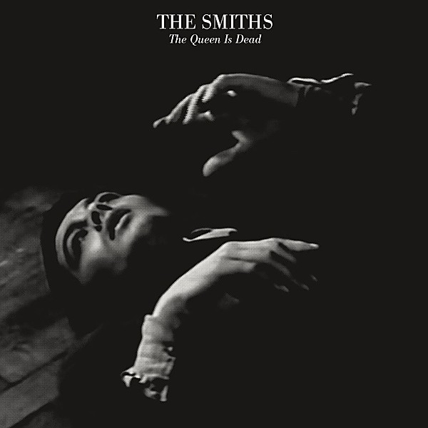

# The Queen Is Dead

By **Smiths**

## Album Data

- **Catalog:** Beets
- **Format:** Digital, Album
- **Album:** The Queen Is Dead
- **Artist:** Smiths
- **Albumartist:** Smiths
- **Genre:** Indie Rock
- **MusicBrainz Album Artist ID:** 
- **MusicBrainz Album ID:** 
- **MusicBrainz Release Group ID:** 
- **Year:** 0000
- **Catalog #:** 
- **Label:** 
- **Total Tracks:** 00

## Album Tracks

### Track 05 - Cemetry Gates

- **Artist:** Smiths
- **Format:** AAC
- **Genre:** Indie Rock
- **Length:** 2:41
- **MusicBrainz Track ID:** 
- **Title:** Cemetry Gates
- **Track:** 05
- **Year:** 0000

