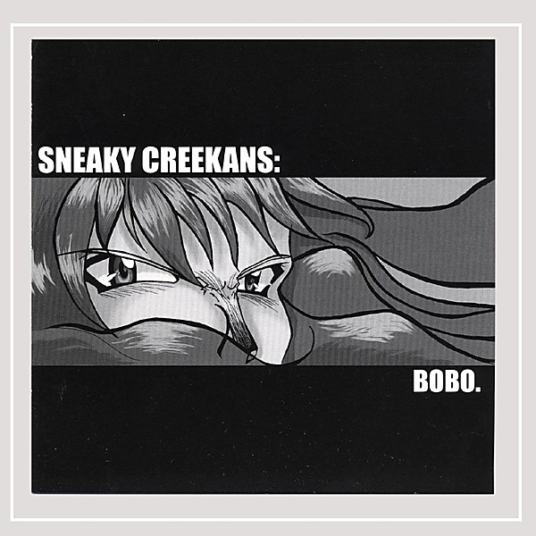

# Bobo

By **Sneaky Creekans**

## Album Data

- **Catalog:** Beets
- **Format:** Digital, Album
- **Album:** Bobo
- **Artist:** Sneaky Creekans
- **Albumartist:** Sneaky Creekans
- **Genre:** Unknown
- **MusicBrainz Album Artist ID:** 
- **MusicBrainz Album ID:** 
- **MusicBrainz Release Group ID:** 
- **Year:** 0000
- **Catalog #:** 
- **Label:** 
- **Total Tracks:** 14

## Album Tracks

### Track 01 - Track 1

- **Artist:** Sneaky Creekans
- **Format:** MP3
- **Genre:** Unknown
- **Length:** 0:28
- **MusicBrainz Track ID:** 
- **Title:** Track 1
- **Track:** 01
- **Year:** 0000

### Track 02 - Track 2

- **Artist:** Sneaky Creekans
- **Format:** MP3
- **Genre:** Unknown
- **Length:** 1:48
- **MusicBrainz Track ID:** 
- **Title:** Track 2
- **Track:** 02
- **Year:** 0000

### Track 03 - Track 3

- **Artist:** Sneaky Creekans
- **Format:** MP3
- **Genre:** Unknown
- **Length:** 3:52
- **MusicBrainz Track ID:** 
- **Title:** Track 3
- **Track:** 03
- **Year:** 0000

### Track 04 - Track 4

- **Artist:** Sneaky Creekans
- **Format:** MP3
- **Genre:** Unknown
- **Length:** 4:23
- **MusicBrainz Track ID:** 
- **Title:** Track 4
- **Track:** 04
- **Year:** 0000

### Track 05 - Track 5

- **Artist:** Sneaky Creekans
- **Format:** MP3
- **Genre:** Unknown
- **Length:** 6:19
- **MusicBrainz Track ID:** 
- **Title:** Track 5
- **Track:** 05
- **Year:** 0000

### Track 06 - Track 6

- **Artist:** Sneaky Creekans
- **Format:** MP3
- **Genre:** Unknown
- **Length:** 5:06
- **MusicBrainz Track ID:** 
- **Title:** Track 6
- **Track:** 06
- **Year:** 0000

### Track 07 - Track 7

- **Artist:** Sneaky Creekans
- **Format:** MP3
- **Genre:** Unknown
- **Length:** 3:49
- **MusicBrainz Track ID:** 
- **Title:** Track 7
- **Track:** 07
- **Year:** 0000

### Track 08 - Track 8

- **Artist:** Sneaky Creekans
- **Format:** MP3
- **Genre:** Unknown
- **Length:** 5:48
- **MusicBrainz Track ID:** 
- **Title:** Track 8
- **Track:** 08
- **Year:** 0000

### Track 09 - Track 9

- **Artist:** Sneaky Creekans
- **Format:** MP3
- **Genre:** Unknown
- **Length:** 5:11
- **MusicBrainz Track ID:** 
- **Title:** Track 9
- **Track:** 09
- **Year:** 0000

### Track 10 - Track 10

- **Artist:** Sneaky Creekans
- **Format:** MP3
- **Genre:** Unknown
- **Length:** 4:56
- **MusicBrainz Track ID:** 
- **Title:** Track 10
- **Track:** 10
- **Year:** 0000

### Track 11 - Track 11

- **Artist:** Sneaky Creekans
- **Format:** MP3
- **Genre:** Unknown
- **Length:** 4:11
- **MusicBrainz Track ID:** 
- **Title:** Track 11
- **Track:** 11
- **Year:** 0000

### Track 12 - Track 12

- **Artist:** Sneaky Creekans
- **Format:** MP3
- **Genre:** Unknown
- **Length:** 3:56
- **MusicBrainz Track ID:** 
- **Title:** Track 12
- **Track:** 12
- **Year:** 0000

### Track 13 - Track 13

- **Artist:** Sneaky Creekans
- **Format:** MP3
- **Genre:** Unknown
- **Length:** 2:33
- **MusicBrainz Track ID:** 
- **Title:** Track 13
- **Track:** 13
- **Year:** 0000

### Track 14 - Track 14

- **Artist:** Sneaky Creekans
- **Format:** MP3
- **Genre:** Unknown
- **Length:** 0:01
- **MusicBrainz Track ID:** 
- **Title:** Track 14
- **Track:** 14
- **Year:** 0000

## See also

- [Roon: Bobo](../../Roon/Sneaky_Creekans/Bobo.md)
