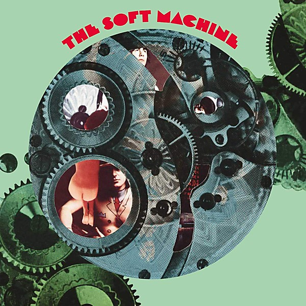

# One

By **Soft Machine**

## Album Data

- **Catalog:** Beets
- **Format:** Digital, Album
- **Album:** One
- **Artist:** Soft Machine
- **Albumartist:** Soft Machine
- **Genre:** Canterbury Scene
- **MusicBrainz Album Artist ID:** 
- **MusicBrainz Album ID:** 
- **MusicBrainz Release Group ID:** 
- **Year:** 1968
- **Catalog #:** SC 6306
- **Label:** Sundazed Music
- **Total Tracks:** 17

## Album Tracks

### Track 01 - Pataphysical Introduction, Part I

- **Artist:** Soft Machine
- **Format:** ALAC
- **Genre:** Canterbury Scene
- **Length:** 0:59
- **MusicBrainz Track ID:** [378a874a-85fb-4c1d-af80-685862fe8495](https://musicbrainz.org/recording/378a874a-85fb-4c1d-af80-685862fe8495)
- **Title:** Pataphysical Introduction, Part I
- **Track:** 01
- **Year:** 2012

### Track 02 - A Concise British Alphabet, Part I

- **Artist:** Soft Machine
- **Format:** ALAC
- **Genre:** Canterbury Scene
- **Length:** 0:09
- **MusicBrainz Track ID:** [09762526-c6da-485f-a46d-8f60ac76790b](https://musicbrainz.org/recording/09762526-c6da-485f-a46d-8f60ac76790b)
- **Title:** A Concise British Alphabet, Part I
- **Track:** 02
- **Year:** 2012

### Track 03 - Hibou, Anemone and Bear

- **Artist:** Soft Machine
- **Format:** ALAC
- **Genre:** Canterbury Scene
- **Length:** 5:59
- **MusicBrainz Track ID:** [2cff3247-0aa4-45aa-b529-d8d000d55658](https://musicbrainz.org/recording/2cff3247-0aa4-45aa-b529-d8d000d55658)
- **Title:** Hibou, Anemone and Bear
- **Track:** 03
- **Year:** 2012

### Track 04 - A Concise British Alphabet, Part II

- **Artist:** Soft Machine
- **Format:** ALAC
- **Genre:** Canterbury Scene
- **Length:** 0:12
- **MusicBrainz Track ID:** [525cd53c-2dfd-4026-a0f1-a0e6b1131e30](https://musicbrainz.org/recording/525cd53c-2dfd-4026-a0f1-a0e6b1131e30)
- **Title:** A Concise British Alphabet, Part II
- **Track:** 04
- **Year:** 2012

### Track 05 - Hulloder

- **Artist:** Soft Machine
- **Format:** ALAC
- **Genre:** Canterbury Scene
- **Length:** 0:54
- **MusicBrainz Track ID:** [6bf17393-b1e8-4270-bf27-fd33b3c2ec9c](https://musicbrainz.org/recording/6bf17393-b1e8-4270-bf27-fd33b3c2ec9c)
- **Title:** Hulloder
- **Track:** 05
- **Year:** 2012

### Track 06 - Dada Was Here

- **Artist:** Soft Machine
- **Format:** ALAC
- **Genre:** Canterbury Scene
- **Length:** 3:25
- **MusicBrainz Track ID:** [34d2afd4-c12b-4f98-8445-f945ed4a556c](https://musicbrainz.org/recording/34d2afd4-c12b-4f98-8445-f945ed4a556c)
- **Title:** Dada Was Here
- **Track:** 06
- **Year:** 2012

### Track 07 - Thank You Pierrot Lunaire

- **Artist:** Soft Machine
- **Format:** ALAC
- **Genre:** Canterbury Scene
- **Length:** 0:48
- **MusicBrainz Track ID:** [a5a3576c-5298-401b-bb7d-fe7b2440b205](https://musicbrainz.org/recording/a5a3576c-5298-401b-bb7d-fe7b2440b205)
- **Title:** Thank You Pierrot Lunaire
- **Track:** 07
- **Year:** 2012

### Track 08 - Have You Ever Bean Grean?

- **Artist:** Soft Machine
- **Format:** ALAC
- **Genre:** Canterbury Scene
- **Length:** 1:19
- **MusicBrainz Track ID:** [a47f2504-fff9-4ce5-950d-3076a85189fb](https://musicbrainz.org/recording/a47f2504-fff9-4ce5-950d-3076a85189fb)
- **Title:** Have You Ever Bean Grean?
- **Track:** 08
- **Year:** 2012

### Track 09 - Pataphysical Introduction, Part II

- **Artist:** Soft Machine
- **Format:** ALAC
- **Genre:** Canterbury Scene
- **Length:** 0:51
- **MusicBrainz Track ID:** [d1a557b1-91ff-40d9-9cb4-665013b06156](https://musicbrainz.org/recording/d1a557b1-91ff-40d9-9cb4-665013b06156)
- **Title:** Pataphysical Introduction, Part II
- **Track:** 09
- **Year:** 2012

### Track 10 - Out of Tunes

- **Artist:** Soft Machine
- **Format:** ALAC
- **Genre:** Canterbury Scene
- **Length:** 2:34
- **MusicBrainz Track ID:** [31e13f51-5f9e-4c4c-9132-566817e7de78](https://musicbrainz.org/recording/31e13f51-5f9e-4c4c-9132-566817e7de78)
- **Title:** Out of Tunes
- **Track:** 10
- **Year:** 2012

### Track 11 - As Long as He Lies Perfectly Still

- **Artist:** Soft Machine
- **Format:** ALAC
- **Genre:** Canterbury Scene
- **Length:** 2:34
- **MusicBrainz Track ID:** [63e1066d-15a0-4e3f-951b-5273ebfaf854](https://musicbrainz.org/recording/63e1066d-15a0-4e3f-951b-5273ebfaf854)
- **Title:** As Long as He Lies Perfectly Still
- **Track:** 11
- **Year:** 2012

### Track 12 - Dedicated to You but You Weren’t Listening

- **Artist:** Soft Machine
- **Format:** ALAC
- **Genre:** Canterbury Scene
- **Length:** 2:32
- **MusicBrainz Track ID:** [b4c3c10e-e3fb-45c9-bf59-73790c4d06fd](https://musicbrainz.org/recording/b4c3c10e-e3fb-45c9-bf59-73790c4d06fd)
- **Title:** Dedicated to You but You Weren’t Listening
- **Track:** 12
- **Year:** 2012

### Track 13 - Fire Engine Passing With Bells Clanging

- **Artist:** Soft Machine
- **Format:** ALAC
- **Genre:** Canterbury Scene
- **Length:** 1:52
- **MusicBrainz Track ID:** [c8b8bdab-22ca-4df7-ac8a-ebd4980ef69e](https://musicbrainz.org/recording/c8b8bdab-22ca-4df7-ac8a-ebd4980ef69e)
- **Title:** Fire Engine Passing With Bells Clanging
- **Track:** 13
- **Year:** 2012

### Track 14 - Pig

- **Artist:** Soft Machine
- **Format:** ALAC
- **Genre:** Canterbury Scene
- **Length:** 2:07
- **MusicBrainz Track ID:** [1419a90e-a903-4543-9328-e51809a821d0](https://musicbrainz.org/recording/1419a90e-a903-4543-9328-e51809a821d0)
- **Title:** Pig
- **Track:** 14
- **Year:** 2012

### Track 15 - Orange Skin Food

- **Artist:** Soft Machine
- **Format:** ALAC
- **Genre:** Canterbury Scene
- **Length:** 1:47
- **MusicBrainz Track ID:** [68cb5e4e-0fd0-4d2b-8bf2-c9c505a70b08](https://musicbrainz.org/recording/68cb5e4e-0fd0-4d2b-8bf2-c9c505a70b08)
- **Title:** Orange Skin Food
- **Track:** 15
- **Year:** 2012

### Track 16 - A Door Opens and Closes

- **Artist:** Soft Machine
- **Format:** ALAC
- **Genre:** Canterbury Scene
- **Length:** 1:09
- **MusicBrainz Track ID:** [bcdfa47c-797a-4766-ac91-c725b6a99408](https://musicbrainz.org/recording/bcdfa47c-797a-4766-ac91-c725b6a99408)
- **Title:** A Door Opens and Closes
- **Track:** 16
- **Year:** 2012

### Track 17 - 10

- **Artist:** Soft Machine
- **Format:** ALAC
- **Genre:** Psychedelic Rock
- **Length:** 4:14
- **MusicBrainz Track ID:** [1881b0a7-595f-44da-a09a-13734caab2f2](https://musicbrainz.org/recording/1881b0a7-595f-44da-a09a-13734caab2f2)
- **Title:** 10
- **Track:** 17
- **Year:** 2012

## See also

- [Volume Two](Volume_Two.md)
