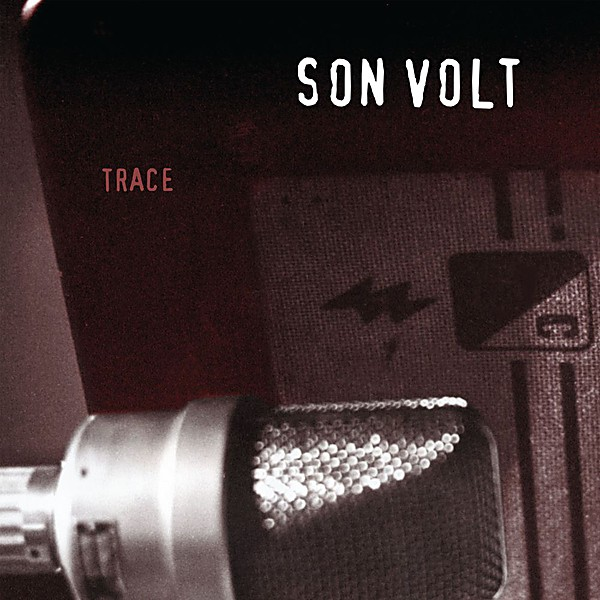

# Trace

By **Son Volt**

## Album Data

- **Catalog:** Beets
- **Format:** Digital, Album
- **Album:** Trace
- **Artist:** Son Volt
- **Albumartist:** Son Volt
- **Genre:** Americana
- **MusicBrainz Album Artist ID:** [ecbd1331-95b6-4a77-b739-b4bd8ef222a7](https://musicbrainz.org/artist/ecbd1331-95b6-4a77-b739-b4bd8ef222a7)
- **MusicBrainz Album ID:** [fcd5070c-26ca-4dfb-bb94-45135425b23d](https://musicbrainz.org/release/fcd5070c-26ca-4dfb-bb94-45135425b23d)
- **MusicBrainz Release Group ID:** [ca7754fe-49ea-3429-a4ee-eed1b88e926e](https://musicbrainz.org/release-group/ca7754fe-49ea-3429-a4ee-eed1b88e926e)
- **Year:** 1995
- **Catalog #:** 9 46010-2
- **Label:** Warner Bros. Records
- **Total Tracks:** 11

## Album Tracks

### Track 01 - Windfall

- **Artist:** Son Volt
- **Format:** ALAC
- **Genre:** Americana
- **Length:** 2:58
- **MusicBrainz Track ID:** [900e1185-6e5a-410c-85a5-92941341277f](https://musicbrainz.org/recording/900e1185-6e5a-410c-85a5-92941341277f)
- **Title:** Windfall
- **Track:** 01
- **Year:** 1995

### Track 02 - Live Free

- **Artist:** Son Volt
- **Format:** ALAC
- **Genre:** Americana
- **Length:** 3:13
- **MusicBrainz Track ID:** [b0ebdcbe-2e03-4422-9fd3-89f2cca0ab63](https://musicbrainz.org/recording/b0ebdcbe-2e03-4422-9fd3-89f2cca0ab63)
- **Title:** Live Free
- **Track:** 02
- **Year:** 1995

### Track 03 - Tear Stained Eye

- **Artist:** Son Volt
- **Format:** ALAC
- **Genre:** Americana
- **Length:** 4:21
- **MusicBrainz Track ID:** [23967050-3b37-406b-8923-22819ec6088b](https://musicbrainz.org/recording/23967050-3b37-406b-8923-22819ec6088b)
- **Title:** Tear Stained Eye
- **Track:** 03
- **Year:** 1995

### Track 04 - Route

- **Artist:** Son Volt
- **Format:** ALAC
- **Genre:** Indie Rock
- **Length:** 3:57
- **MusicBrainz Track ID:** [ffdf275c-2f8c-4aa6-983c-09e07147143c](https://musicbrainz.org/recording/ffdf275c-2f8c-4aa6-983c-09e07147143c)
- **Title:** Route
- **Track:** 04
- **Year:** 1995

### Track 05 - Ten Second News

- **Artist:** Son Volt
- **Format:** ALAC
- **Genre:** Americana
- **Length:** 3:57
- **MusicBrainz Track ID:** [29bd6826-bede-4cc3-8a2e-66cb3f69f39a](https://musicbrainz.org/recording/29bd6826-bede-4cc3-8a2e-66cb3f69f39a)
- **Title:** Ten Second News
- **Track:** 05
- **Year:** 1995

### Track 06 - Drown

- **Artist:** Son Volt
- **Format:** ALAC
- **Genre:** Americana
- **Length:** 3:20
- **MusicBrainz Track ID:** [6677535f-931d-4c14-8c76-4197c0c0b72f](https://musicbrainz.org/recording/6677535f-931d-4c14-8c76-4197c0c0b72f)
- **Title:** Drown
- **Track:** 06
- **Year:** 1995

### Track 07 - Loose String

- **Artist:** Son Volt
- **Format:** ALAC
- **Genre:** Indie Rock
- **Length:** 3:48
- **MusicBrainz Track ID:** [0284879c-b0a2-44cf-8737-7f5b54aaa4fe](https://musicbrainz.org/recording/0284879c-b0a2-44cf-8737-7f5b54aaa4fe)
- **Title:** Loose String
- **Track:** 07
- **Year:** 1995

### Track 08 - Out of the Picture

- **Artist:** Son Volt
- **Format:** ALAC
- **Genre:** Americana
- **Length:** 3:50
- **MusicBrainz Track ID:** [36426cd0-e6ca-498a-b6ae-7b4596592615](https://musicbrainz.org/recording/36426cd0-e6ca-498a-b6ae-7b4596592615)
- **Title:** Out of the Picture
- **Track:** 08
- **Year:** 1995

### Track 09 - Catching On

- **Artist:** Son Volt
- **Format:** ALAC
- **Genre:** Americana
- **Length:** 4:02
- **MusicBrainz Track ID:** [acd7a48d-81d5-437b-927f-477320b17723](https://musicbrainz.org/recording/acd7a48d-81d5-437b-927f-477320b17723)
- **Title:** Catching On
- **Track:** 09
- **Year:** 1995

### Track 10 - Too Early

- **Artist:** Son Volt
- **Format:** ALAC
- **Genre:** Americana
- **Length:** 4:29
- **MusicBrainz Track ID:** [991329c4-34f2-421b-83f8-740976c88ba9](https://musicbrainz.org/recording/991329c4-34f2-421b-83f8-740976c88ba9)
- **Title:** Too Early
- **Track:** 10
- **Year:** 1995

### Track 11 - Mystifies Me

- **Artist:** Son Volt
- **Format:** ALAC
- **Genre:** Rock And Roll
- **Length:** 4:12
- **MusicBrainz Track ID:** [b642cddd-e7f6-4828-a288-679d83fe9783](https://musicbrainz.org/recording/b642cddd-e7f6-4828-a288-679d83fe9783)
- **Title:** Mystifies Me
- **Track:** 11
- **Year:** 1995

