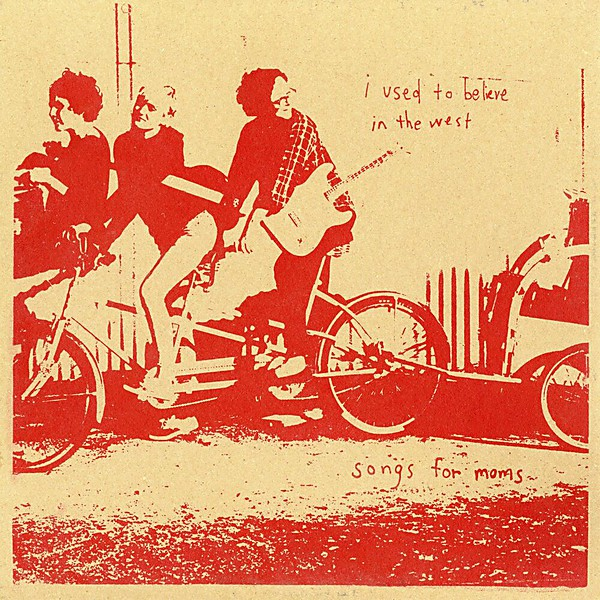

# I Used To Believe In The West

By **Songs For Moms**

## Album Data

- **Catalog:** Beets
- **Format:** Digital, Album
- **Album:** I Used To Believe In The West
- **Artist:** Songs For Moms
- **Albumartist:** Songs For Moms
- **Genre:** Folk Punk
- **MusicBrainz Album Artist ID:** 
- **MusicBrainz Album ID:** 
- **MusicBrainz Release Group ID:** 
- **Year:** 2009
- **Catalog #:** 
- **Label:** Songs For Moms
- **Total Tracks:** 11

## Album Tracks

### Track 01 - 1906

- **Artist:** Songs For Moms
- **Format:** MP3
- **Genre:** Folk Punk
- **Length:** 2:35
- **MusicBrainz Track ID:** [https](https://musicbrainz.org/recording/https)
- **Title:** 1906
- **Track:** 01
- **Year:** 2007

### Track 02 - My Darling Faye

- **Artist:** Songs For Moms
- **Format:** MP3
- **Genre:** Folk Punk
- **Length:** 4:25
- **MusicBrainz Track ID:** [https](https://musicbrainz.org/recording/https)
- **Title:** My Darling Faye
- **Track:** 02
- **Year:** 2007

### Track 03 - Expendable

- **Artist:** Songs For Moms
- **Format:** MP3
- **Genre:** Folk Punk
- **Length:** 1:53
- **MusicBrainz Track ID:** [https](https://musicbrainz.org/recording/https)
- **Title:** Expendable
- **Track:** 03
- **Year:** 2007

### Track 04 - My Skin is a Graveyard

- **Artist:** Songs For Moms
- **Format:** MP3
- **Genre:** Folk Punk
- **Length:** 3:33
- **MusicBrainz Track ID:** [https](https://musicbrainz.org/recording/https)
- **Title:** My Skin is a Graveyard
- **Track:** 04
- **Year:** 2007

### Track 05 - Don't Live With Your Lover or Love With Your Liver

- **Artist:** Songs For Moms
- **Format:** MP3
- **Genre:** Folk Punk
- **Length:** 1:42
- **MusicBrainz Track ID:** [https](https://musicbrainz.org/recording/https)
- **Title:** Don't Live With Your Lover or Love With Your Liver
- **Track:** 05
- **Year:** 2007

### Track 06 - Why Oh Why

- **Artist:** Songs For Moms
- **Format:** MP3
- **Genre:** Folk Punk
- **Length:** 2:33
- **MusicBrainz Track ID:** [https](https://musicbrainz.org/recording/https)
- **Title:** Why Oh Why
- **Track:** 06
- **Year:** 2007

### Track 07 - Underground

- **Artist:** Songs For Moms
- **Format:** MP3
- **Genre:** Folk Punk
- **Length:** 2:23
- **MusicBrainz Track ID:** [https](https://musicbrainz.org/recording/https)
- **Title:** Underground
- **Track:** 07
- **Year:** 2007

### Track 08 - The Places We Love

- **Artist:** Songs For Moms
- **Format:** MP3
- **Genre:** Folk Punk
- **Length:** 3:45
- **MusicBrainz Track ID:** [https](https://musicbrainz.org/recording/https)
- **Title:** The Places We Love
- **Track:** 08
- **Year:** 2007

### Track 09 - Coney Island

- **Artist:** Songs For Moms
- **Format:** MP3
- **Genre:** Folk Punk
- **Length:** 2:31
- **MusicBrainz Track ID:** [https](https://musicbrainz.org/recording/https)
- **Title:** Coney Island
- **Track:** 09
- **Year:** 2007

### Track 10 - The Rain Song

- **Artist:** Songs For Moms
- **Format:** MP3
- **Genre:** Folk Punk
- **Length:** 2:31
- **MusicBrainz Track ID:** [https](https://musicbrainz.org/recording/https)
- **Title:** The Rain Song
- **Track:** 10
- **Year:** 2007

### Track 11 - The Worse It Gets The Better

- **Artist:** Songs For Moms
- **Format:** MP3
- **Genre:** Folk Punk
- **Length:** 3:35
- **MusicBrainz Track ID:** [https](https://musicbrainz.org/recording/https)
- **Title:** The Worse It Gets The Better
- **Track:** 11
- **Year:** 2007

## See also

- [The Worse It Gets The Better](The_Worse_It_Gets_The_Better.md)
