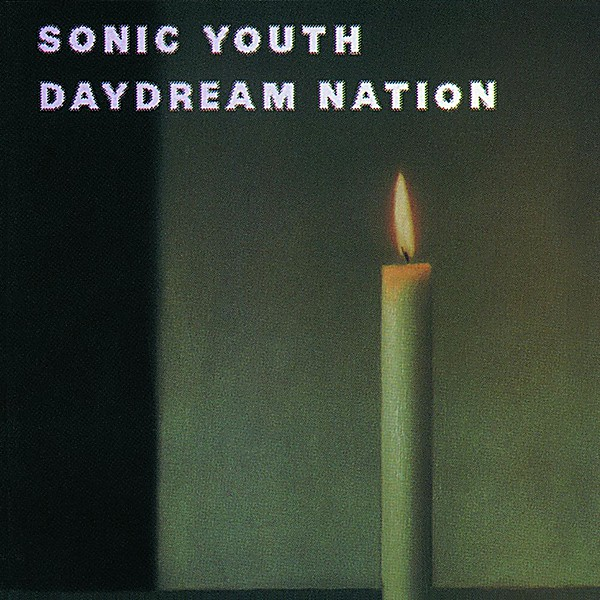

# Daydream Nation

By **Sonic Youth**

## Album Data

- **Catalog:** Beets
- **Format:** Digital, Album
- **Album:** Daydream Nation
- **Artist:** Sonic Youth
- **Albumartist:** Sonic Youth
- **Genre:** Noise Rock
- **MusicBrainz Album Artist ID:** [5cbef01b-cc35-4f52-af7b-d0df0c4f61b9](https://musicbrainz.org/artist/5cbef01b-cc35-4f52-af7b-d0df0c4f61b9)
- **MusicBrainz Album ID:** [3e45d49c-fd4e-3075-a425-ceb27df91e3e](https://musicbrainz.org/release/3e45d49c-fd4e-3075-a425-ceb27df91e3e)
- **MusicBrainz Release Group ID:** [24769a99-8189-3d8c-947e-dbc8574dad5c](https://musicbrainz.org/release-group/24769a99-8189-3d8c-947e-dbc8574dad5c)
- **Year:** 1988
- **Catalog #:** 7 75403-2
- **Label:** Enigma Records
- **Total Tracks:** 12

## Album Tracks

### Track 01 - Teen Age Riot

- **Artist:** Sonic Youth
- **Format:** ALAC
- **Genre:** Noise Rock
- **Length:** 6:58
- **MusicBrainz Track ID:** [2109e376-132b-40ad-b993-2bb6812e19d4](https://musicbrainz.org/recording/2109e376-132b-40ad-b993-2bb6812e19d4)
- **Title:** Teen Age Riot
- **Track:** 01
- **Year:** 1988

### Track 02 - Silver Rocket

- **Artist:** Sonic Youth
- **Format:** ALAC
- **Genre:** Noise Rock
- **Length:** 3:47
- **MusicBrainz Track ID:** [9faf903b-cadb-47ac-ad69-5d7d0f95c1d3](https://musicbrainz.org/recording/9faf903b-cadb-47ac-ad69-5d7d0f95c1d3)
- **Title:** Silver Rocket
- **Track:** 02
- **Year:** 1988

### Track 03 - The Sprawl

- **Artist:** Sonic Youth
- **Format:** ALAC
- **Genre:** Shoegaze
- **Length:** 7:42
- **MusicBrainz Track ID:** [ba8b2b4e-fee0-4b0f-a242-b5dfc5ddb3b1](https://musicbrainz.org/recording/ba8b2b4e-fee0-4b0f-a242-b5dfc5ddb3b1)
- **Title:** The Sprawl
- **Track:** 03
- **Year:** 1988

### Track 04 - ’Cross the Breeze

- **Artist:** Sonic Youth
- **Format:** ALAC
- **Genre:** Noise Rock
- **Length:** 7:00
- **MusicBrainz Track ID:** [91624793-31dd-44b9-9f2b-af4dd16609a9](https://musicbrainz.org/recording/91624793-31dd-44b9-9f2b-af4dd16609a9)
- **Title:** ’Cross the Breeze
- **Track:** 04
- **Year:** 1988

### Track 05 - Eric’s Trip

- **Artist:** Sonic Youth
- **Format:** ALAC
- **Genre:** Noise Rock
- **Length:** 3:48
- **MusicBrainz Track ID:** [d826ba8b-bd7f-44e1-8470-9cd382c694da](https://musicbrainz.org/recording/d826ba8b-bd7f-44e1-8470-9cd382c694da)
- **Title:** Eric’s Trip
- **Track:** 05
- **Year:** 1988

### Track 06 - Total Trash

- **Artist:** Sonic Youth
- **Format:** ALAC
- **Genre:** Noise Rock
- **Length:** 7:33
- **MusicBrainz Track ID:** [509d456b-3523-4a36-a852-748b3665ae49](https://musicbrainz.org/recording/509d456b-3523-4a36-a852-748b3665ae49)
- **Title:** Total Trash
- **Track:** 06
- **Year:** 1988

### Track 07 - Hey Joni

- **Artist:** Sonic Youth
- **Format:** ALAC
- **Genre:** Noise Rock
- **Length:** 4:23
- **MusicBrainz Track ID:** [e0c179c5-e983-4baf-97e9-b0e4a2a1d4d1](https://musicbrainz.org/recording/e0c179c5-e983-4baf-97e9-b0e4a2a1d4d1)
- **Title:** Hey Joni
- **Track:** 07
- **Year:** 1988

### Track 08 - Providence

- **Artist:** Sonic Youth
- **Format:** ALAC
- **Genre:** Noise Rock
- **Length:** 2:41
- **MusicBrainz Track ID:** [ac8cf461-30a5-4f02-a557-2181d3ca3a37](https://musicbrainz.org/recording/ac8cf461-30a5-4f02-a557-2181d3ca3a37)
- **Title:** Providence
- **Track:** 08
- **Year:** 1988

### Track 09 - Candle

- **Artist:** Sonic Youth
- **Format:** ALAC
- **Genre:** Shoegaze
- **Length:** 4:58
- **MusicBrainz Track ID:** [963187fe-2e06-47b8-8c25-3495041b9d20](https://musicbrainz.org/recording/963187fe-2e06-47b8-8c25-3495041b9d20)
- **Title:** Candle
- **Track:** 09
- **Year:** 1988

### Track 10 - Rain King

- **Artist:** Sonic Youth
- **Format:** ALAC
- **Genre:** Shoegaze
- **Length:** 4:39
- **MusicBrainz Track ID:** [4305798e-a89e-4004-98cf-56b666976214](https://musicbrainz.org/recording/4305798e-a89e-4004-98cf-56b666976214)
- **Title:** Rain King
- **Track:** 10
- **Year:** 1988

### Track 11 - Kissability

- **Artist:** Sonic Youth
- **Format:** ALAC
- **Genre:** Shoegaze
- **Length:** 3:08
- **MusicBrainz Track ID:** [b9f26196-37c4-4ab9-96c2-37a346e2ace6](https://musicbrainz.org/recording/b9f26196-37c4-4ab9-96c2-37a346e2ace6)
- **Title:** Kissability
- **Track:** 11
- **Year:** 1988

### Track 12 - Trilogy

- **Artist:** Sonic Youth
- **Format:** ALAC
- **Genre:** Noise Rock
- **Length:** 14:06
- **MusicBrainz Track ID:** [f16b0475-2052-4f69-96cf-02bf2ae3b6bb](https://musicbrainz.org/recording/f16b0475-2052-4f69-96cf-02bf2ae3b6bb)
- **Title:** Trilogy
- **Track:** 12
- **Year:** 1988

