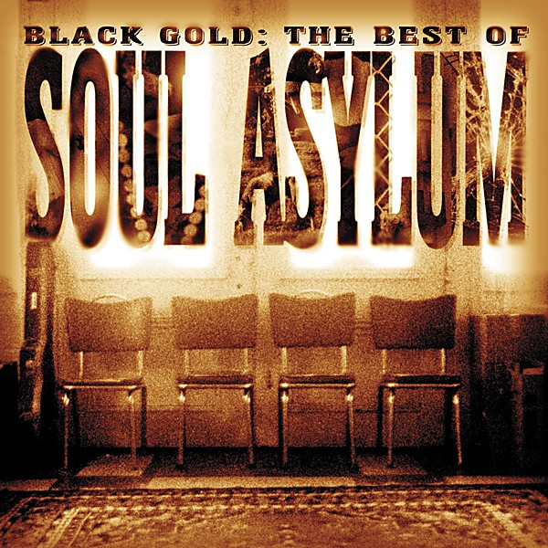

# Runaway Train

By **Soul Asylum**

## Album Data

- **Catalog:** Beets
- **Format:** Digital, Album
- **Album:** Runaway Train
- **Artist:** Soul Asylum
- **Albumartist:** Soul Asylum
- **Genre:** Grunge
- **MusicBrainz Album Artist ID:** [b10db9ad-b4c3-47f3-a7a4-37864b134f65](https://musicbrainz.org/artist/b10db9ad-b4c3-47f3-a7a4-37864b134f65)
- **MusicBrainz Album ID:** [956aed13-da00-47fa-a6aa-dd59da214b0d](https://musicbrainz.org/release/956aed13-da00-47fa-a6aa-dd59da214b0d)
- **MusicBrainz Release Group ID:** [767095c7-4607-33c7-840f-40ea2313786d](https://musicbrainz.org/release-group/767095c7-4607-33c7-840f-40ea2313786d)
- **Year:** 1993
- **Catalog #:** 44K 74947
- **Label:** Columbia
- **Total Tracks:** 05

## Album Tracks

### Track 01 - Runaway Train

- **Artist:** Soul Asylum
- **Format:** MP3
- **Genre:** Grunge
- **Length:** 4:27
- **MusicBrainz Track ID:** [af62c2a8-5355-40b0-bddf-3577a77a0d38](https://musicbrainz.org/recording/af62c2a8-5355-40b0-bddf-3577a77a0d38)
- **Title:** Runaway Train
- **Track:** 01
- **Year:** 1993

### Track 02 - Black Gold (live)

- **Artist:** Soul Asylum
- **Format:** MP3
- **Genre:** Grunge
- **Length:** 3:55
- **MusicBrainz Track ID:** [53c89abd-a996-4caa-a817-f3fd92a0628c](https://musicbrainz.org/recording/53c89abd-a996-4caa-a817-f3fd92a0628c)
- **Title:** Black Gold (live)
- **Track:** 02
- **Year:** 1993

### Track 03 - Never Really Been (live)

- **Artist:** Soul Asylum
- **Format:** MP3
- **Genre:** Grunge
- **Length:** 3:13
- **MusicBrainz Track ID:** [17ce0d92-c942-4518-b80a-6fee4c7e6fc8](https://musicbrainz.org/recording/17ce0d92-c942-4518-b80a-6fee4c7e6fc8)
- **Title:** Never Really Been (live)
- **Track:** 03
- **Year:** 1993

### Track 04 - By the Way

- **Artist:** Soul Asylum
- **Format:** MP3
- **Genre:** Post-Grunge
- **Length:** 3:46
- **MusicBrainz Track ID:** [c97287c7-841a-4001-8579-7aa1415d8b1b](https://musicbrainz.org/recording/c97287c7-841a-4001-8579-7aa1415d8b1b)
- **Title:** By the Way
- **Track:** 04
- **Year:** 1993

### Track 05 - Everybody Loves a Winner

- **Artist:** Soul Asylum
- **Format:** MP3
- **Genre:** Grunge
- **Length:** 5:07
- **MusicBrainz Track ID:** [b2c0602c-9042-44b6-8fdd-7569c6e86909](https://musicbrainz.org/recording/b2c0602c-9042-44b6-8fdd-7569c6e86909)
- **Title:** Everybody Loves a Winner
- **Track:** 05
- **Year:** 1993

## See also

- [Let Your Dim Light Shine](Let_Your_Dim_Light_Shine.md)
