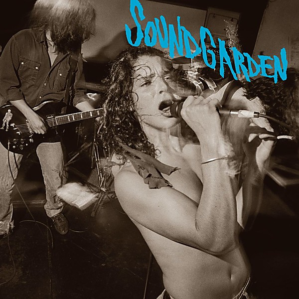

# Screaming Life / Fopp

By **Soundgarden**

## Album Data

- **Catalog:** Beets
- **Format:** Digital, Album
- **Album:** Screaming Life / Fopp
- **Artist:** Soundgarden
- **Albumartist:** Soundgarden
- **Genre:** Grunge
- **MusicBrainz Album Artist ID:** [153c9281-268f-4cf3-8938-f5a4593e5df4](https://musicbrainz.org/artist/153c9281-268f-4cf3-8938-f5a4593e5df4)
- **MusicBrainz Album ID:** [ae2b6b48-b25c-436f-8c32-773fc8090813](https://musicbrainz.org/release/ae2b6b48-b25c-436f-8c32-773fc8090813)
- **MusicBrainz Release Group ID:** [f72610aa-be6b-37dd-b068-b21d07bb717d](https://musicbrainz.org/release-group/f72610aa-be6b-37dd-b068-b21d07bb717d)
- **Year:** 1990
- **Catalog #:** 
- **Label:** 
- **Total Tracks:** 00

## Album Tracks

### Track 04 - Like Suicide (Acoustic Version)

- **Artist:** Soundgarden
- **Format:** ALAC
- **Genre:** Alternative Rock
- **Length:** 6:16
- **MusicBrainz Track ID:** 
- **Title:** Like Suicide (Acoustic Version)
- **Track:** 04
- **Year:** 1994

## See also

- [Songs from the Superunknown](Songs_from_the_Superunknown.md)
- [Superunknown (20th Anniversary)](Superunknown_20th_Anniversary.md)
- [Superunknown](Superunknown.md)
- [CD: Screaming Life/Fopp](../../CD/Soundgarden/Screaming_Life-Fopp.md)
- [CD: ](../../CD/Soundgarden/Soundgarden.md)
- [Roon: Superunknown (20th Anniversary)](../../Roon/Soundgarden/Superunknown_20th_Anniversary.md)
- [Vinyl: ](../../Vinyl/Soundgarden/Soundgarden.md)
- [Vinyl: Superunknown](../../Vinyl/Soundgarden/Superunknown.md)
