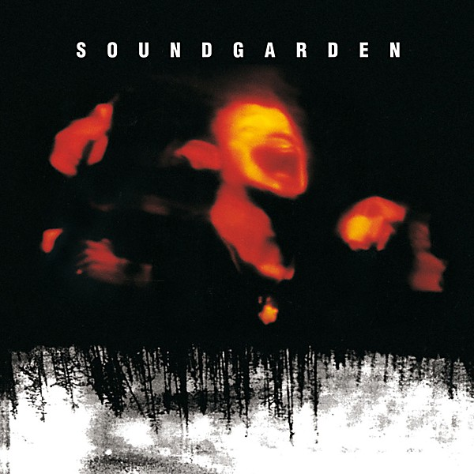

# Superunknown (20th Anniversary)

By **Soundgarden**

## Album Data

- **Catalog:** Beets
- **Format:** Digital, Album
- **Album:** Superunknown (20th Anniversary)
- **Artist:** Soundgarden
- **Albumartist:** Soundgarden
- **Genre:** Stoner Rock
- **MusicBrainz Album Artist ID:** 
- **MusicBrainz Album ID:** 
- **MusicBrainz Release Group ID:** 
- **Year:** 2014
- **Catalog #:** 
- **Label:** 
- **Total Tracks:** 15

## Album Tracks

### Track 01 - Let Me Drown

- **Artist:** Soundgarden
- **Format:** MP3
- **Genre:** Grunge
- **Length:** 3:52
- **MusicBrainz Track ID:** 
- **Title:** Let Me Drown
- **Track:** 01
- **Year:** 2014

### Track 02 - My Wave

- **Artist:** Soundgarden
- **Format:** MP3
- **Genre:** Grunge
- **Length:** 5:12
- **MusicBrainz Track ID:** 
- **Title:** My Wave
- **Track:** 02
- **Year:** 2014

### Track 03 - Fell On Black Days (Album Version)

- **Artist:** Soundgarden
- **Format:** MP3
- **Genre:** Stoner Rock
- **Length:** 4:43
- **MusicBrainz Track ID:** 
- **Title:** Fell On Black Days (Album Version)
- **Track:** 03
- **Year:** 2014

### Track 04 - Mailman

- **Artist:** Soundgarden
- **Format:** MP3
- **Genre:** Grunge
- **Length:** 4:26
- **MusicBrainz Track ID:** 
- **Title:** Mailman
- **Track:** 04
- **Year:** 2014

### Track 05 - Superunknown

- **Artist:** Soundgarden
- **Format:** MP3
- **Genre:** Grunge
- **Length:** 5:06
- **MusicBrainz Track ID:** 
- **Title:** Superunknown
- **Track:** 05
- **Year:** 2014

### Track 06 - Head Down

- **Artist:** Soundgarden
- **Format:** MP3
- **Genre:** Grunge
- **Length:** 6:09
- **MusicBrainz Track ID:** 
- **Title:** Head Down
- **Track:** 06
- **Year:** 2014

### Track 07 - Black Hole Sun

- **Artist:** Soundgarden
- **Format:** MP3
- **Genre:** Grunge
- **Length:** 5:18
- **MusicBrainz Track ID:** 
- **Title:** Black Hole Sun
- **Track:** 07
- **Year:** 2014

### Track 08 - Spoonman

- **Artist:** Soundgarden
- **Format:** MP3
- **Genre:** Grunge
- **Length:** 4:06
- **MusicBrainz Track ID:** 
- **Title:** Spoonman
- **Track:** 08
- **Year:** 2014

### Track 09 - Limo Wreck

- **Artist:** Soundgarden
- **Format:** MP3
- **Genre:** Grunge
- **Length:** 5:48
- **MusicBrainz Track ID:** 
- **Title:** Limo Wreck
- **Track:** 09
- **Year:** 2014

### Track 10 - The Day I Tried To Live (Album Version)

- **Artist:** Soundgarden
- **Format:** MP3
- **Genre:** Stoner Rock
- **Length:** 5:20
- **MusicBrainz Track ID:** 
- **Title:** The Day I Tried To Live (Album Version)
- **Track:** 10
- **Year:** 2014

### Track 11 - Kickstand

- **Artist:** Soundgarden
- **Format:** MP3
- **Genre:** Grunge
- **Length:** 1:34
- **MusicBrainz Track ID:** 
- **Title:** Kickstand
- **Track:** 11
- **Year:** 2014

### Track 12 - Fresh Tendrils

- **Artist:** Soundgarden
- **Format:** MP3
- **Genre:** Grunge
- **Length:** 4:16
- **MusicBrainz Track ID:** 
- **Title:** Fresh Tendrils
- **Track:** 12
- **Year:** 2014

### Track 13 - 4th Of July

- **Artist:** Soundgarden
- **Format:** MP3
- **Genre:** Grunge
- **Length:** 5:08
- **MusicBrainz Track ID:** 
- **Title:** 4th Of July
- **Track:** 13
- **Year:** 2014

### Track 14 - Half

- **Artist:** Soundgarden
- **Format:** MP3
- **Genre:** Grunge
- **Length:** 2:14
- **MusicBrainz Track ID:** 
- **Title:** Half
- **Track:** 14
- **Year:** 2014

### Track 15 - Like Suicide (Album Version)

- **Artist:** Soundgarden
- **Format:** MP3
- **Genre:** Stoner Rock
- **Length:** 7:04
- **MusicBrainz Track ID:** 
- **Title:** Like Suicide (Album Version)
- **Track:** 15
- **Year:** 2014

## See also

- [Screaming Life / Fopp](Screaming_Life_-_Fopp.md)
- [Songs from the Superunknown](Songs_from_the_Superunknown.md)
- [Superunknown](Superunknown.md)
- [CD: Screaming Life/Fopp](../../CD/Soundgarden/Screaming_Life-Fopp.md)
- [CD: ](../../CD/Soundgarden/Soundgarden.md)
- [Roon: Superunknown (20th Anniversary)](../../Roon/Soundgarden/Superunknown_20th_Anniversary.md)
- [Vinyl: ](../../Vinyl/Soundgarden/Soundgarden.md)
- [Vinyl: Superunknown](../../Vinyl/Soundgarden/Superunknown.md)
