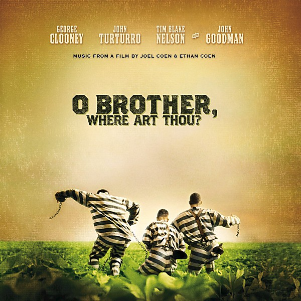

# O Brother, Where Art Thou

By **Soundtrack**

## Album Data

- **Catalog:** Beets
- **Format:** Digital, Album
- **Album:** O Brother, Where Art Thou
- **Artist:** Soundtrack
- **Albumartist:** Soundtrack
- **Genre:** Blues
- **MusicBrainz Album Artist ID:** 
- **MusicBrainz Album ID:** 
- **MusicBrainz Release Group ID:** 
- **Year:** 0000
- **Catalog #:** 
- **Label:** 
- **Total Tracks:** 10

## Album Tracks

### Track 01 - Goodbye, Eddie, Goodbye

- **Artist:** Paul Williams
- **Format:** ALAC
- **Genre:** Soul
- **Length:** 3:35
- **MusicBrainz Track ID:** 
- **Title:** Goodbye, Eddie, Goodbye
- **Track:** 01
- **Year:** 1989

### Track 02 - Faust (Winslow)

- **Artist:** Paul Williams
- **Format:** ALAC
- **Genre:** Soul
- **Length:** 3:30
- **MusicBrainz Track ID:** 
- **Title:** Faust (Winslow)
- **Track:** 02
- **Year:** 1989

### Track 03 - Upholstery

- **Artist:** Paul Williams
- **Format:** ALAC
- **Genre:** Soul
- **Length:** 2:53
- **MusicBrainz Track ID:** 
- **Title:** Upholstery
- **Track:** 03
- **Year:** 1989

### Track 04 - Special To Me

- **Artist:** Paul Williams
- **Format:** ALAC
- **Genre:** Soul
- **Length:** 2:49
- **MusicBrainz Track ID:** 
- **Title:** Special To Me
- **Track:** 04
- **Year:** 1989

### Track 05 - Phantom's Theme

- **Artist:** Paul Williams
- **Format:** ALAC
- **Genre:** Soul
- **Length:** 4:43
- **MusicBrainz Track ID:** 
- **Title:** Phantom's Theme
- **Track:** 05
- **Year:** 1989

### Track 06 - Somebody Super Like You

- **Artist:** Paul Williams
- **Format:** ALAC
- **Genre:** Glam Rock
- **Length:** 4:33
- **MusicBrainz Track ID:** 
- **Title:** Somebody Super Like You
- **Track:** 06
- **Year:** 1989

### Track 07 - Life At Last

- **Artist:** Paul Williams
- **Format:** ALAC
- **Genre:** Soul
- **Length:** 2:16
- **MusicBrainz Track ID:** 
- **Title:** Life At Last
- **Track:** 07
- **Year:** 1989

### Track 08 - Old Souls

- **Artist:** Paul Williams
- **Format:** ALAC
- **Genre:** Soul
- **Length:** 2:44
- **MusicBrainz Track ID:** 
- **Title:** Old Souls
- **Track:** 08
- **Year:** 1989

### Track 09 - Faust (Swan)

- **Artist:** Paul Williams
- **Format:** ALAC
- **Genre:** Soul
- **Length:** 5:07
- **MusicBrainz Track ID:** 
- **Title:** Faust (Swan)
- **Track:** 09
- **Year:** 1989

### Track 10 - The Hell Of It

- **Artist:** Paul Williams
- **Format:** ALAC
- **Genre:** Hard Rock
- **Length:** 3:45
- **MusicBrainz Track ID:** 
- **Title:** The Hell Of It
- **Track:** 10
- **Year:** 1989

## See also

- [Josie And The Pussycats](Josie_And_The_Pussycats.md)
- [Phantom Of The Paradise](Phantom_Of_The_Paradise.md)
- [Reservoir Dogs](Reservoir_Dogs.md)
- [Romantic Duets from MGM Classics](Romantic_Duets_from_MGM_Classics.md)
- [Sucker Punch](Sucker_Punch.md)
- [The Crow, City of Angels](The_Crow__City_of_Angels.md)
- [The Last Picture Show](The_Last_Picture_Show.md)
- [zensnap up](zensnap_up.md)
- [Roon: O Brother, Where Art Thou](../../Roon/Soundtrack/O_Brother__Where_Art_Thou.md)
- [Roon: Reservoir Dogs](../../Roon/Soundtrack/Reservoir_Dogs.md)
- [Roon: Romantic Duets from MGM Classics](../../Roon/Soundtrack/Romantic_Duets_from_MGM_Classics.md)
- [Roon: The Crow, City of Angels](../../Roon/Soundtrack/The_Crow__City_of_Angels.md)
- [Roon: The Last Picture Show](../../Roon/Soundtrack/The_Last_Picture_Show.md)
- [Roon: zensnap up](../../Roon/Soundtrack/zensnap_up.md)
