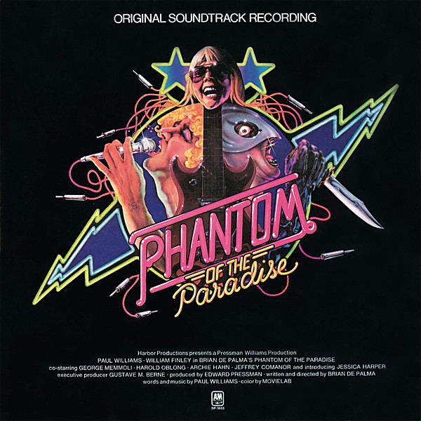

# Phantom Of The Paradise

By **Soundtrack**

## Album Data

- **Catalog:** Beets
- **Format:** Digital, Album
- **Album:** Phantom Of The Paradise
- **Artist:** Soundtrack
- **Albumartist:** Soundtrack
- **Genre:** Soul
- **MusicBrainz Album Artist ID:** 
- **MusicBrainz Album ID:** 
- **MusicBrainz Release Group ID:** 
- **Year:** 1989
- **Catalog #:** 
- **Label:** 
- **Total Tracks:** 00

## Album Tracks

### Track 06 - I Gotcha

- **Artist:** Joe Tex
- **Format:** AAC
- **Genre:** Uk Garage
- **Length:** 2:27
- **MusicBrainz Track ID:** 
- **Title:** I Gotcha
- **Track:** 06
- **Year:** 1992

## See also

- [Josie And The Pussycats](Josie_And_The_Pussycats.md)
- [O Brother, Where Art Thou](O_Brother__Where_Art_Thou.md)
- [Reservoir Dogs](Reservoir_Dogs.md)
- [Romantic Duets from MGM Classics](Romantic_Duets_from_MGM_Classics.md)
- [Sucker Punch](Sucker_Punch.md)
- [The Crow, City of Angels](The_Crow__City_of_Angels.md)
- [The Last Picture Show](The_Last_Picture_Show.md)
- [zensnap up](zensnap_up.md)
- [Roon: O Brother, Where Art Thou](../../Roon/Soundtrack/O_Brother__Where_Art_Thou.md)
- [Roon: Reservoir Dogs](../../Roon/Soundtrack/Reservoir_Dogs.md)
- [Roon: Romantic Duets from MGM Classics](../../Roon/Soundtrack/Romantic_Duets_from_MGM_Classics.md)
- [Roon: The Crow, City of Angels](../../Roon/Soundtrack/The_Crow__City_of_Angels.md)
- [Roon: The Last Picture Show](../../Roon/Soundtrack/The_Last_Picture_Show.md)
- [Roon: zensnap up](../../Roon/Soundtrack/zensnap_up.md)
