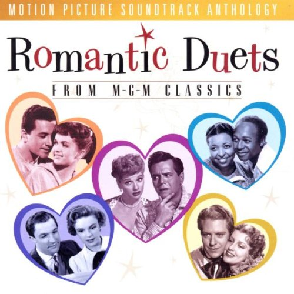

# Romantic Duets from MGM Classics

By **Soundtrack**

## Album Data

- **Catalog:** Beets
- **Format:** Digital, Album
- **Album:** Romantic Duets from MGM Classics
- **Artist:** Soundtrack
- **Albumartist:** Soundtrack
- **Genre:** Unknown
- **MusicBrainz Album Artist ID:** 
- **MusicBrainz Album ID:** 
- **MusicBrainz Release Group ID:** 
- **Year:** 1997
- **Catalog #:** 
- **Label:** 
- **Total Tracks:** 09

## Album Tracks

### Track 02 - Army Of Me - (Björk Featuring Skunk Anansie - Sucker Punch Remix)

- **Artist:** Björk Feat. Skunk Anansie
- **Format:** AAC
- **Genre:** Rock
- **Length:** 6:50
- **MusicBrainz Track ID:** 
- **Title:** Army Of Me - (Björk Featuring Skunk Anansie - Sucker Punch Remix)
- **Track:** 02
- **Year:** 2011

### Track 06 - Tomorrow Never Knows - (Alison Mosshart & Carla Azar)

- **Artist:** Carla Azar & Alison Mosshart
- **Format:** AAC
- **Genre:** Pop
- **Length:** 7:35
- **MusicBrainz Track ID:** 
- **Title:** Tomorrow Never Knows - (Alison Mosshart & Carla Azar)
- **Track:** 06
- **Year:** 2011

### Track 09 - Love Is The Drug - (Carla Gugino & Oscar Isaac)

- **Artist:** Carla Gugino & Oscar Isaac
- **Format:** AAC
- **Genre:** Unknown
- **Length:** 4:12
- **MusicBrainz Track ID:** 
- **Title:** Love Is The Drug - (Carla Gugino & Oscar Isaac)
- **Track:** 09
- **Year:** 2011

### Track 03 - White Rabbit - (Emiliana Torrini)

- **Artist:** Emiliana Torrini
- **Format:** AAC
- **Genre:** Indie Pop
- **Length:** 5:08
- **MusicBrainz Track ID:** 
- **Title:** White Rabbit - (Emiliana Torrini)
- **Track:** 03
- **Year:** 2011

### Track 01 - Sweet Dreams (Are Made Of This) - (Emily Browning)

- **Artist:** Emily Browning
- **Format:** AAC
- **Genre:** Unknown
- **Length:** 5:18
- **MusicBrainz Track ID:** 
- **Title:** Sweet Dreams (Are Made Of This) - (Emily Browning)
- **Track:** 01
- **Year:** 2011

### Track 08 - Asleep - (Emily Browning)

- **Artist:** Emily Browning
- **Format:** AAC
- **Genre:** Unknown
- **Length:** 4:23
- **MusicBrainz Track ID:** 
- **Title:** Asleep - (Emily Browning)
- **Track:** 08
- **Year:** 2011

### Track 04 - I Want It All - We Will Rock You - (Queen With Armageddon Aka Geddy - Mash-Up)

- **Artist:** Queen With Armageddon Aka Geddy
- **Format:** AAC
- **Genre:** Rock
- **Length:** 5:08
- **MusicBrainz Track ID:** 
- **Title:** I Want It All - We Will Rock You - (Queen With Armageddon Aka Geddy - Mash-Up)
- **Track:** 04
- **Year:** 2011

### Track 05 - Search And Destroy - (Skunk Anansie)

- **Artist:** Skunk Anansie
- **Format:** AAC
- **Genre:** Hard Rock
- **Length:** 4:25
- **MusicBrainz Track ID:** 
- **Title:** Search And Destroy - (Skunk Anansie)
- **Track:** 05
- **Year:** 2011

### Track 07 - Where Is My Mind - (Yoav Featuring Emily Browning)

- **Artist:** Yoav Feat. Emily Browning
- **Format:** AAC
- **Genre:** Rock
- **Length:** 6:11
- **MusicBrainz Track ID:** 
- **Title:** Where Is My Mind - (Yoav Featuring Emily Browning)
- **Track:** 07
- **Year:** 2011

## See also

- [Josie And The Pussycats](Josie_And_The_Pussycats.md)
- [O Brother, Where Art Thou](O_Brother__Where_Art_Thou.md)
- [Phantom Of The Paradise](Phantom_Of_The_Paradise.md)
- [Reservoir Dogs](Reservoir_Dogs.md)
- [Sucker Punch](Sucker_Punch.md)
- [The Crow, City of Angels](The_Crow__City_of_Angels.md)
- [The Last Picture Show](The_Last_Picture_Show.md)
- [zensnap up](zensnap_up.md)
- [Roon: O Brother, Where Art Thou](../../Roon/Soundtrack/O_Brother__Where_Art_Thou.md)
- [Roon: Reservoir Dogs](../../Roon/Soundtrack/Reservoir_Dogs.md)
- [Roon: Romantic Duets from MGM Classics](../../Roon/Soundtrack/Romantic_Duets_from_MGM_Classics.md)
- [Roon: The Crow, City of Angels](../../Roon/Soundtrack/The_Crow__City_of_Angels.md)
- [Roon: The Last Picture Show](../../Roon/Soundtrack/The_Last_Picture_Show.md)
- [Roon: zensnap up](../../Roon/Soundtrack/zensnap_up.md)
