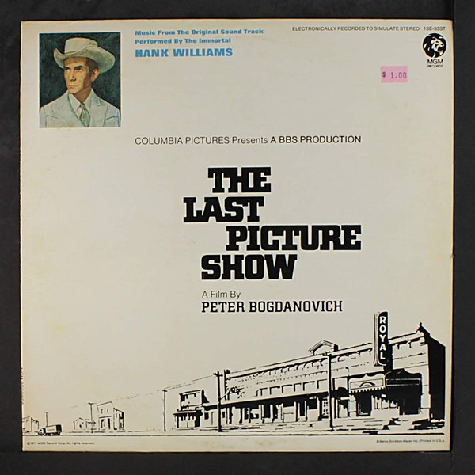

# The Last Picture Show

By **Soundtrack**

## Album Data

- **Catalog:** Beets
- **Format:** Digital, Album
- **Album:** The Last Picture Show
- **Artist:** Soundtrack
- **Albumartist:** Soundtrack
- **Genre:** Unknown
- **MusicBrainz Album Artist ID:** 
- **MusicBrainz Album ID:** 
- **MusicBrainz Release Group ID:** 
- **Year:** 1971
- **Catalog #:** 
- **Label:** 
- **Total Tracks:** 00

## Album Tracks

### Track 01 - The Intro

- **Artist:** Soundtrack
- **Format:** MP3
- **Genre:** Soul
- **Length:** 3:02
- **MusicBrainz Track ID:** 
- **Title:** The Intro
- **Track:** 01
- **Year:** 0000

### Track 02 - Are they lonely

- **Artist:** Soundtrack
- **Format:** MP3
- **Genre:** Soul
- **Length:** 4:38
- **MusicBrainz Track ID:** 
- **Title:** Are they lonely
- **Track:** 02
- **Year:** 0000

### Track 03 - On a wave

- **Artist:** Soundtrack
- **Format:** MP3
- **Genre:** Soul
- **Length:** 4:00
- **MusicBrainz Track ID:** 
- **Title:** On a wave
- **Track:** 03
- **Year:** 0000

### Track 04 - little bird

- **Artist:** Soundtrack
- **Format:** MP3
- **Genre:** Soul
- **Length:** 4:22
- **MusicBrainz Track ID:** 
- **Title:** little bird
- **Track:** 04
- **Year:** 0000

### Track 05 - blue heron

- **Artist:** Soundtrack
- **Format:** MP3
- **Genre:** Soul
- **Length:** 5:49
- **MusicBrainz Track ID:** 
- **Title:** blue heron
- **Track:** 05
- **Year:** 0000

### Track 06 - lady light

- **Artist:** Soundtrack
- **Format:** MP3
- **Genre:** Soul
- **Length:** 4:10
- **MusicBrainz Track ID:** 
- **Title:** lady light
- **Track:** 06
- **Year:** 0000

### Track 07 - no promises

- **Artist:** Soundtrack
- **Format:** MP3
- **Genre:** Soul
- **Length:** 7:03
- **MusicBrainz Track ID:** 
- **Title:** no promises
- **Track:** 07
- **Year:** 0000

### Track 08 - follow this melody

- **Artist:** Soundtrack
- **Format:** MP3
- **Genre:** Soul
- **Length:** 4:21
- **MusicBrainz Track ID:** 
- **Title:** follow this melody
- **Track:** 08
- **Year:** 0000

### Track 09 - I'm Falling

- **Artist:** Soundtrack
- **Format:** MP3
- **Genre:** Soul
- **Length:** 2:13
- **MusicBrainz Track ID:** 
- **Title:** I'm Falling
- **Track:** 09
- **Year:** 0000

### Track 10 - Soul Behind the Word

- **Artist:** Soundtrack
- **Format:** MP3
- **Genre:** Soul
- **Length:** 2:30
- **MusicBrainz Track ID:** 
- **Title:** Soul Behind the Word
- **Track:** 10
- **Year:** 0000

### Track 11 - EveryDay Hero

- **Artist:** Soundtrack
- **Format:** MP3
- **Genre:** Soul
- **Length:** 3:42
- **MusicBrainz Track ID:** 
- **Title:** EveryDay Hero
- **Track:** 11
- **Year:** 0000

### Track 12 - Magic Child

- **Artist:** Soundtrack
- **Format:** MP3
- **Genre:** Soul
- **Length:** 2:36
- **MusicBrainz Track ID:** 
- **Title:** Magic Child
- **Track:** 12
- **Year:** 0000

### Track 13 - Death Be not Today

- **Artist:** Soundtrack
- **Format:** MP3
- **Genre:** Soul
- **Length:** 3:07
- **MusicBrainz Track ID:** 
- **Title:** Death Be not Today
- **Track:** 13
- **Year:** 0000

### Track 14 - I'll Tell You Why

- **Artist:** Soundtrack
- **Format:** MP3
- **Genre:** Soul
- **Length:** 5:38
- **MusicBrainz Track ID:** 
- **Title:** I'll Tell You Why
- **Track:** 14
- **Year:** 0000

### Track 15 - If I Don't Have You

- **Artist:** Soundtrack
- **Format:** MP3
- **Genre:** Soul
- **Length:** 3:13
- **MusicBrainz Track ID:** 
- **Title:** If I Don't Have You
- **Track:** 15
- **Year:** 0000

### Track 16 - The Return

- **Artist:** Soundtrack
- **Format:** MP3
- **Genre:** Soul
- **Length:** 1:44
- **MusicBrainz Track ID:** 
- **Title:** The Return
- **Track:** 16
- **Year:** 0000

### Track 17 - Love of my life

- **Artist:** Soundtrack
- **Format:** MP3
- **Genre:** Soul
- **Length:** 4:19
- **MusicBrainz Track ID:** 
- **Title:** Love of my life
- **Track:** 17
- **Year:** 0000

## See also

- [Josie And The Pussycats](Josie_And_The_Pussycats.md)
- [O Brother, Where Art Thou](O_Brother__Where_Art_Thou.md)
- [Phantom Of The Paradise](Phantom_Of_The_Paradise.md)
- [Reservoir Dogs](Reservoir_Dogs.md)
- [Romantic Duets from MGM Classics](Romantic_Duets_from_MGM_Classics.md)
- [Sucker Punch](Sucker_Punch.md)
- [The Crow, City of Angels](The_Crow__City_of_Angels.md)
- [zensnap up](zensnap_up.md)
- [Roon: O Brother, Where Art Thou](../../Roon/Soundtrack/O_Brother__Where_Art_Thou.md)
- [Roon: Reservoir Dogs](../../Roon/Soundtrack/Reservoir_Dogs.md)
- [Roon: Romantic Duets from MGM Classics](../../Roon/Soundtrack/Romantic_Duets_from_MGM_Classics.md)
- [Roon: The Crow, City of Angels](../../Roon/Soundtrack/The_Crow__City_of_Angels.md)
- [Roon: The Last Picture Show](../../Roon/Soundtrack/The_Last_Picture_Show.md)
- [Roon: zensnap up](../../Roon/Soundtrack/zensnap_up.md)
