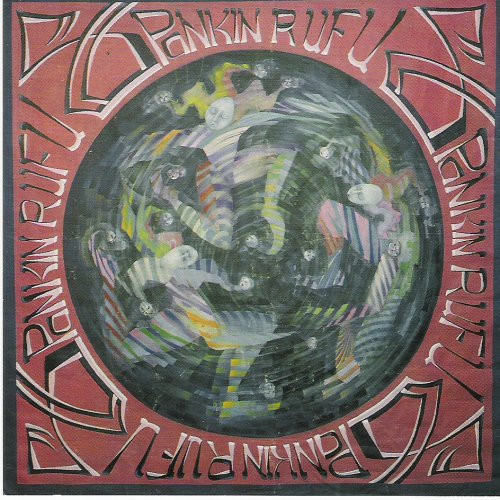

# Spankin Rufus

By **Spankin Rufus**

## Album Data

- **Catalog:** Beets
- **Format:** Digital, Album
- **Album:** Spankin Rufus
- **Artist:** Spankin Rufus
- **Albumartist:** Spankin Rufus
- **Genre:** Ska
- **MusicBrainz Album Artist ID:** 
- **MusicBrainz Album ID:** 
- **MusicBrainz Release Group ID:** 
- **Year:** 0000
- **Catalog #:** 
- **Label:** 
- **Total Tracks:** 00

## Album Tracks

### Track 01 - The Spanking Fields

- **Artist:** Spankin Rufus
- **Format:** MP3
- **Genre:** Ska
- **Length:** 3:20
- **MusicBrainz Track ID:** 
- **Title:** The Spanking Fields
- **Track:** 01
- **Year:** 0000

### Track 02 - Confide in Me

- **Artist:** Spankin Rufus
- **Format:** MP3
- **Genre:** Ska
- **Length:** 2:58
- **MusicBrainz Track ID:** 
- **Title:** Confide in Me
- **Track:** 02
- **Year:** 0000

### Track 03 - The Only One

- **Artist:** Spankin Rufus
- **Format:** MP3
- **Genre:** Ska
- **Length:** 2:52
- **MusicBrainz Track ID:** 
- **Title:** The Only One
- **Track:** 03
- **Year:** 0000

### Track 04 - Sing High

- **Artist:** Spankin Rufus
- **Format:** MP3
- **Genre:** Ska
- **Length:** 4:59
- **MusicBrainz Track ID:** 
- **Title:** Sing High
- **Track:** 04
- **Year:** 0000

### Track 05 - Jane, Stop This Crazy Thing

- **Artist:** Spankin Rufus
- **Format:** MP3
- **Genre:** Ska
- **Length:** 3:17
- **MusicBrainz Track ID:** 
- **Title:** Jane, Stop This Crazy Thing
- **Track:** 05
- **Year:** 0000

### Track 06 - Blitzkreig Lover

- **Artist:** Spankin Rufus
- **Format:** MP3
- **Genre:** Ska
- **Length:** 4:11
- **MusicBrainz Track ID:** 
- **Title:** Blitzkreig Lover
- **Track:** 06
- **Year:** 0000

### Track 07 - Be Cool

- **Artist:** Spankin Rufus
- **Format:** MP3
- **Genre:** Ska
- **Length:** 5:01
- **MusicBrainz Track ID:** 
- **Title:** Be Cool
- **Track:** 07
- **Year:** 0000

### Track 08 - Party Central

- **Artist:** Spankin Rufus
- **Format:** MP3
- **Genre:** Ska
- **Length:** 3:56
- **MusicBrainz Track ID:** 
- **Title:** Party Central
- **Track:** 08
- **Year:** 0000

### Track 09 - Dose the Bone

- **Artist:** Spankin Rufus
- **Format:** MP3
- **Genre:** Ska
- **Length:** 3:26
- **MusicBrainz Track ID:** 
- **Title:** Dose the Bone
- **Track:** 09
- **Year:** 0000

### Track 10 - Jonesin'

- **Artist:** Spankin Rufus
- **Format:** MP3
- **Genre:** Ska
- **Length:** 3:43
- **MusicBrainz Track ID:** 
- **Title:** Jonesin'
- **Track:** 10
- **Year:** 0000

### Track 11 - No Pain, No Pain

- **Artist:** Spankin Rufus
- **Format:** MP3
- **Genre:** Ska
- **Length:** 3:51
- **MusicBrainz Track ID:** 
- **Title:** No Pain, No Pain
- **Track:** 11
- **Year:** 0000

### Track 12 - Stayin' After School

- **Artist:** Spankin Rufus
- **Format:** MP3
- **Genre:** Ska
- **Length:** 3:19
- **MusicBrainz Track ID:** 
- **Title:** Stayin' After School
- **Track:** 12
- **Year:** 0000

### Track 13 - Funk Church

- **Artist:** Spankin Rufus
- **Format:** MP3
- **Genre:** Ska
- **Length:** 4:03
- **MusicBrainz Track ID:** 
- **Title:** Funk Church
- **Track:** 13
- **Year:** 0000

