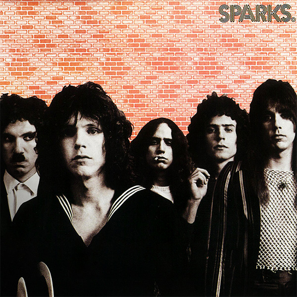

# Sparks

By **Sparks**

## Album Data

- **Catalog:** Beets
- **Format:** Digital, Album
- **Album:** Sparks
- **Artist:** Sparks
- **Albumartist:** Sparks
- **Genre:** Psychedelic Rock
- **MusicBrainz Album Artist ID:** [f319b57a-a494-40f6-a467-3d196d3484e6](https://musicbrainz.org/artist/f319b57a-a494-40f6-a467-3d196d3484e6)
- **MusicBrainz Album ID:** [396475fe-7fbb-332d-afc6-2c650676954a](https://musicbrainz.org/release/396475fe-7fbb-332d-afc6-2c650676954a)
- **MusicBrainz Release Group ID:** [14ac17d2-5a87-3cd1-8533-414dc57544af](https://musicbrainz.org/release-group/14ac17d2-5a87-3cd1-8533-414dc57544af)
- **Year:** 2006
- **Catalog #:** WOU 2048
- **Label:** Wounded Bird Records
- **Total Tracks:** 11

## Album Tracks

### Track 01 - Wonder Girl

- **Artist:** Sparks
- **Format:** AAC
- **Genre:** Rock
- **Length:** 2:21
- **MusicBrainz Track ID:** [aa371191-c552-4dcf-9885-7388bf4da8ac](https://musicbrainz.org/recording/aa371191-c552-4dcf-9885-7388bf4da8ac)
- **Title:** Wonder Girl
- **Track:** 01
- **Year:** 2006

### Track 02 - Fa La Fa Lee

- **Artist:** Sparks
- **Format:** AAC
- **Genre:** New Wave
- **Length:** 2:53
- **MusicBrainz Track ID:** [fc9e7814-9eb1-4478-a565-0b431414b5d6](https://musicbrainz.org/recording/fc9e7814-9eb1-4478-a565-0b431414b5d6)
- **Title:** Fa La Fa Lee
- **Track:** 02
- **Year:** 2006

### Track 03 - Roger

- **Artist:** Sparks
- **Format:** AAC
- **Genre:** Rock
- **Length:** 2:37
- **MusicBrainz Track ID:** [cf3edc41-f95a-46ff-9602-369432cf80d4](https://musicbrainz.org/recording/cf3edc41-f95a-46ff-9602-369432cf80d4)
- **Title:** Roger
- **Track:** 03
- **Year:** 2006

### Track 04 - High C

- **Artist:** Sparks
- **Format:** AAC
- **Genre:** Rock
- **Length:** 3:12
- **MusicBrainz Track ID:** [7d7c86c3-2251-4e60-a76f-981481507ff0](https://musicbrainz.org/recording/7d7c86c3-2251-4e60-a76f-981481507ff0)
- **Title:** High C
- **Track:** 04
- **Year:** 2006

### Track 05 - Fletcher Honorama

- **Artist:** Sparks
- **Format:** AAC
- **Genre:** Psychedelic Rock
- **Length:** 4:14
- **MusicBrainz Track ID:** [497ba8ed-6f91-4788-b3ca-c4c330490e07](https://musicbrainz.org/recording/497ba8ed-6f91-4788-b3ca-c4c330490e07)
- **Title:** Fletcher Honorama
- **Track:** 05
- **Year:** 2006

### Track 06 - Simple Ballet

- **Artist:** Sparks
- **Format:** AAC
- **Genre:** Progressive Rock
- **Length:** 3:53
- **MusicBrainz Track ID:** [ebbf7210-0d34-405c-80b5-9718bb14b771](https://musicbrainz.org/recording/ebbf7210-0d34-405c-80b5-9718bb14b771)
- **Title:** Simple Ballet
- **Track:** 06
- **Year:** 2006

### Track 07 - Slowboat

- **Artist:** Sparks
- **Format:** AAC
- **Genre:** Art Rock
- **Length:** 3:54
- **MusicBrainz Track ID:** [04be6a2a-ea2f-477b-8248-36dbd7ebd52d](https://musicbrainz.org/recording/04be6a2a-ea2f-477b-8248-36dbd7ebd52d)
- **Title:** Slowboat
- **Track:** 07
- **Year:** 2006

### Track 08 - Biology 2

- **Artist:** Sparks
- **Format:** AAC
- **Genre:** Rock
- **Length:** 3:09
- **MusicBrainz Track ID:** [5ce0694e-998e-42f9-8a2c-9de365f8e822](https://musicbrainz.org/recording/5ce0694e-998e-42f9-8a2c-9de365f8e822)
- **Title:** Biology 2
- **Track:** 08
- **Year:** 2006

### Track 09 - Saccharin and the War

- **Artist:** Sparks
- **Format:** AAC
- **Genre:** Rock
- **Length:** 4:02
- **MusicBrainz Track ID:** [5298b80c-ef3a-4389-aa6e-907bcdaae674](https://musicbrainz.org/recording/5298b80c-ef3a-4389-aa6e-907bcdaae674)
- **Title:** Saccharin and the War
- **Track:** 09
- **Year:** 2006

### Track 10 - Big Bands

- **Artist:** Sparks
- **Format:** AAC
- **Genre:** Art Rock
- **Length:** 4:15
- **MusicBrainz Track ID:** [fabc7786-a585-40b5-a152-919f434c6bd4](https://musicbrainz.org/recording/fabc7786-a585-40b5-a152-919f434c6bd4)
- **Title:** Big Bands
- **Track:** 10
- **Year:** 2006

### Track 11 - (No More) Mr. Nice Guys

- **Artist:** Sparks
- **Format:** AAC
- **Genre:** Rock
- **Length:** 5:49
- **MusicBrainz Track ID:** [6f9ef7f5-ea91-4282-a0af-15828b90bdd4](https://musicbrainz.org/recording/6f9ef7f5-ea91-4282-a0af-15828b90bdd4)
- **Title:** (No More) Mr. Nice Guys
- **Track:** 11
- **Year:** 2006

## See also

- [Indiscreet](Indiscreet.md)
