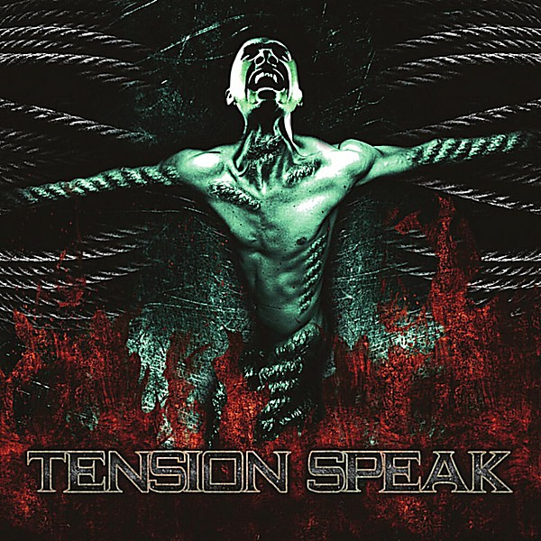

# Speak

By **Speak**

## Album Data

- **Catalog:** Beets
- **Format:** Digital, Album
- **Album:** Speak
- **Artist:** Speak
- **Albumartist:** Speak
- **Genre:** Synthpop
- **MusicBrainz Album Artist ID:** 
- **MusicBrainz Album ID:** 
- **MusicBrainz Release Group ID:** 
- **Year:** 1997
- **Catalog #:** 
- **Label:** 
- **Total Tracks:** 08

## Album Tracks

### Track 01 - Fuzzy

- **Artist:** Speak
- **Format:** ALAC
- **Genre:** Synthpop
- **Length:** 3:52
- **MusicBrainz Track ID:** 
- **Title:** Fuzzy
- **Track:** 01
- **Year:** 1997

### Track 02 - Buddha

- **Artist:** Speak
- **Format:** ALAC
- **Genre:** Synthpop
- **Length:** 4:57
- **MusicBrainz Track ID:** 
- **Title:** Buddha
- **Track:** 02
- **Year:** 1997

### Track 03 - Gorilla

- **Artist:** Speak
- **Format:** ALAC
- **Genre:** Synthpop
- **Length:** 4:29
- **MusicBrainz Track ID:** 
- **Title:** Gorilla
- **Track:** 03
- **Year:** 1997

### Track 04 - Nothing Ever Is, Everything Is Becoming

- **Artist:** Speak
- **Format:** ALAC
- **Genre:** Synthpop
- **Length:** 4:53
- **MusicBrainz Track ID:** 
- **Title:** Nothing Ever Is, Everything Is Becoming
- **Track:** 04
- **Year:** 1997

### Track 05 - Pimpin'

- **Artist:** Speak
- **Format:** ALAC
- **Genre:** Synthpop
- **Length:** 5:45
- **MusicBrainz Track ID:** 
- **Title:** Pimpin'
- **Track:** 05
- **Year:** 1997

### Track 06 - Revolving

- **Artist:** Speak
- **Format:** ALAC
- **Genre:** Synthpop
- **Length:** 4:01
- **MusicBrainz Track ID:** 
- **Title:** Revolving
- **Track:** 06
- **Year:** 1997

### Track 07 - Thing

- **Artist:** Speak
- **Format:** ALAC
- **Genre:** Synthpop
- **Length:** 3:46
- **MusicBrainz Track ID:** 
- **Title:** Thing
- **Track:** 07
- **Year:** 1997

### Track 08 - The Dharma

- **Artist:** Speak
- **Format:** ALAC
- **Genre:** Synthpop
- **Length:** 1:22
- **MusicBrainz Track ID:** 
- **Title:** The Dharma
- **Track:** 08
- **Year:** 1997

