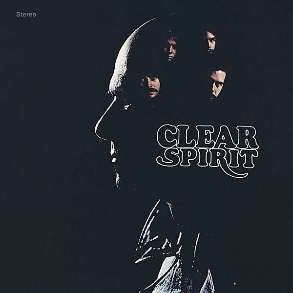

# Clear

By **Spirit**

## Album Data

- **Catalog:** Beets
- **Format:** Digital, Album
- **Album:** Clear
- **Artist:** Spirit
- **Albumartist:** Spirit
- **Genre:** Psychedelic Rock
- **MusicBrainz Album Artist ID:** [ca5db97b-ba17-4e85-a876-46065e2052b3](https://musicbrainz.org/artist/ca5db97b-ba17-4e85-a876-46065e2052b3)
- **MusicBrainz Album ID:** [f6e6ef1b-192c-42b3-8ea9-ae7d5aa9c381](https://musicbrainz.org/release/f6e6ef1b-192c-42b3-8ea9-ae7d5aa9c381)
- **MusicBrainz Release Group ID:** [b5599d6f-c242-3f78-af20-60725d3b0f49](https://musicbrainz.org/release-group/b5599d6f-c242-3f78-af20-60725d3b0f49)
- **Year:** 1996
- **Catalog #:** 64507
- **Label:** Epic
- **Total Tracks:** 10

## Album Tracks

### Track 01 - Chelsea Girls

- **Artist:** Spirit
- **Format:** ALAC
- **Genre:** Psychedelic Rock
- **Length:** 3:29
- **MusicBrainz Track ID:** [d659198d-4f60-4571-9ce3-48c60e0f019f](https://musicbrainz.org/recording/d659198d-4f60-4571-9ce3-48c60e0f019f)
- **Title:** Chelsea Girls
- **Track:** 01
- **Year:** 1972

### Track 02 - Cadillac Cowboys

- **Artist:** Spirit
- **Format:** ALAC
- **Genre:** Rock
- **Length:** 3:38
- **MusicBrainz Track ID:** [1e6f9ad6-137e-48a1-a797-f5e4e4030a05](https://musicbrainz.org/recording/1e6f9ad6-137e-48a1-a797-f5e4e4030a05)
- **Title:** Cadillac Cowboys
- **Track:** 02
- **Year:** 1972

### Track 03 - Puesta del Scam

- **Artist:** Spirit
- **Format:** ALAC
- **Genre:** Psychedelic Rock
- **Length:** 2:01
- **MusicBrainz Track ID:** [8b5af7b7-52fc-434b-a299-6dc31d6623e7](https://musicbrainz.org/recording/8b5af7b7-52fc-434b-a299-6dc31d6623e7)
- **Title:** Puesta del Scam
- **Track:** 03
- **Year:** 1972

### Track 04 - Ripe and Ready

- **Artist:** Spirit
- **Format:** ALAC
- **Genre:** Psychedelic Rock
- **Length:** 3:53
- **MusicBrainz Track ID:** [5c67b041-f9da-4402-a9f6-0b1d4f62ddae](https://musicbrainz.org/recording/5c67b041-f9da-4402-a9f6-0b1d4f62ddae)
- **Title:** Ripe and Ready
- **Track:** 04
- **Year:** 1972

### Track 05 - Darkness

- **Artist:** Spirit
- **Format:** ALAC
- **Genre:** Psychedelic Rock
- **Length:** 4:47
- **MusicBrainz Track ID:** [75c2d99c-e62a-47cc-9588-246fed212bc7](https://musicbrainz.org/recording/75c2d99c-e62a-47cc-9588-246fed212bc7)
- **Title:** Darkness
- **Track:** 05
- **Year:** 1972

### Track 06 - Earth Shaker

- **Artist:** Spirit
- **Format:** ALAC
- **Genre:** Psychedelic Rock
- **Length:** 3:54
- **MusicBrainz Track ID:** [dc4c91bc-7e4d-4f28-acd1-8f8198776a46](https://musicbrainz.org/recording/dc4c91bc-7e4d-4f28-acd1-8f8198776a46)
- **Title:** Earth Shaker
- **Track:** 06
- **Year:** 1972

### Track 07 - Mellow Morning

- **Artist:** Spirit
- **Format:** ALAC
- **Genre:** Psychedelic Rock
- **Length:** 2:22
- **MusicBrainz Track ID:** [1bbbe750-f070-4a55-82c6-707ac0394952](https://musicbrainz.org/recording/1bbbe750-f070-4a55-82c6-707ac0394952)
- **Title:** Mellow Morning
- **Track:** 07
- **Year:** 1972

### Track 08 - Right on Time

- **Artist:** Spirit
- **Format:** ALAC
- **Genre:** Psychedelic Rock
- **Length:** 2:47
- **MusicBrainz Track ID:** [38a646b2-d506-4e65-bd79-026e6c780b79](https://musicbrainz.org/recording/38a646b2-d506-4e65-bd79-026e6c780b79)
- **Title:** Right on Time
- **Track:** 08
- **Year:** 1972

### Track 09 - Trancas Fog-Out

- **Artist:** Spirit
- **Format:** ALAC
- **Genre:** Psychedelic Rock
- **Length:** 2:37
- **MusicBrainz Track ID:** [18c836a9-80ec-43a7-a33d-90dc55259fdb](https://musicbrainz.org/recording/18c836a9-80ec-43a7-a33d-90dc55259fdb)
- **Title:** Trancas Fog-Out
- **Track:** 09
- **Year:** 1972

### Track 10 - Witch

- **Artist:** Spirit
- **Format:** ALAC
- **Genre:** Psychedelic Rock
- **Length:** 5:20
- **MusicBrainz Track ID:** [ad93b8ea-276a-47bb-b6c1-8219085c428f](https://musicbrainz.org/recording/ad93b8ea-276a-47bb-b6c1-8219085c428f)
- **Title:** Witch
- **Track:** 10
- **Year:** 1972

## See also

- [Feedback](Feedback.md)
- [Spirit](Spirit.md)
- [The Best Of Spirit](The_Best_Of_Spirit.md)
- [The Family That Plays Together](The_Family_That_Plays_Together.md)
- [Twelve Dreams of Dr. Sardonicus](Twelve_Dreams_of_Dr_Sardonicus.md)
- [Roon: Clear](../../Roon/Spirit/Clear.md)
- [Roon: Feedback](../../Roon/Spirit/Feedback.md)
- [Roon: Spirit](../../Roon/Spirit/Spirit.md)
- [Roon: The Best Of Spirit](../../Roon/Spirit/The_Best_Of_Spirit.md)
- [Roon: The Family That Plays Together](../../Roon/Spirit/The_Family_That_Plays_Together.md)
- [Roon: Twelve Dreams Of Dr. Sardonicus](../../Roon/Spirit/Twelve_Dreams_Of_Dr_Sardonicus.md)
- [Vinyl: Clear](../../Vinyl/Spirit/Clear.md)
- [Vinyl: ](../../Vinyl/Spirit/Spirit_index.md)
- [Vinyl: Spirit](../../Vinyl/Spirit/Spirit.md)
- [Vinyl: Twelve Dreams Of Dr. Sardonicus](../../Vinyl/Spirit/Twelve_Dreams_Of_Dr_Sardonicus.md)
