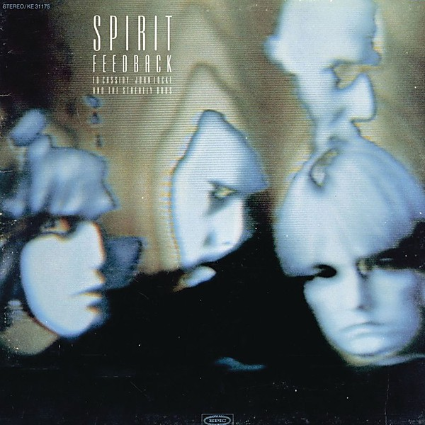

# Feedback

By **Spirit**

## Album Data

- **Catalog:** Beets
- **Format:** Digital, Album
- **Album:** Feedback
- **Artist:** Spirit
- **Albumartist:** Spirit
- **Genre:** Psychedelic Rock
- **MusicBrainz Album Artist ID:** [ca5db97b-ba17-4e85-a876-46065e2052b3](https://musicbrainz.org/artist/ca5db97b-ba17-4e85-a876-46065e2052b3)
- **MusicBrainz Album ID:** [39879f50-70f6-4d2e-a275-c73f2aac1b5e](https://musicbrainz.org/release/39879f50-70f6-4d2e-a275-c73f2aac1b5e)
- **MusicBrainz Release Group ID:** [d23a4452-80bf-3bce-8fde-b76b6a87f32c](https://musicbrainz.org/release-group/d23a4452-80bf-3bce-8fde-b76b6a87f32c)
- **Year:** 1972
- **Catalog #:** 485175-2
- **Label:** Epic
- **Total Tracks:** 15

## Album Tracks

### Track 01 - Fresh Garbage

- **Artist:** Spirit
- **Format:** ALAC
- **Genre:** Psychedelic Rock
- **Length:** 3:11
- **MusicBrainz Track ID:** [83c32852-9df9-45ed-8d0a-c32b7bdc339f](https://musicbrainz.org/recording/83c32852-9df9-45ed-8d0a-c32b7bdc339f)
- **Title:** Fresh Garbage
- **Track:** 01
- **Year:** 1996

### Track 02 - Uncle Jack

- **Artist:** Spirit
- **Format:** ALAC
- **Genre:** Teen Pop
- **Length:** 2:43
- **MusicBrainz Track ID:** [1ba3686f-6e45-47db-83d7-34df3e7ea507](https://musicbrainz.org/recording/1ba3686f-6e45-47db-83d7-34df3e7ea507)
- **Title:** Uncle Jack
- **Track:** 02
- **Year:** 1996

### Track 03 - Mechanical World

- **Artist:** Spirit
- **Format:** ALAC
- **Genre:** Psychedelic Rock
- **Length:** 5:14
- **MusicBrainz Track ID:** [d5d213af-c2c1-4577-97fe-d6587f0b3cb0](https://musicbrainz.org/recording/d5d213af-c2c1-4577-97fe-d6587f0b3cb0)
- **Title:** Mechanical World
- **Track:** 03
- **Year:** 1996

### Track 04 - Taurus

- **Artist:** Spirit
- **Format:** ALAC
- **Genre:** Acid Rock
- **Length:** 2:37
- **MusicBrainz Track ID:** [42c2f23c-4dbd-4c3e-98e5-3c123280ad25](https://musicbrainz.org/recording/42c2f23c-4dbd-4c3e-98e5-3c123280ad25)
- **Title:** Taurus
- **Track:** 04
- **Year:** 1996

### Track 05 - Girl in Your Eye

- **Artist:** Spirit
- **Format:** ALAC
- **Genre:** Raga Rock
- **Length:** 3:15
- **MusicBrainz Track ID:** [b726f689-7a2e-4cca-a953-46ca5d3d170d](https://musicbrainz.org/recording/b726f689-7a2e-4cca-a953-46ca5d3d170d)
- **Title:** Girl in Your Eye
- **Track:** 05
- **Year:** 1996

### Track 06 - Straight Arrow

- **Artist:** Spirit
- **Format:** ALAC
- **Genre:** Psychedelic Rock
- **Length:** 2:51
- **MusicBrainz Track ID:** [9c8de670-9c4c-4b29-b3de-338862daf2f8](https://musicbrainz.org/recording/9c8de670-9c4c-4b29-b3de-338862daf2f8)
- **Title:** Straight Arrow
- **Track:** 06
- **Year:** 1996

### Track 07 - Topanga Windows

- **Artist:** Spirit
- **Format:** ALAC
- **Genre:** Orchestral
- **Length:** 3:36
- **MusicBrainz Track ID:** [e1326146-df1c-44bf-a089-1a70479455b3](https://musicbrainz.org/recording/e1326146-df1c-44bf-a089-1a70479455b3)
- **Title:** Topanga Windows
- **Track:** 07
- **Year:** 1996

### Track 08 - Gramophone Man

- **Artist:** Spirit
- **Format:** ALAC
- **Genre:** Psychedelic Rock
- **Length:** 3:49
- **MusicBrainz Track ID:** [529c233e-6366-4838-9c68-a61fad4d0c04](https://musicbrainz.org/recording/529c233e-6366-4838-9c68-a61fad4d0c04)
- **Title:** Gramophone Man
- **Track:** 08
- **Year:** 1996

### Track 09 - Water Woman

- **Artist:** Spirit
- **Format:** ALAC
- **Genre:** Psychedelic Rock
- **Length:** 2:11
- **MusicBrainz Track ID:** [55972b18-a907-4fb7-8e5f-b4156ae13904](https://musicbrainz.org/recording/55972b18-a907-4fb7-8e5f-b4156ae13904)
- **Title:** Water Woman
- **Track:** 09
- **Year:** 1996

### Track 10 - Great Canyon Fire in General

- **Artist:** Spirit
- **Format:** ALAC
- **Genre:** Psychedelic Rock
- **Length:** 2:47
- **MusicBrainz Track ID:** [02a137a7-f79e-492b-9fa6-c3afcde459c8](https://musicbrainz.org/recording/02a137a7-f79e-492b-9fa6-c3afcde459c8)
- **Title:** Great Canyon Fire in General
- **Track:** 10
- **Year:** 1996

### Track 11 - Elijah

- **Artist:** Spirit
- **Format:** ALAC
- **Genre:** Psychedelic Rock
- **Length:** 10:49
- **MusicBrainz Track ID:** [d34ab339-9a23-4d35-892a-3115336233ca](https://musicbrainz.org/recording/d34ab339-9a23-4d35-892a-3115336233ca)
- **Title:** Elijah
- **Track:** 11
- **Year:** 1996

### Track 12 - Veruska

- **Artist:** Spirit
- **Format:** ALAC
- **Genre:** Psychedelic Rock
- **Length:** 2:51
- **MusicBrainz Track ID:** [98f84a87-2a12-45d1-a01e-1e7efd5e7862](https://musicbrainz.org/recording/98f84a87-2a12-45d1-a01e-1e7efd5e7862)
- **Title:** Veruska
- **Track:** 12
- **Year:** 1996

### Track 13 - Free Spirit

- **Artist:** Spirit
- **Format:** ALAC
- **Genre:** Psychedelic Rock
- **Length:** 4:28
- **MusicBrainz Track ID:** [725beb78-1802-4353-8b63-6b1415d6e207](https://musicbrainz.org/recording/725beb78-1802-4353-8b63-6b1415d6e207)
- **Title:** Free Spirit
- **Track:** 13
- **Year:** 1996

### Track 14 - If I Had a Woman

- **Artist:** Spirit
- **Format:** ALAC
- **Genre:** Psychedelic Rock
- **Length:** 3:12
- **MusicBrainz Track ID:** [577caaba-3ae1-4336-bc6f-18e6f9c799bf](https://musicbrainz.org/recording/577caaba-3ae1-4336-bc6f-18e6f9c799bf)
- **Title:** If I Had a Woman
- **Track:** 14
- **Year:** 1996

### Track 15 - Elijah (alternate take)

- **Artist:** Spirit
- **Format:** ALAC
- **Genre:** Psychedelic Rock
- **Length:** 9:42
- **MusicBrainz Track ID:** [d26e8e64-b782-4df5-a6a4-d818c4d78aca](https://musicbrainz.org/recording/d26e8e64-b782-4df5-a6a4-d818c4d78aca)
- **Title:** Elijah (alternate take)
- **Track:** 15
- **Year:** 1996

## See also

- [Clear](Clear.md)
- [Spirit](Spirit.md)
- [The Best Of Spirit](The_Best_Of_Spirit.md)
- [The Family That Plays Together](The_Family_That_Plays_Together.md)
- [Twelve Dreams of Dr. Sardonicus](Twelve_Dreams_of_Dr_Sardonicus.md)
- [Roon: Clear](../../Roon/Spirit/Clear.md)
- [Roon: Feedback](../../Roon/Spirit/Feedback.md)
- [Roon: Spirit](../../Roon/Spirit/Spirit.md)
- [Roon: The Best Of Spirit](../../Roon/Spirit/The_Best_Of_Spirit.md)
- [Roon: The Family That Plays Together](../../Roon/Spirit/The_Family_That_Plays_Together.md)
- [Roon: Twelve Dreams Of Dr. Sardonicus](../../Roon/Spirit/Twelve_Dreams_Of_Dr_Sardonicus.md)
- [Vinyl: Clear](../../Vinyl/Spirit/Clear.md)
- [Vinyl: ](../../Vinyl/Spirit/Spirit_index.md)
- [Vinyl: Spirit](../../Vinyl/Spirit/Spirit.md)
- [Vinyl: Twelve Dreams Of Dr. Sardonicus](../../Vinyl/Spirit/Twelve_Dreams_Of_Dr_Sardonicus.md)
