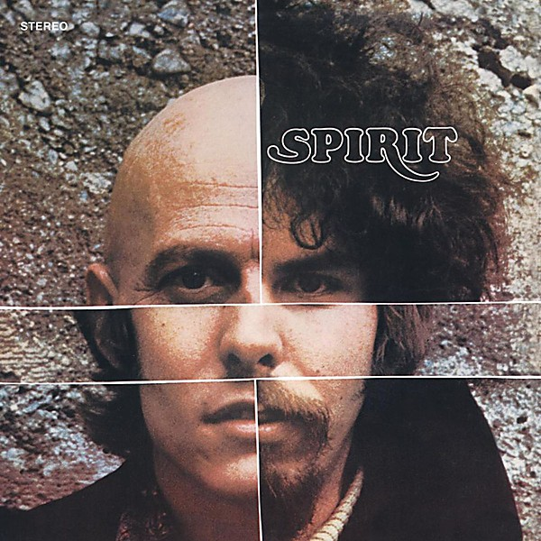

# Spirit

By **Spirit**

## Album Data

- **Catalog:** Beets
- **Format:** Digital, Album
- **Album:** Spirit
- **Artist:** Spirit
- **Albumartist:** Spirit
- **Genre:** Psychedelic Rock
- **MusicBrainz Album Artist ID:** [ca5db97b-ba17-4e85-a876-46065e2052b3](https://musicbrainz.org/artist/ca5db97b-ba17-4e85-a876-46065e2052b3)
- **MusicBrainz Album ID:** [bc61a7f0-a4ee-47a5-a61a-10c546f1a1f1](https://musicbrainz.org/release/bc61a7f0-a4ee-47a5-a61a-10c546f1a1f1)
- **MusicBrainz Release Group ID:** [9ae95886-c764-3bc6-ae1a-514d183641c7](https://musicbrainz.org/release-group/9ae95886-c764-3bc6-ae1a-514d183641c7)
- **Year:** 1996
- **Catalog #:** 
- **Label:** 
- **Total Tracks:** 23

## Album Tracks

### Track 01 - Fresh-Garbage

- **Artist:** Spirit
- **Format:** ALAC
- **Genre:** Psychedelic Rock
- **Length:** 3:15
- **MusicBrainz Track ID:** 
- **Title:** Fresh-Garbage
- **Track:** 01
- **Year:** 1973

### Track 02 - Uncle Jack

- **Artist:** Spirit
- **Format:** ALAC
- **Genre:** Teen Pop
- **Length:** 2:47
- **MusicBrainz Track ID:** 
- **Title:** Uncle Jack
- **Track:** 02
- **Year:** 1973

### Track 03 - Mechanical World

- **Artist:** Spirit
- **Format:** ALAC
- **Genre:** Psychedelic Rock
- **Length:** 5:22
- **MusicBrainz Track ID:** 
- **Title:** Mechanical World
- **Track:** 03
- **Year:** 1973

### Track 04 - Taurus

- **Artist:** Spirit
- **Format:** ALAC
- **Genre:** Acid Rock
- **Length:** 2:40
- **MusicBrainz Track ID:** 
- **Title:** Taurus
- **Track:** 04
- **Year:** 1973

### Track 05 - Girl In Your Eye

- **Artist:** Spirit
- **Format:** ALAC
- **Genre:** Raga Rock
- **Length:** 3:20
- **MusicBrainz Track ID:** 
- **Title:** Girl In Your Eye
- **Track:** 05
- **Year:** 1973

### Track 06 - Straight Arrow

- **Artist:** Spirit
- **Format:** ALAC
- **Genre:** Psychedelic Rock
- **Length:** 2:52
- **MusicBrainz Track ID:** 
- **Title:** Straight Arrow
- **Track:** 06
- **Year:** 1973

### Track 07 - Topango Windows

- **Artist:** Spirit
- **Format:** ALAC
- **Genre:** Orchestral
- **Length:** 3:41
- **MusicBrainz Track ID:** 
- **Title:** Topango Windows
- **Track:** 07
- **Year:** 1973

### Track 08 - Gramophone Man

- **Artist:** Spirit
- **Format:** ALAC
- **Genre:** Psychedelic Rock
- **Length:** 3:55
- **MusicBrainz Track ID:** 
- **Title:** Gramophone Man
- **Track:** 08
- **Year:** 1973

### Track 09 - Water Woman

- **Artist:** Spirit
- **Format:** ALAC
- **Genre:** Psychedelic Rock
- **Length:** 2:13
- **MusicBrainz Track ID:** 
- **Title:** Water Woman
- **Track:** 09
- **Year:** 1973

### Track 10 - The Great Canyon Fire In General

- **Artist:** Spirit
- **Format:** ALAC
- **Genre:** Psychedelic Rock
- **Length:** 2:49
- **MusicBrainz Track ID:** 
- **Title:** The Great Canyon Fire In General
- **Track:** 10
- **Year:** 1973

### Track 11 - Elijah

- **Artist:** Spirit
- **Format:** ALAC
- **Genre:** Psychedelic Rock
- **Length:** 11:01
- **MusicBrainz Track ID:** 
- **Title:** Elijah
- **Track:** 11
- **Year:** 1973

### Track 12 - Dark Eyed Woman

- **Artist:** Spirit
- **Format:** ALAC
- **Genre:** Psychedelic Rock
- **Length:** 3:11
- **MusicBrainz Track ID:** 
- **Title:** Dark Eyed Woman
- **Track:** 12
- **Year:** 1973

### Track 13 - Apple Orchard

- **Artist:** Spirit
- **Format:** ALAC
- **Genre:** Psychedelic Rock
- **Length:** 4:12
- **MusicBrainz Track ID:** 
- **Title:** Apple Orchard
- **Track:** 13
- **Year:** 1973

### Track 14 - So Little Time To Fly

- **Artist:** Spirit
- **Format:** ALAC
- **Genre:** Psychedelic Rock
- **Length:** 2:53
- **MusicBrainz Track ID:** 
- **Title:** So Little Time To Fly
- **Track:** 14
- **Year:** 1973

### Track 15 - Ground Hog

- **Artist:** Spirit
- **Format:** ALAC
- **Genre:** Psychedelic Rock
- **Length:** 3:08
- **MusicBrainz Track ID:** 
- **Title:** Ground Hog
- **Track:** 15
- **Year:** 1973

### Track 16 - Cold Wind

- **Artist:** Spirit
- **Format:** ALAC
- **Genre:** Psychedelic Rock
- **Length:** 3:27
- **MusicBrainz Track ID:** 
- **Title:** Cold Wind
- **Track:** 16
- **Year:** 1973

### Track 17 - Policeman's Ball

- **Artist:** Spirit
- **Format:** ALAC
- **Genre:** Progressive Rock
- **Length:** 2:33
- **MusicBrainz Track ID:** 
- **Title:** Policeman's Ball
- **Track:** 17
- **Year:** 1973

### Track 18 - Ice

- **Artist:** Spirit
- **Format:** ALAC
- **Genre:** Space Rock
- **Length:** 5:50
- **MusicBrainz Track ID:** 
- **Title:** Ice
- **Track:** 18
- **Year:** 1973

### Track 19 - Give A Life Take A Life

- **Artist:** Spirit
- **Format:** ALAC
- **Genre:** Psychedelic Rock
- **Length:** 3:31
- **MusicBrainz Track ID:** 
- **Title:** Give A Life Take A Life
- **Track:** 19
- **Year:** 1973

### Track 20 - I'm Truckin'

- **Artist:** Spirit
- **Format:** ALAC
- **Genre:** Psychedelic Rock
- **Length:** 2:30
- **MusicBrainz Track ID:** 
- **Title:** I'm Truckin'
- **Track:** 20
- **Year:** 1973

### Track 21 - Clear

- **Artist:** Spirit
- **Format:** ALAC
- **Genre:** Space Rock
- **Length:** 4:14
- **MusicBrainz Track ID:** 
- **Title:** Clear
- **Track:** 21
- **Year:** 1973

### Track 22 - Caught

- **Artist:** Spirit
- **Format:** ALAC
- **Genre:** Psychedelic Rock
- **Length:** 3:19
- **MusicBrainz Track ID:** 
- **Title:** Caught
- **Track:** 22
- **Year:** 1973

### Track 23 - New Dope In Town

- **Artist:** Spirit
- **Format:** ALAC
- **Genre:** Progressive Rock
- **Length:** 4:30
- **MusicBrainz Track ID:** 
- **Title:** New Dope In Town
- **Track:** 23
- **Year:** 1973

## See also

- [Clear](Clear.md)
- [Feedback](Feedback.md)
- [The Best Of Spirit](The_Best_Of_Spirit.md)
- [The Family That Plays Together](The_Family_That_Plays_Together.md)
- [Twelve Dreams of Dr. Sardonicus](Twelve_Dreams_of_Dr_Sardonicus.md)
- [Roon: Clear](../../Roon/Spirit/Clear.md)
- [Roon: Feedback](../../Roon/Spirit/Feedback.md)
- [Roon: Spirit](../../Roon/Spirit/Spirit.md)
- [Roon: The Best Of Spirit](../../Roon/Spirit/The_Best_Of_Spirit.md)
- [Roon: The Family That Plays Together](../../Roon/Spirit/The_Family_That_Plays_Together.md)
- [Roon: Twelve Dreams Of Dr. Sardonicus](../../Roon/Spirit/Twelve_Dreams_Of_Dr_Sardonicus.md)
- [Vinyl: Clear](../../Vinyl/Spirit/Clear.md)
- [Vinyl: ](../../Vinyl/Spirit/Spirit_index.md)
- [Vinyl: Spirit](../../Vinyl/Spirit/Spirit.md)
- [Vinyl: Twelve Dreams Of Dr. Sardonicus](../../Vinyl/Spirit/Twelve_Dreams_Of_Dr_Sardonicus.md)
