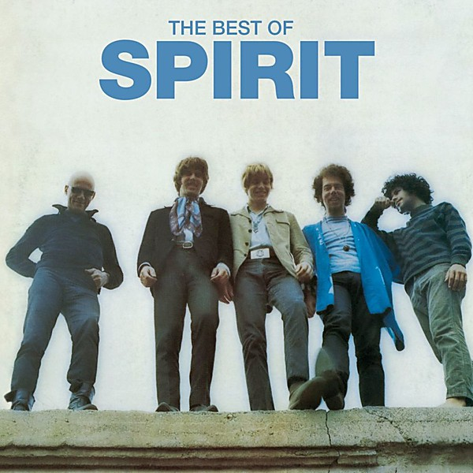

# The Best Of Spirit

By **Spirit**

## Album Data

- **Catalog:** Beets
- **Format:** Digital, Album
- **Album:** The Best Of Spirit
- **Artist:** Spirit
- **Albumartist:** Spirit
- **Genre:** Psychedelic Rock
- **MusicBrainz Album Artist ID:** 
- **MusicBrainz Album ID:** 
- **MusicBrainz Release Group ID:** 
- **Year:** 1973
- **Catalog #:** EK 65001
- **Label:** Epic
- **Total Tracks:** 16

## Album Tracks

### Track 01 - I Got a Line on You

- **Artist:** Spirit
- **Format:** ALAC
- **Genre:** Psychedelic Rock
- **Length:** 2:37
- **MusicBrainz Track ID:** [eb3db575-e44f-4892-96f6-6b614d08cc7e](https://musicbrainz.org/recording/eb3db575-e44f-4892-96f6-6b614d08cc7e)
- **Title:** I Got a Line on You
- **Track:** 01
- **Year:** 1996

### Track 02 - It Shall Be

- **Artist:** Spirit
- **Format:** ALAC
- **Genre:** Psychedelic Rock
- **Length:** 3:24
- **MusicBrainz Track ID:** [5fcfce69-272f-44f5-a3f0-4e2b9195c0cd](https://musicbrainz.org/recording/5fcfce69-272f-44f5-a3f0-4e2b9195c0cd)
- **Title:** It Shall Be
- **Track:** 02
- **Year:** 1996

### Track 03 - Poor Richard

- **Artist:** Spirit
- **Format:** ALAC
- **Genre:** Psychedelic Rock
- **Length:** 2:29
- **MusicBrainz Track ID:** [46f70622-ce9e-4d35-8ac9-6eaf193be76f](https://musicbrainz.org/recording/46f70622-ce9e-4d35-8ac9-6eaf193be76f)
- **Title:** Poor Richard
- **Track:** 03
- **Year:** 1996

### Track 04 - Silky Sam

- **Artist:** Spirit
- **Format:** ALAC
- **Genre:** Psychedelic Rock
- **Length:** 4:05
- **MusicBrainz Track ID:** [bf7c59e1-1a30-40de-b39d-c86b21ac278c](https://musicbrainz.org/recording/bf7c59e1-1a30-40de-b39d-c86b21ac278c)
- **Title:** Silky Sam
- **Track:** 04
- **Year:** 1996

### Track 05 - Drunkard

- **Artist:** Spirit
- **Format:** ALAC
- **Genre:** Art Rock
- **Length:** 2:38
- **MusicBrainz Track ID:** [b69ae74c-9096-4bdc-82e5-a1737cabd7e3](https://musicbrainz.org/recording/b69ae74c-9096-4bdc-82e5-a1737cabd7e3)
- **Title:** Drunkard
- **Track:** 05
- **Year:** 1996

### Track 06 - Darlin' If

- **Artist:** Spirit
- **Format:** ALAC
- **Genre:** Psychedelic Rock
- **Length:** 3:41
- **MusicBrainz Track ID:** [6e4e5291-d1bb-4f7f-9206-923702e53be2](https://musicbrainz.org/recording/6e4e5291-d1bb-4f7f-9206-923702e53be2)
- **Title:** Darlin' If
- **Track:** 06
- **Year:** 1996

### Track 07 - It's All the Same

- **Artist:** Spirit
- **Format:** ALAC
- **Genre:** Psychedelic Rock
- **Length:** 4:43
- **MusicBrainz Track ID:** [1c5fe081-486e-4764-827b-49f2a166568a](https://musicbrainz.org/recording/1c5fe081-486e-4764-827b-49f2a166568a)
- **Title:** It's All the Same
- **Track:** 07
- **Year:** 1996

### Track 08 - Jewish

- **Artist:** Spirit
- **Format:** ALAC
- **Genre:** Psychedelic Rock
- **Length:** 2:50
- **MusicBrainz Track ID:** [6db677ce-19a8-4045-ad78-69c49c1b3bdb](https://musicbrainz.org/recording/6db677ce-19a8-4045-ad78-69c49c1b3bdb)
- **Title:** Jewish
- **Track:** 08
- **Year:** 1996

### Track 09 - Dream Within a Dream

- **Artist:** Spirit
- **Format:** ALAC
- **Genre:** Psychedelic Rock
- **Length:** 3:02
- **MusicBrainz Track ID:** [c92a8af6-5743-4b60-845f-1c7c1405de79](https://musicbrainz.org/recording/c92a8af6-5743-4b60-845f-1c7c1405de79)
- **Title:** Dream Within a Dream
- **Track:** 09
- **Year:** 1996

### Track 10 - She Smiles

- **Artist:** Spirit
- **Format:** ALAC
- **Genre:** Art Rock
- **Length:** 2:32
- **MusicBrainz Track ID:** [820018ba-2a79-4247-9010-910be450f913](https://musicbrainz.org/recording/820018ba-2a79-4247-9010-910be450f913)
- **Title:** She Smiles
- **Track:** 10
- **Year:** 1996

### Track 11 - Aren't You Glad

- **Artist:** Spirit
- **Format:** ALAC
- **Genre:** Psychedelic Rock
- **Length:** 5:38
- **MusicBrainz Track ID:** [9ab7e36f-1bf2-49b0-aa7d-1d13a384e78f](https://musicbrainz.org/recording/9ab7e36f-1bf2-49b0-aa7d-1d13a384e78f)
- **Title:** Aren't You Glad
- **Track:** 11
- **Year:** 1996

### Track 12 - Fog

- **Artist:** Spirit
- **Format:** ALAC
- **Genre:** Progressive Rock
- **Length:** 2:26
- **MusicBrainz Track ID:** [f03f1c11-cc30-45d4-8bad-e9dc1946e03b](https://musicbrainz.org/recording/f03f1c11-cc30-45d4-8bad-e9dc1946e03b)
- **Title:** Fog
- **Track:** 12
- **Year:** 1996

### Track 13 - So Little to Say

- **Artist:** Spirit
- **Format:** ALAC
- **Genre:** Art Rock
- **Length:** 3:01
- **MusicBrainz Track ID:** [760bdd86-49b7-4e35-a3fa-503e45c8cc79](https://musicbrainz.org/recording/760bdd86-49b7-4e35-a3fa-503e45c8cc79)
- **Title:** So Little to Say
- **Track:** 13
- **Year:** 1996

### Track 14 - Mellow Fellow

- **Artist:** Spirit
- **Format:** ALAC
- **Genre:** Art Rock
- **Length:** 3:49
- **MusicBrainz Track ID:** [cd178b94-a28b-4f6e-91af-0b4067df5340](https://musicbrainz.org/recording/cd178b94-a28b-4f6e-91af-0b4067df5340)
- **Title:** Mellow Fellow
- **Track:** 14
- **Year:** 1996

### Track 15 - Now or Anywhere

- **Artist:** Spirit
- **Format:** ALAC
- **Genre:** Psychedelic Rock
- **Length:** 4:23
- **MusicBrainz Track ID:** [d75aa9c4-4e64-454e-8102-7692836d5bb0](https://musicbrainz.org/recording/d75aa9c4-4e64-454e-8102-7692836d5bb0)
- **Title:** Now or Anywhere
- **Track:** 15
- **Year:** 1996

### Track 16 - Space Chile

- **Artist:** Spirit
- **Format:** ALAC
- **Genre:** Psychedelic Rock
- **Length:** 6:26
- **MusicBrainz Track ID:** [b763cdf3-6318-451c-9873-2d51e337b4d1](https://musicbrainz.org/recording/b763cdf3-6318-451c-9873-2d51e337b4d1)
- **Title:** Space Chile
- **Track:** 16
- **Year:** 1996

## See also

- [Clear](Clear.md)
- [Feedback](Feedback.md)
- [Spirit](Spirit.md)
- [The Family That Plays Together](The_Family_That_Plays_Together.md)
- [Twelve Dreams of Dr. Sardonicus](Twelve_Dreams_of_Dr_Sardonicus.md)
- [Roon: Clear](../../Roon/Spirit/Clear.md)
- [Roon: Feedback](../../Roon/Spirit/Feedback.md)
- [Roon: Spirit](../../Roon/Spirit/Spirit.md)
- [Roon: The Best Of Spirit](../../Roon/Spirit/The_Best_Of_Spirit.md)
- [Roon: The Family That Plays Together](../../Roon/Spirit/The_Family_That_Plays_Together.md)
- [Roon: Twelve Dreams Of Dr. Sardonicus](../../Roon/Spirit/Twelve_Dreams_Of_Dr_Sardonicus.md)
- [Vinyl: Clear](../../Vinyl/Spirit/Clear.md)
- [Vinyl: ](../../Vinyl/Spirit/Spirit_index.md)
- [Vinyl: Spirit](../../Vinyl/Spirit/Spirit.md)
- [Vinyl: Twelve Dreams Of Dr. Sardonicus](../../Vinyl/Spirit/Twelve_Dreams_Of_Dr_Sardonicus.md)
