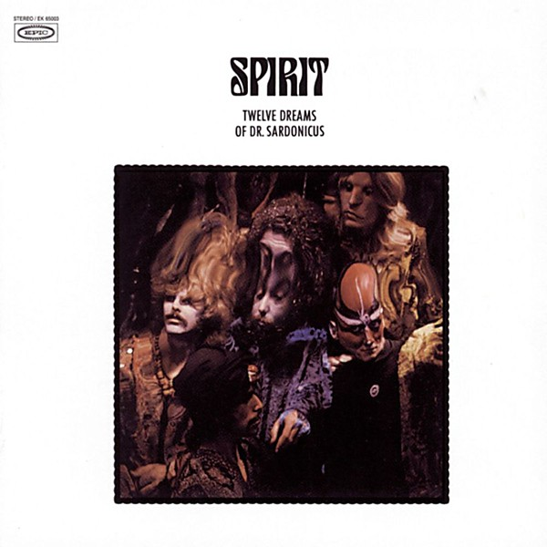

# Twelve Dreams of Dr. Sardonicus

By **Spirit**

## Album Data

- **Catalog:** Beets
- **Format:** Digital, Album
- **Album:** Twelve Dreams of Dr. Sardonicus
- **Artist:** Spirit
- **Albumartist:** Spirit
- **Genre:** Psychedelic Rock
- **MusicBrainz Album Artist ID:** [ca5db97b-ba17-4e85-a876-46065e2052b3](https://musicbrainz.org/artist/ca5db97b-ba17-4e85-a876-46065e2052b3)
- **MusicBrainz Album ID:** [fab44256-31a5-42fd-8d07-780932cae387](https://musicbrainz.org/release/fab44256-31a5-42fd-8d07-780932cae387)
- **MusicBrainz Release Group ID:** [86c7bfe0-b686-3c61-8ca3-0156d2735f4c](https://musicbrainz.org/release-group/86c7bfe0-b686-3c61-8ca3-0156d2735f4c)
- **Year:** 1996
- **Catalog #:** EK 65003
- **Label:** Epic
- **Total Tracks:** 16

## Album Tracks

### Track 01 - Prelude - Nothin' to Hide

- **Artist:** Spirit
- **Format:** ALAC
- **Genre:** Psychedelic Rock
- **Length:** 3:43
- **MusicBrainz Track ID:** [47e6c01d-58dd-4c68-b57e-eabc7d507aa2](https://musicbrainz.org/recording/47e6c01d-58dd-4c68-b57e-eabc7d507aa2)
- **Title:** Prelude - Nothin' to Hide
- **Track:** 01
- **Year:** 1996

### Track 02 - Nature's Way

- **Artist:** Spirit
- **Format:** ALAC
- **Genre:** Psychedelic Rock
- **Length:** 2:40
- **MusicBrainz Track ID:** [de6b000e-a80a-41d8-b74a-d656312be062](https://musicbrainz.org/recording/de6b000e-a80a-41d8-b74a-d656312be062)
- **Title:** Nature's Way
- **Track:** 02
- **Year:** 1996

### Track 03 - Animal Zoo

- **Artist:** Spirit
- **Format:** ALAC
- **Genre:** Acid Rock
- **Length:** 3:10
- **MusicBrainz Track ID:** [e1e66976-a45e-4e5c-8805-80d09c327b6c](https://musicbrainz.org/recording/e1e66976-a45e-4e5c-8805-80d09c327b6c)
- **Title:** Animal Zoo
- **Track:** 03
- **Year:** 1996

### Track 04 - Love Has Found a Way

- **Artist:** Spirit
- **Format:** ALAC
- **Genre:** Acid Rock
- **Length:** 2:42
- **MusicBrainz Track ID:** [8bc61d99-d750-4d74-8a70-0150d7633a1d](https://musicbrainz.org/recording/8bc61d99-d750-4d74-8a70-0150d7633a1d)
- **Title:** Love Has Found a Way
- **Track:** 04
- **Year:** 1996

### Track 05 - Why Can't I Be Free

- **Artist:** Spirit
- **Format:** ALAC
- **Genre:** Psychedelic Rock
- **Length:** 1:05
- **MusicBrainz Track ID:** [7bafb311-7db8-447e-b9f7-dad5a08d70fa](https://musicbrainz.org/recording/7bafb311-7db8-447e-b9f7-dad5a08d70fa)
- **Title:** Why Can't I Be Free
- **Track:** 05
- **Year:** 1996

### Track 06 - Mr. Skin

- **Artist:** Spirit
- **Format:** ALAC
- **Genre:** Acid Rock
- **Length:** 4:01
- **MusicBrainz Track ID:** [d94891c0-0ea4-410c-b179-0b7d3196bcfd](https://musicbrainz.org/recording/d94891c0-0ea4-410c-b179-0b7d3196bcfd)
- **Title:** Mr. Skin
- **Track:** 06
- **Year:** 1996

### Track 07 - Space Child

- **Artist:** Spirit
- **Format:** ALAC
- **Genre:** Psychedelic Rock
- **Length:** 3:25
- **MusicBrainz Track ID:** [6aaa8e21-68b9-4de5-9372-772cd3e7d0f1](https://musicbrainz.org/recording/6aaa8e21-68b9-4de5-9372-772cd3e7d0f1)
- **Title:** Space Child
- **Track:** 07
- **Year:** 1996

### Track 08 - When I Touch You

- **Artist:** Spirit
- **Format:** ALAC
- **Genre:** Space Rock
- **Length:** 5:37
- **MusicBrainz Track ID:** [d3cefc0a-868b-4215-8004-085fe4ebc62d](https://musicbrainz.org/recording/d3cefc0a-868b-4215-8004-085fe4ebc62d)
- **Title:** When I Touch You
- **Track:** 08
- **Year:** 1996

### Track 09 - Street Worm

- **Artist:** Spirit
- **Format:** ALAC
- **Genre:** Acid Rock
- **Length:** 3:43
- **MusicBrainz Track ID:** [ce26805b-e607-47bd-a22e-7fc2858db6c4](https://musicbrainz.org/recording/ce26805b-e607-47bd-a22e-7fc2858db6c4)
- **Title:** Street Worm
- **Track:** 09
- **Year:** 1996

### Track 10 - Life Has Just Begun

- **Artist:** Spirit
- **Format:** ALAC
- **Genre:** Acid Rock
- **Length:** 3:29
- **MusicBrainz Track ID:** [8c2c864d-2ae4-4830-a46c-219de30fd5c8](https://musicbrainz.org/recording/8c2c864d-2ae4-4830-a46c-219de30fd5c8)
- **Title:** Life Has Just Begun
- **Track:** 10
- **Year:** 1996

### Track 11 - Morning Will Come

- **Artist:** Spirit
- **Format:** ALAC
- **Genre:** Acid Rock
- **Length:** 2:50
- **MusicBrainz Track ID:** [8b834ee1-e7db-41d2-9d84-83fb277dd868](https://musicbrainz.org/recording/8b834ee1-e7db-41d2-9d84-83fb277dd868)
- **Title:** Morning Will Come
- **Track:** 11
- **Year:** 1996

### Track 12 - Soldier

- **Artist:** Spirit
- **Format:** ALAC
- **Genre:** Stoner Rock
- **Length:** 2:50
- **MusicBrainz Track ID:** [8fd2f220-32ce-4ba2-ac95-7613a594b37f](https://musicbrainz.org/recording/8fd2f220-32ce-4ba2-ac95-7613a594b37f)
- **Title:** Soldier
- **Track:** 12
- **Year:** 1996

### Track 13 - Rougher Road (mono)

- **Artist:** Spirit
- **Format:** ALAC
- **Genre:** Psychedelic Rock
- **Length:** 3:17
- **MusicBrainz Track ID:** [d35d7e8e-0c28-40c9-99f1-fb442ce25d25](https://musicbrainz.org/recording/d35d7e8e-0c28-40c9-99f1-fb442ce25d25)
- **Title:** Rougher Road (mono)
- **Track:** 13
- **Year:** 1996

### Track 14 - Animal Zoo (mono single version)

- **Artist:** Spirit
- **Format:** ALAC
- **Genre:** Psychedelic Rock
- **Length:** 3:10
- **MusicBrainz Track ID:** [6ea77f7a-35e7-400e-adee-f469da272bcf](https://musicbrainz.org/recording/6ea77f7a-35e7-400e-adee-f469da272bcf)
- **Title:** Animal Zoo (mono single version)
- **Track:** 14
- **Year:** 1996

### Track 15 - Morning Will Come (alternate mono mix)

- **Artist:** Spirit
- **Format:** ALAC
- **Genre:** Acid Rock
- **Length:** 2:50
- **MusicBrainz Track ID:** [076d62bd-aae8-447e-9409-0bd49f6abb5e](https://musicbrainz.org/recording/076d62bd-aae8-447e-9409-0bd49f6abb5e)
- **Title:** Morning Will Come (alternate mono mix)
- **Track:** 15
- **Year:** 1996

### Track 16 - Red Light Roll On (mono)

- **Artist:** Spirit
- **Format:** ALAC
- **Genre:** Psychedelic Rock
- **Length:** 5:41
- **MusicBrainz Track ID:** [42418bfe-7c1a-45e2-a9cb-4ac420a0558a](https://musicbrainz.org/recording/42418bfe-7c1a-45e2-a9cb-4ac420a0558a)
- **Title:** Red Light Roll On (mono)
- **Track:** 16
- **Year:** 1996

## See also

- [Clear](Clear.md)
- [Feedback](Feedback.md)
- [Spirit](Spirit.md)
- [The Best Of Spirit](The_Best_Of_Spirit.md)
- [The Family That Plays Together](The_Family_That_Plays_Together.md)
- [Roon: Clear](../../Roon/Spirit/Clear.md)
- [Roon: Feedback](../../Roon/Spirit/Feedback.md)
- [Roon: Spirit](../../Roon/Spirit/Spirit.md)
- [Roon: The Best Of Spirit](../../Roon/Spirit/The_Best_Of_Spirit.md)
- [Roon: The Family That Plays Together](../../Roon/Spirit/The_Family_That_Plays_Together.md)
- [Roon: Twelve Dreams Of Dr. Sardonicus](../../Roon/Spirit/Twelve_Dreams_Of_Dr_Sardonicus.md)
- [Vinyl: Clear](../../Vinyl/Spirit/Clear.md)
- [Vinyl: ](../../Vinyl/Spirit/Spirit_index.md)
- [Vinyl: Spirit](../../Vinyl/Spirit/Spirit.md)
- [Vinyl: Twelve Dreams Of Dr. Sardonicus](../../Vinyl/Spirit/Twelve_Dreams_Of_Dr_Sardonicus.md)
