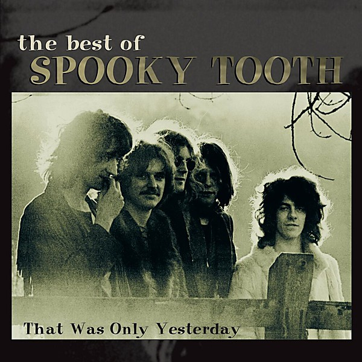

# The Best of

By **Spooky Tooth**

## Album Data

- **Catalog:** Beets
- **Format:** Digital, Album
- **Album:** The Best of
- **Artist:** Spooky Tooth
- **Albumartist:** Spooky Tooth
- **Genre:** Psychedelic Rock
- **MusicBrainz Album Artist ID:** [c8f8f706-2176-4fde-9f50-4e243dd096c8](https://musicbrainz.org/artist/c8f8f706-2176-4fde-9f50-4e243dd096c8)
- **MusicBrainz Album ID:** [1e7679bb-a2be-4995-a4f1-23880e3ac4cf](https://musicbrainz.org/release/1e7679bb-a2be-4995-a4f1-23880e3ac4cf)
- **MusicBrainz Release Group ID:** [09f4385b-333a-33d2-a749-a9444eef9036](https://musicbrainz.org/release-group/09f4385b-333a-33d2-a749-a9444eef9036)
- **Year:** 1999
- **Catalog #:** 314 541 049-2
- **Label:** A&M Records
- **Total Tracks:** 16

## Album Tracks

### Track 01 - Sunshine Help Me

- **Artist:** Spooky Tooth
- **Format:** ALAC
- **Genre:** Psychedelic Rock
- **Length:** 3:04
- **MusicBrainz Track ID:** [a5e31dd4-95ca-4e91-83ac-500f48ddb0a8](https://musicbrainz.org/recording/a5e31dd4-95ca-4e91-83ac-500f48ddb0a8)
- **Title:** Sunshine Help Me
- **Track:** 01
- **Year:** 1999

### Track 02 - Tobacco Road

- **Artist:** Spooky Tooth
- **Format:** ALAC
- **Genre:** Psychedelic Rock
- **Length:** 5:07
- **MusicBrainz Track ID:** [15aadf2f-6e8a-4394-8f2b-9f27b8907814](https://musicbrainz.org/recording/15aadf2f-6e8a-4394-8f2b-9f27b8907814)
- **Title:** Tobacco Road
- **Track:** 02
- **Year:** 1999

### Track 03 - Society’s Child

- **Artist:** Spooky Tooth
- **Format:** ALAC
- **Genre:** Psychedelic Rock
- **Length:** 4:31
- **MusicBrainz Track ID:** [030965c8-20c1-4431-864b-75f681f56f32](https://musicbrainz.org/recording/030965c8-20c1-4431-864b-75f681f56f32)
- **Title:** Society’s Child
- **Track:** 03
- **Year:** 1999

### Track 04 - Waitin’ for the Wind

- **Artist:** Spooky Tooth
- **Format:** ALAC
- **Genre:** Psychedelic Rock
- **Length:** 3:46
- **MusicBrainz Track ID:** [f98ca510-d2ed-4c28-ad09-55f69c91bb64](https://musicbrainz.org/recording/f98ca510-d2ed-4c28-ad09-55f69c91bb64)
- **Title:** Waitin’ for the Wind
- **Track:** 04
- **Year:** 1999

### Track 05 - Feelin’ Bad

- **Artist:** Spooky Tooth
- **Format:** ALAC
- **Genre:** Psychedelic Rock
- **Length:** 3:06
- **MusicBrainz Track ID:** [e416d24f-4c57-48d4-8452-699f19a1ecee](https://musicbrainz.org/recording/e416d24f-4c57-48d4-8452-699f19a1ecee)
- **Title:** Feelin’ Bad
- **Track:** 05
- **Year:** 1999

### Track 06 - Evil Woman

- **Artist:** Spooky Tooth
- **Format:** ALAC
- **Genre:** Psychedelic Rock
- **Length:** 9:06
- **MusicBrainz Track ID:** [fd61982f-29de-47fa-82ae-0f2a7940be48](https://musicbrainz.org/recording/fd61982f-29de-47fa-82ae-0f2a7940be48)
- **Title:** Evil Woman
- **Track:** 06
- **Year:** 1999

### Track 07 - Lost in My Dream

- **Artist:** Spooky Tooth
- **Format:** ALAC
- **Genre:** Psychedelic Rock
- **Length:** 5:05
- **MusicBrainz Track ID:** [7e9263cc-747e-4741-b450-bfcd52c85c2a](https://musicbrainz.org/recording/7e9263cc-747e-4741-b450-bfcd52c85c2a)
- **Title:** Lost in My Dream
- **Track:** 07
- **Year:** 1999

### Track 08 - That Was Only Yesterday

- **Artist:** Spooky Tooth
- **Format:** ALAC
- **Genre:** Progressive Rock
- **Length:** 3:53
- **MusicBrainz Track ID:** [5ed31ee0-4c8c-4a3c-b353-2740b7b3c601](https://musicbrainz.org/recording/5ed31ee0-4c8c-4a3c-b353-2740b7b3c601)
- **Title:** That Was Only Yesterday
- **Track:** 08
- **Year:** 1999

### Track 09 - Better by You, Better Than Me

- **Artist:** Spooky Tooth
- **Format:** ALAC
- **Genre:** Psychedelic Rock
- **Length:** 3:41
- **MusicBrainz Track ID:** [7ce514d1-cd5e-49f1-a298-91c97e8a5b18](https://musicbrainz.org/recording/7ce514d1-cd5e-49f1-a298-91c97e8a5b18)
- **Title:** Better by You, Better Than Me
- **Track:** 09
- **Year:** 1999

### Track 10 - Hangman Hang My Shell on a Tree

- **Artist:** Spooky Tooth
- **Format:** ALAC
- **Genre:** Soul
- **Length:** 5:46
- **MusicBrainz Track ID:** [239f26e3-bada-4916-839d-8f7d042766eb](https://musicbrainz.org/recording/239f26e3-bada-4916-839d-8f7d042766eb)
- **Title:** Hangman Hang My Shell on a Tree
- **Track:** 10
- **Year:** 1999

### Track 11 - Prayer

- **Artist:** Spooky Tooth
- **Format:** ALAC
- **Genre:** Psychedelic Rock
- **Length:** 5:28
- **MusicBrainz Track ID:** [20dac8db-d8e3-4db6-9967-3db1f3f0b830](https://musicbrainz.org/recording/20dac8db-d8e3-4db6-9967-3db1f3f0b830)
- **Title:** Prayer
- **Track:** 11
- **Year:** 1999

### Track 12 - I Am the Walrus

- **Artist:** Spooky Tooth
- **Format:** ALAC
- **Genre:** Psychedelic Rock
- **Length:** 6:24
- **MusicBrainz Track ID:** [55da9ada-6edc-412f-ba0c-c17b9762646c](https://musicbrainz.org/recording/55da9ada-6edc-412f-ba0c-c17b9762646c)
- **Title:** I Am the Walrus
- **Track:** 12
- **Year:** 1999

### Track 13 - The Wrong Time

- **Artist:** Spooky Tooth
- **Format:** ALAC
- **Genre:** Psychedelic Rock
- **Length:** 5:11
- **MusicBrainz Track ID:** [cf008386-f8c4-40a3-88fe-67a7882d3fda](https://musicbrainz.org/recording/cf008386-f8c4-40a3-88fe-67a7882d3fda)
- **Title:** The Wrong Time
- **Track:** 13
- **Year:** 1999

### Track 14 - Something to Say

- **Artist:** Spooky Tooth
- **Format:** ALAC
- **Genre:** Psychedelic Rock
- **Length:** 5:52
- **MusicBrainz Track ID:** [d10792d6-e7ad-426c-b0ca-cb6a75f94ea7](https://musicbrainz.org/recording/d10792d6-e7ad-426c-b0ca-cb6a75f94ea7)
- **Title:** Something to Say
- **Track:** 14
- **Year:** 1999

### Track 15 - Son of Your Father

- **Artist:** Spooky Tooth
- **Format:** ALAC
- **Genre:** Progressive Rock
- **Length:** 3:54
- **MusicBrainz Track ID:** [bd494d7a-4600-498a-a8a6-478bc5448245](https://musicbrainz.org/recording/bd494d7a-4600-498a-a8a6-478bc5448245)
- **Title:** Son of Your Father
- **Track:** 15
- **Year:** 1999

### Track 16 - Cotton Growing Man

- **Artist:** Spooky Tooth
- **Format:** ALAC
- **Genre:** Progressive Rock
- **Length:** 4:37
- **MusicBrainz Track ID:** [5b7decc0-4232-4f31-9f0d-03117dad8976](https://musicbrainz.org/recording/5b7decc0-4232-4f31-9f0d-03117dad8976)
- **Title:** Cotton Growing Man
- **Track:** 16
- **Year:** 1999

## See also

- [CD: ](../../CD/Spooky_Tooth/Spooky_Tooth.md)
- [CD: The Best Of - That Was Only Yesterday](../../CD/Spooky_Tooth/The_Best_Of_-_That_Was_Only_Yesterday.md)
