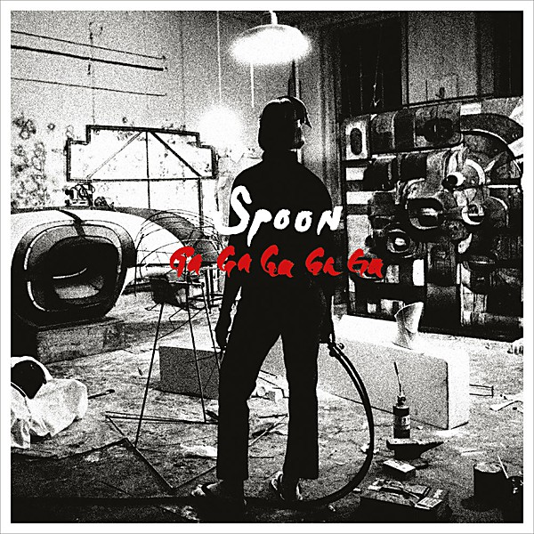

# Ga Ga Ga Ga Ga

By **Spoon**

## Album Data

- **Catalog:** Beets
- **Format:** Digital, Album
- **Album:** Ga Ga Ga Ga Ga
- **Artist:** Spoon
- **Albumartist:** Spoon
- **Genre:** Indie Rock
- **MusicBrainz Album Artist ID:** [84eac621-1c5a-49a1-9500-555099c6e184](https://musicbrainz.org/artist/84eac621-1c5a-49a1-9500-555099c6e184)
- **MusicBrainz Album ID:** [43a01517-cbf9-4693-b7f6-f24930e7a9c5](https://musicbrainz.org/release/43a01517-cbf9-4693-b7f6-f24930e7a9c5)
- **MusicBrainz Release Group ID:** [9fe3ccc2-9649-3ac3-bc7f-a82d9b6ee815](https://musicbrainz.org/release-group/9fe3ccc2-9649-3ac3-bc7f-a82d9b6ee815)
- **Year:** 2007
- **Catalog #:** 
- **Label:** Matador Records
- **Total Tracks:** 10

## Album Tracks

### Track 01 - Hot Thoughts

- **Artist:** Spoon
- **Format:** MP3
- **Genre:** Indietronica
- **Length:** 3:48
- **MusicBrainz Track ID:** [https](https://musicbrainz.org/recording/https)
- **Title:** Hot Thoughts
- **Track:** 01
- **Year:** 2017

### Track 02 - WhisperI'lllistentohearit

- **Artist:** Spoon
- **Format:** MP3
- **Genre:** Electronic
- **Length:** 4:20
- **MusicBrainz Track ID:** [https](https://musicbrainz.org/recording/https)
- **Title:** WhisperI'lllistentohearit
- **Track:** 02
- **Year:** 2017

### Track 03 - Do I Have to Talk You Into It

- **Artist:** Spoon
- **Format:** MP3
- **Genre:** Indie Rock
- **Length:** 4:20
- **MusicBrainz Track ID:** [https](https://musicbrainz.org/recording/https)
- **Title:** Do I Have to Talk You Into It
- **Track:** 03
- **Year:** 2017

### Track 04 - First Caress

- **Artist:** Spoon
- **Format:** MP3
- **Genre:** Indie Rock
- **Length:** 2:48
- **MusicBrainz Track ID:** [https](https://musicbrainz.org/recording/https)
- **Title:** First Caress
- **Track:** 04
- **Year:** 2017

### Track 05 - Pink Up

- **Artist:** Spoon
- **Format:** MP3
- **Genre:** Indie Rock
- **Length:** 5:57
- **MusicBrainz Track ID:** [https](https://musicbrainz.org/recording/https)
- **Title:** Pink Up
- **Track:** 05
- **Year:** 2017

### Track 06 - Can I Sit Next to You

- **Artist:** Spoon
- **Format:** MP3
- **Genre:** Indie Rock
- **Length:** 3:54
- **MusicBrainz Track ID:** [https](https://musicbrainz.org/recording/https)
- **Title:** Can I Sit Next to You
- **Track:** 06
- **Year:** 2017

### Track 07 - I Ain't the One

- **Artist:** Spoon
- **Format:** MP3
- **Genre:** Indie Rock
- **Length:** 3:48
- **MusicBrainz Track ID:** [https](https://musicbrainz.org/recording/https)
- **Title:** I Ain't the One
- **Track:** 07
- **Year:** 2017

### Track 08 - Tear It Down

- **Artist:** Spoon
- **Format:** MP3
- **Genre:** Indie Rock
- **Length:** 4:20
- **MusicBrainz Track ID:** [https](https://musicbrainz.org/recording/https)
- **Title:** Tear It Down
- **Track:** 08
- **Year:** 2017

### Track 09 - Shotgun

- **Artist:** Spoon
- **Format:** MP3
- **Genre:** Indie Rock
- **Length:** 3:38
- **MusicBrainz Track ID:** [https](https://musicbrainz.org/recording/https)
- **Title:** Shotgun
- **Track:** 09
- **Year:** 2017

### Track 10 - Us

- **Artist:** Spoon
- **Format:** MP3
- **Genre:** Indie Rock
- **Length:** 4:59
- **MusicBrainz Track ID:** [https](https://musicbrainz.org/recording/https)
- **Title:** Us
- **Track:** 10
- **Year:** 2017

## See also

- [Hot Thoughts](Hot_Thoughts.md)
- [Roon: Ga Ga Ga Ga Ga (2017 Remaster)](../../Roon/Spoon/Ga_Ga_Ga_Ga_Ga_2017_Remaster.md)
- [Roon: Hot Thoughts](../../Roon/Spoon/Hot_Thoughts.md)
- [Roon: Lucifer On The Sofa](../../Roon/Spoon/Lucifer_On_The_Sofa.md)
- [Vinyl: Hot Thoughts](../../Vinyl/Spoon/Hot_Thoughts.md)
- [Vinyl: ](../../Vinyl/Spoon/Spoon.md)
