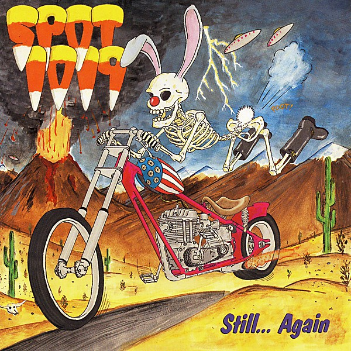

# Still... Again

By **Spot 1019**

## Album Data

- **Catalog:** Beets
- **Format:** Digital, Album
- **Album:** Still... Again
- **Artist:** Spot 1019
- **Albumartist:** Spot 1019
- **Genre:** Rock
- **MusicBrainz Album Artist ID:** [24011065-3cb2-4048-bd61-439466c4ba2c](https://musicbrainz.org/artist/24011065-3cb2-4048-bd61-439466c4ba2c)
- **MusicBrainz Album ID:** [2b00d362-72c3-4f5c-98c0-784e53efa23f](https://musicbrainz.org/release/2b00d362-72c3-4f5c-98c0-784e53efa23f)
- **MusicBrainz Release Group ID:** [e44320a9-24a9-3911-b526-7eaa20a88f2a](https://musicbrainz.org/release-group/e44320a9-24a9-3911-b526-7eaa20a88f2a)
- **Year:** 1990
- **Catalog #:** 34635
- **Label:** Frontier Records
- **Total Tracks:** 16

## Album Tracks

### Track 01 - Love's Pillory

- **Artist:** Spot 1019
- **Format:** ALAC
- **Genre:** Rock
- **Length:** 2:17
- **MusicBrainz Track ID:** [2c016f5f-93fc-47dc-9515-205085b579d2](https://musicbrainz.org/recording/2c016f5f-93fc-47dc-9515-205085b579d2)
- **Title:** Love's Pillory
- **Track:** 01
- **Year:** 1991

### Track 02 - Interesting People

- **Artist:** Spot 1019
- **Format:** ALAC
- **Genre:** Rock
- **Length:** 1:44
- **MusicBrainz Track ID:** [e7bec2f5-d8ef-44ac-aa16-9bb65f58e95e](https://musicbrainz.org/recording/e7bec2f5-d8ef-44ac-aa16-9bb65f58e95e)
- **Title:** Interesting People
- **Track:** 02
- **Year:** 1991

### Track 03 - Who Am I? (Saturday Afternoon)

- **Artist:** Spot 1019
- **Format:** ALAC
- **Genre:** Rock
- **Length:** 2:06
- **MusicBrainz Track ID:** [ab45d20a-94e1-4190-b174-7a7f24a960a8](https://musicbrainz.org/recording/ab45d20a-94e1-4190-b174-7a7f24a960a8)
- **Title:** Who Am I? (Saturday Afternoon)
- **Track:** 03
- **Year:** 1991

### Track 04 - Think and Grow Thin

- **Artist:** Spot 1019
- **Format:** ALAC
- **Genre:** Rock
- **Length:** 4:21
- **MusicBrainz Track ID:** [1d16ebe3-4ef6-4036-b15e-896dabc1e28c](https://musicbrainz.org/recording/1d16ebe3-4ef6-4036-b15e-896dabc1e28c)
- **Title:** Think and Grow Thin
- **Track:** 04
- **Year:** 1991

### Track 05 - Bucket of Blood

- **Artist:** Spot 1019
- **Format:** ALAC
- **Genre:** Rock
- **Length:** 4:33
- **MusicBrainz Track ID:** [394fb4c3-ac16-4c5b-ac83-79d1eeb837a2](https://musicbrainz.org/recording/394fb4c3-ac16-4c5b-ac83-79d1eeb837a2)
- **Title:** Bucket of Blood
- **Track:** 05
- **Year:** 1991

### Track 06 - Skies of Blood

- **Artist:** Spot 1019
- **Format:** ALAC
- **Genre:** Rock
- **Length:** 3:52
- **MusicBrainz Track ID:** [0e1186e8-bc5f-4e0e-89d9-0e8d3c433479](https://musicbrainz.org/recording/0e1186e8-bc5f-4e0e-89d9-0e8d3c433479)
- **Title:** Skies of Blood
- **Track:** 06
- **Year:** 1991

### Track 07 - Distance We Know

- **Artist:** Spot 1019
- **Format:** ALAC
- **Genre:** Rock
- **Length:** 1:57
- **MusicBrainz Track ID:** [cafb01d9-04c7-40c9-8a04-3d4dd5965619](https://musicbrainz.org/recording/cafb01d9-04c7-40c9-8a04-3d4dd5965619)
- **Title:** Distance We Know
- **Track:** 07
- **Year:** 1991

### Track 08 - Peace War

- **Artist:** Spot 1019
- **Format:** ALAC
- **Genre:** Rock
- **Length:** 2:01
- **MusicBrainz Track ID:** [122c936d-4e3c-4bd1-846c-9ea080139a9a](https://musicbrainz.org/recording/122c936d-4e3c-4bd1-846c-9ea080139a9a)
- **Title:** Peace War
- **Track:** 08
- **Year:** 1991

### Track 09 - Free Men Bear Arms

- **Artist:** Spot 1019
- **Format:** ALAC
- **Genre:** Rock
- **Length:** 3:36
- **MusicBrainz Track ID:** [0b658516-c5b6-41c1-ba55-3060de0be72b](https://musicbrainz.org/recording/0b658516-c5b6-41c1-ba55-3060de0be72b)
- **Title:** Free Men Bear Arms
- **Track:** 09
- **Year:** 1991

### Track 10 - Few Remaining Fools

- **Artist:** Spot 1019
- **Format:** ALAC
- **Genre:** Rock
- **Length:** 1:33
- **MusicBrainz Track ID:** [a24c8f54-b03d-44e8-98f5-ce0eae121d64](https://musicbrainz.org/recording/a24c8f54-b03d-44e8-98f5-ce0eae121d64)
- **Title:** Few Remaining Fools
- **Track:** 10
- **Year:** 1991

### Track 11 - Bonehead

- **Artist:** Spot 1019
- **Format:** ALAC
- **Genre:** Rock
- **Length:** 2:46
- **MusicBrainz Track ID:** [5db47b22-0c30-481b-baab-6bf08e90add9](https://musicbrainz.org/recording/5db47b22-0c30-481b-baab-6bf08e90add9)
- **Title:** Bonehead
- **Track:** 11
- **Year:** 1991

### Track 12 - Goin' Home

- **Artist:** Spot 1019
- **Format:** ALAC
- **Genre:** Rock
- **Length:** 1:44
- **MusicBrainz Track ID:** [314feae5-ad4a-4e9d-8ff7-de2efa89a32c](https://musicbrainz.org/recording/314feae5-ad4a-4e9d-8ff7-de2efa89a32c)
- **Title:** Goin' Home
- **Track:** 12
- **Year:** 1991

### Track 13 - I'd Do Anything

- **Artist:** Spot 1019
- **Format:** ALAC
- **Genre:** Rock
- **Length:** 4:38
- **MusicBrainz Track ID:** [3a794829-43ba-44a4-948d-82866b5eb844](https://musicbrainz.org/recording/3a794829-43ba-44a4-948d-82866b5eb844)
- **Title:** I'd Do Anything
- **Track:** 13
- **Year:** 1991

### Track 14 - Better World

- **Artist:** Spot 1019
- **Format:** ALAC
- **Genre:** Rock
- **Length:** 1:33
- **MusicBrainz Track ID:** [ac5ef48a-7bb7-4a20-9868-7d8211041e0f](https://musicbrainz.org/recording/ac5ef48a-7bb7-4a20-9868-7d8211041e0f)
- **Title:** Better World
- **Track:** 14
- **Year:** 1991

### Track 15 - Present Tense

- **Artist:** Spot 1019
- **Format:** ALAC
- **Genre:** Rock
- **Length:** 3:42
- **MusicBrainz Track ID:** [9152f7e1-b27f-444d-a6a9-a24ef6072ecc](https://musicbrainz.org/recording/9152f7e1-b27f-444d-a6a9-a24ef6072ecc)
- **Title:** Present Tense
- **Track:** 15
- **Year:** 1991

### Track 16 - Crazy When I Die

- **Artist:** Spot 1019
- **Format:** ALAC
- **Genre:** Rock
- **Length:** 1:08
- **MusicBrainz Track ID:** [954af92e-ce4a-49ae-a124-ea30a835a8fd](https://musicbrainz.org/recording/954af92e-ce4a-49ae-a124-ea30a835a8fd)
- **Title:** Crazy When I Die
- **Track:** 16
- **Year:** 1991

## See also

- [This World Owes Me a Buzz](This_World_Owes_Me_a_Buzz.md)
- [Roon: Still...Again](../../Roon/Spot_1019/StillAgain.md)
- [Roon: This World Owes Me a Buzz](../../Roon/Spot_1019/This_World_Owes_Me_a_Buzz.md)
- [Vinyl: ](../../Vinyl/Spot_1019/Spot_1019_index.md)
- [Vinyl: Spot 1019](../../Vinyl/Spot_1019/Spot_1019.md)
