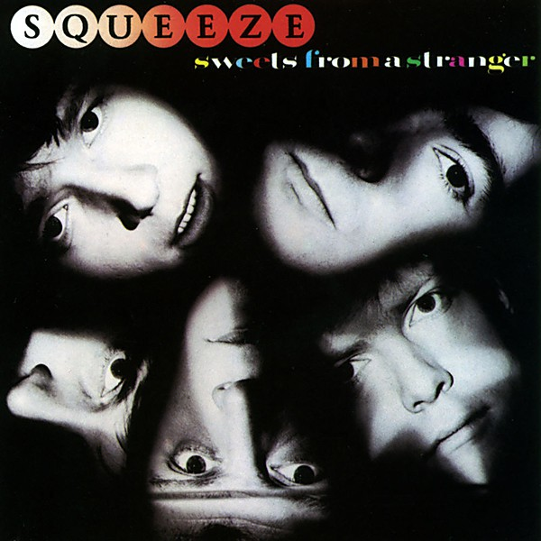

# Sweets From a Stranger

By **Squeeze**

## Album Data

- **Catalog:** Beets
- **Format:** Digital, Album
- **Album:** Sweets From a Stranger
- **Artist:** Squeeze
- **Albumartist:** Squeeze
- **Genre:** New Wave
- **MusicBrainz Album Artist ID:** [0509a681-a362-4800-9075-656041dccdbd](https://musicbrainz.org/artist/0509a681-a362-4800-9075-656041dccdbd)
- **MusicBrainz Album ID:** [33cdaf1c-e877-4f95-a694-4eb7373612eb](https://musicbrainz.org/release/33cdaf1c-e877-4f95-a694-4eb7373612eb)
- **MusicBrainz Release Group ID:** [32120ca8-30b5-37c0-bded-f71df85034e6](https://musicbrainz.org/release-group/32120ca8-30b5-37c0-bded-f71df85034e6)
- **Year:** 2007
- **Catalog #:** 
- **Label:** A&M Records
- **Total Tracks:** 12

## Album Tracks

### Track 01 - Out of Touch

- **Artist:** Squeeze
- **Format:** MP3
- **Genre:** New Wave
- **Length:** 3:52
- **MusicBrainz Track ID:** [c99b9815-0f51-4543-9b03-21604d81e06a](https://musicbrainz.org/recording/c99b9815-0f51-4543-9b03-21604d81e06a)
- **Title:** Out of Touch
- **Track:** 01
- **Year:** 2007

### Track 02 - I Can’t Hold On

- **Artist:** Squeeze
- **Format:** MP3
- **Genre:** New Wave
- **Length:** 3:36
- **MusicBrainz Track ID:** [5c8a56e6-0c2c-4a86-b621-99c2f9a56c29](https://musicbrainz.org/recording/5c8a56e6-0c2c-4a86-b621-99c2f9a56c29)
- **Title:** I Can’t Hold On
- **Track:** 02
- **Year:** 2007

### Track 03 - Points of View

- **Artist:** Squeeze
- **Format:** MP3
- **Genre:** New Wave
- **Length:** 4:14
- **MusicBrainz Track ID:** [09449841-11d4-41d4-bed3-79ba7f09dd20](https://musicbrainz.org/recording/09449841-11d4-41d4-bed3-79ba7f09dd20)
- **Title:** Points of View
- **Track:** 03
- **Year:** 2007

### Track 04 - Stranger Than the Stranger on the Store

- **Artist:** Squeeze
- **Format:** MP3
- **Genre:** New Wave
- **Length:** 3:20
- **MusicBrainz Track ID:** [085fe9da-405b-44ab-b1d1-4632887b811c](https://musicbrainz.org/recording/085fe9da-405b-44ab-b1d1-4632887b811c)
- **Title:** Stranger Than the Stranger on the Store
- **Track:** 04
- **Year:** 2007

### Track 05 - Onto the Dance Floor

- **Artist:** Squeeze
- **Format:** MP3
- **Genre:** New Wave
- **Length:** 3:39
- **MusicBrainz Track ID:** [540fd67c-fcad-406f-853d-e997f0dce860](https://musicbrainz.org/recording/540fd67c-fcad-406f-853d-e997f0dce860)
- **Title:** Onto the Dance Floor
- **Track:** 05
- **Year:** 2007

### Track 06 - When the Hangover Strikes

- **Artist:** Squeeze
- **Format:** MP3
- **Genre:** New Wave
- **Length:** 4:31
- **MusicBrainz Track ID:** [38721c41-0146-41db-8f85-8ed79ae7208a](https://musicbrainz.org/recording/38721c41-0146-41db-8f85-8ed79ae7208a)
- **Title:** When the Hangover Strikes
- **Track:** 06
- **Year:** 2007

### Track 07 - Black Coffee in Bed

- **Artist:** Squeeze
- **Format:** MP3
- **Genre:** Power Pop
- **Length:** 6:14
- **MusicBrainz Track ID:** [6508cd6b-0779-479d-ad71-26b6e8e6a8be](https://musicbrainz.org/recording/6508cd6b-0779-479d-ad71-26b6e8e6a8be)
- **Title:** Black Coffee in Bed
- **Track:** 07
- **Year:** 2007

### Track 08 - I’ve Returned

- **Artist:** Squeeze
- **Format:** MP3
- **Genre:** New Wave
- **Length:** 2:36
- **MusicBrainz Track ID:** [63ec3bb4-1301-4bac-9091-1c0658efa75a](https://musicbrainz.org/recording/63ec3bb4-1301-4bac-9091-1c0658efa75a)
- **Title:** I’ve Returned
- **Track:** 08
- **Year:** 2007

### Track 09 - Tongue Like a Knife

- **Artist:** Squeeze
- **Format:** MP3
- **Genre:** Rock
- **Length:** 4:11
- **MusicBrainz Track ID:** [ea1a51fd-2449-4c7c-a23c-561d14c38b95](https://musicbrainz.org/recording/ea1a51fd-2449-4c7c-a23c-561d14c38b95)
- **Title:** Tongue Like a Knife
- **Track:** 09
- **Year:** 2007

### Track 10 - His House Her Home

- **Artist:** Squeeze
- **Format:** MP3
- **Genre:** New Wave
- **Length:** 3:25
- **MusicBrainz Track ID:** [0fa3fe6d-2012-4d67-b61b-6e1e6f030a16](https://musicbrainz.org/recording/0fa3fe6d-2012-4d67-b61b-6e1e6f030a16)
- **Title:** His House Her Home
- **Track:** 10
- **Year:** 2007

### Track 11 - The Very First Dance

- **Artist:** Squeeze
- **Format:** MP3
- **Genre:** New Wave
- **Length:** 3:21
- **MusicBrainz Track ID:** [df76756a-8ec9-4b58-9483-bc6f069f97de](https://musicbrainz.org/recording/df76756a-8ec9-4b58-9483-bc6f069f97de)
- **Title:** The Very First Dance
- **Track:** 11
- **Year:** 2007

### Track 12 - The Elephant Ride

- **Artist:** Squeeze
- **Format:** MP3
- **Genre:** New Wave
- **Length:** 3:23
- **MusicBrainz Track ID:** [99a6eac5-29be-4a1c-a948-1cbfcf21c153](https://musicbrainz.org/recording/99a6eac5-29be-4a1c-a948-1cbfcf21c153)
- **Title:** The Elephant Ride
- **Track:** 12
- **Year:** 2007

## See also

- [Argybargy](Argybargy.md)
- [Roon: Cool For Cats](../../Roon/Squeeze/Cool_For_Cats.md)
- [Roon: Play](../../Roon/Squeeze/Play.md)
- [Roon: Some Fantastic Place](../../Roon/Squeeze/Some_Fantastic_Place.md)
- [Roon: The Knowledge](../../Roon/Squeeze/The_Knowledge.md)
- [Vinyl: Argybargy](../../Vinyl/Squeeze/Argybargy.md)
- [Vinyl: ](../../Vinyl/Squeeze/Squeeze.md)
- [Vinyl: Sweets From A Stranger](../../Vinyl/Squeeze/Sweets_From_A_Stranger.md)
