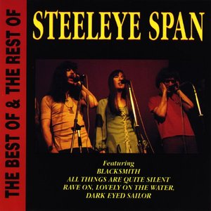

# The Best of & The Rest of Steeleye Span

By **Steeleye Span**

## Album Data

- **Catalog:** Beets
- **Format:** Digital, Album
- **Album:** The Best of & The Rest of Steeleye Span
- **Artist:** Steeleye Span
- **Albumartist:** Steeleye Span
- **Genre:** Folk Rock
- **MusicBrainz Album Artist ID:** [68c6926c-03e0-4afc-9f54-2190b2c8d468](https://musicbrainz.org/artist/68c6926c-03e0-4afc-9f54-2190b2c8d468)
- **MusicBrainz Album ID:** [42f4fbef-a03f-435e-b868-e7674b954869](https://musicbrainz.org/release/42f4fbef-a03f-435e-b868-e7674b954869)
- **MusicBrainz Release Group ID:** [ad82cbed-718c-33a8-80eb-ff01a0194fd1](https://musicbrainz.org/release-group/ad82cbed-718c-33a8-80eb-ff01a0194fd1)
- **Year:** 1990
- **Catalog #:** CDAR1012
- **Label:** Action Replay Records
- **Total Tracks:** 14

## Album Tracks

### Track 01 - Blacksmith

- **Artist:** Steeleye Span
- **Format:** ALAC
- **Genre:** Folk Rock
- **Length:** 3:41
- **MusicBrainz Track ID:** [0daacabb-20e4-4811-8f4d-a75c4241e9e1](https://musicbrainz.org/recording/0daacabb-20e4-4811-8f4d-a75c4241e9e1)
- **Title:** Blacksmith
- **Track:** 01
- **Year:** 1990

### Track 02 - Prince Charlie Stuart

- **Artist:** Steeleye Span
- **Format:** ALAC
- **Genre:** Folk Rock
- **Length:** 4:16
- **MusicBrainz Track ID:** [4d9c7305-99a3-462b-9f9a-2811ece02428](https://musicbrainz.org/recording/4d9c7305-99a3-462b-9f9a-2811ece02428)
- **Title:** Prince Charlie Stuart
- **Track:** 02
- **Year:** 1990

### Track 03 - Marrowbones

- **Artist:** Steeleye Span
- **Format:** ALAC
- **Genre:** Folk Rock
- **Length:** 4:27
- **MusicBrainz Track ID:** [082d1492-6c7b-4aaf-ad3e-f04eb122fcdc](https://musicbrainz.org/recording/082d1492-6c7b-4aaf-ad3e-f04eb122fcdc)
- **Title:** Marrowbones
- **Track:** 03
- **Year:** 1990

### Track 04 - Reels

- **Artist:** Steeleye Span
- **Format:** ALAC
- **Genre:** Folk Rock
- **Length:** 3:46
- **MusicBrainz Track ID:** [45c6b499-df2c-4c3f-8566-e92bacc99249](https://musicbrainz.org/recording/45c6b499-df2c-4c3f-8566-e92bacc99249)
- **Title:** Reels
- **Track:** 04
- **Year:** 1990

### Track 05 - Western Wynde

- **Artist:** Steeleye Span
- **Format:** ALAC
- **Genre:** Folk Rock
- **Length:** 0:26
- **MusicBrainz Track ID:** [edfbca28-f30d-43d5-aa33-d8c6afd79d9f](https://musicbrainz.org/recording/edfbca28-f30d-43d5-aa33-d8c6afd79d9f)
- **Title:** Western Wynde
- **Track:** 05
- **Year:** 1990

### Track 06 - Dark Eyed Sailor

- **Artist:** Steeleye Span
- **Format:** ALAC
- **Genre:** Folk Rock
- **Length:** 5:56
- **MusicBrainz Track ID:** [b4b65ce3-83a7-4976-875c-0425a07609c6](https://musicbrainz.org/recording/b4b65ce3-83a7-4976-875c-0425a07609c6)
- **Title:** Dark Eyed Sailor
- **Track:** 06
- **Year:** 1990

### Track 07 - All Things Are Quite Silent

- **Artist:** Steeleye Span
- **Format:** ALAC
- **Genre:** Folk Rock
- **Length:** 2:39
- **MusicBrainz Track ID:** [2ff1ce4d-30c6-4079-b726-f57682839896](https://musicbrainz.org/recording/2ff1ce4d-30c6-4079-b726-f57682839896)
- **Title:** All Things Are Quite Silent
- **Track:** 07
- **Year:** 1990

### Track 08 - Rave On

- **Artist:** Steeleye Span
- **Format:** ALAC
- **Genre:** Folk Rock
- **Length:** 2:09
- **MusicBrainz Track ID:** [79a88c33-09f6-4043-8200-4aaff7ff9ed8](https://musicbrainz.org/recording/79a88c33-09f6-4043-8200-4aaff7ff9ed8)
- **Title:** Rave On
- **Track:** 08
- **Year:** 1990

### Track 09 - Lovely on the Water

- **Artist:** Steeleye Span
- **Format:** ALAC
- **Genre:** Folk Rock
- **Length:** 5:20
- **MusicBrainz Track ID:** [2055474b-a0c2-4a81-8171-80d1843baf71](https://musicbrainz.org/recording/2055474b-a0c2-4a81-8171-80d1843baf71)
- **Title:** Lovely on the Water
- **Track:** 09
- **Year:** 1990

### Track 10 - Wee Weaver

- **Artist:** Steeleye Span
- **Format:** ALAC
- **Genre:** Folk Rock
- **Length:** 2:40
- **MusicBrainz Track ID:** [51a1bf1b-b47c-4c54-a487-386d6e3d42af](https://musicbrainz.org/recording/51a1bf1b-b47c-4c54-a487-386d6e3d42af)
- **Title:** Wee Weaver
- **Track:** 10
- **Year:** 1990

### Track 11 - The Brisk Young Butcher

- **Artist:** Steeleye Span
- **Format:** ALAC
- **Genre:** Folk Rock
- **Length:** 2:50
- **MusicBrainz Track ID:** [9d9f9e3d-488b-47c8-beef-76300e70d6b4](https://musicbrainz.org/recording/9d9f9e3d-488b-47c8-beef-76300e70d6b4)
- **Title:** The Brisk Young Butcher
- **Track:** 11
- **Year:** 1990

### Track 12 - Boys of Bedlam

- **Artist:** Steeleye Span
- **Format:** ALAC
- **Genre:** Folk Rock
- **Length:** 4:19
- **MusicBrainz Track ID:** [7bf59902-a3c4-4955-aad3-919820f9e6f6](https://musicbrainz.org/recording/7bf59902-a3c4-4955-aad3-919820f9e6f6)
- **Title:** Boys of Bedlam
- **Track:** 12
- **Year:** 1990

### Track 13 - The Blacksmith

- **Artist:** Steeleye Span
- **Format:** ALAC
- **Genre:** Folk Rock
- **Length:** 4:47
- **MusicBrainz Track ID:** [1fc12483-75b3-4f85-b1aa-5ad3a783b1e1](https://musicbrainz.org/recording/1fc12483-75b3-4f85-b1aa-5ad3a783b1e1)
- **Title:** The Blacksmith
- **Track:** 13
- **Year:** 1990

### Track 14 - My Johnny Was a Shoemaker

- **Artist:** Steeleye Span
- **Format:** ALAC
- **Genre:** Folk Rock
- **Length:** 1:10
- **MusicBrainz Track ID:** [2402040d-aaec-4e1c-8390-4b20602664e8](https://musicbrainz.org/recording/2402040d-aaec-4e1c-8390-4b20602664e8)
- **Title:** My Johnny Was a Shoemaker
- **Track:** 14
- **Year:** 1990

